# FIDE: Fiber-Informed Differentiable Experimental Design

> “We have no need of other worlds. We need mirrors.”
>
> — **Stanisław Lem,** *Solaris*

This project was ideated and evaluated by [Pietro Zanotta](https://github.com/PietroZanotta) as part of the [Tesseract Hackathon 2026](https://pasteurlabs.ai/tesseract-hackathon-2026/) for **Track 1: Inverse Design & Shape Optimization**.

- **Contact**: Pietro Zanotta: pzanott1@jhu.edu
- **Technical writeup**: this README is a distillation of our [technical writeup](technical_writeup.pdf), which contains the theorems, proofs, and numerical details.

Our work, **Fiber-Informed Differentiable Experimental Design (FIDE)**, asks how to design measurements when experiments reveal only **aggregate information** about an evolving population. Among measurement systems that are already good enough for the scientific task, FIDE favors those whose implied full population dynamics remain most compatible with a shared frozen reference model.

This lets us use trusted endpoint information and trusted observable responses without requiring the complete intermediate microscopic dynamics to be known or trusted.

We evaluate the idea in two complementary experiments: an analytical Gaussian-mixture transport benchmark, where the hidden law is available in closed form, and a nonlinear vortices benchmark, where four sensors observe particles transported by a time-dependent double gyre.

> **Naming convention.** Throughout this README, **FIDE** refers to the complete proposed framework. In experiments and figures, we call the FIDE-selected design **Full**, because it is selected using the **Full action**, our law-level transportability criterion. We therefore use **FIDE** and **Full** interchangeably when referring to the proposed design method; **Full action** refers specifically to its transportability objective. `Law` and `Tangent` denote the corresponding comparison methods.

## Key Features
- **Designed for aggregate observations.** FIDE works with measurements such as sensor intensities, moments, projections, occupancies, or other population-level summaries, without assuming access to the full microscopic state distribution.

- **Reconstructs a law without pretending to recover ground truth.** Aggregate measurements define a *moment fiber*: a family of distributions compatible with what was observed. FIDE selects a canonical member of this family by information projection onto a common reference law.

- **Provides a canonical law-level completion.** Under the regularity conditions of the theory, the information projection is unique at the level of the probability law and takes the form of an exponential tilt of the frozen reference. The measurements determine the constrained directions; the reference determines how the remaining directions are completed.

- **Uses a frozen dynamical reference.** The reference is learned once, for example from independently trusted endpoint information, and is never retrained as the measurement design changes. Every candidate measurement system is therefore compared against the same dynamical geometry.

- **Separates scientific usefulness from dynamical compatibility.** FIDE first restricts attention to designs that are already near-optimal for a user-specified scientific objective. Only within this admissible set does the **Full** criterion ask which design produces the most transportable law-level reconstruction.

- **Measures compatibility at the level of the full distribution.** Rather than asking only whether the measured moments evolve correctly, the **Full action** measures the minimum kinetic correction required for the entire measurement-implied probability law to evolve consistently with the frozen reference dynamics.

- **Characterizes Full transportability through a weighted Poisson problem.** In the balanced probability-law setting, the minimum-energy Full correction is the gradient of a potential solving a density-weighted Poisson equation. Equivalently, the Full action is a weighted negative-Sobolev $H^{-1}$ norm of the reference-relative continuity residual.

- **Separates visible and hidden dynamical corrections.** The minimum Full correction admits an exact orthogonal decomposition into a component visible through the measured moment rates and a complementary *hidden* component that is invisible to those measurements: **Full action = Tangent action + Hidden action.** The decomposition therefore quantifies how much of the law-level dynamical discrepancy can (and cannot) be detected from the chosen observables.

- **Shows that matching moment dynamics can be fundamentally insufficient.** The gap between moment-level and law-level compatibility is not merely numerical. There is no universal constant controlling Full action by Tangent action: smooth examples exist in which the moment-rate correction vanishes while the Full law-level correction remains strictly positive.

- **Supports differentiable experimental design.** When sensor locations or measurement parameters vary continuously, both the calibrated information projection and the Full action can be differentiated with respect to the design using Tesseract, allowing for faster convergence.

For the formal formulation, method, and proofs, see [Sections 3–5 and Appendix A of the technical writeup](technical_writeup.pdf). The experimental overview and reproducibility details are in Section 6 and Appendix B.

## Table of Contents
- [FIDE: Fiber-Informed Differentiable Experimental Design](#fide-fiber-informed-differentiable-experimental-design)
  - [Key Features](#key-features)
  - [Table of Contents](#table-of-contents)
  - [Motivation](#motivation)
  - [Problem Statement](#problem-statement)
  - [Methodology](#methodology)
  - [Where Does Tesseract Enter the Picture?](#where-does-tesseract-enter-the-picture)
    - [The two Tesseracts used by the analytical example](#the-two-tesseracts-used-by-the-analytical-example)
    - [Where they sit in one Full-action evaluation](#where-they-sit-in-one-full-action-evaluation)
    - [What this looks like at the scale of the analytical run](#what-this-looks-like-at-the-scale-of-the-analytical-run)
    - [Benchmark: Tesseract versus a full JAX implementation](#benchmark-tesseract-versus-a-full-jax-implementation)
  - [Numerical Experiments](#numerical-experiments)
    - [Analytical Gaussian-mixture transport](#analytical-gaussian-mixture-transport)
      - [Analytical system](#analytical-system)
      - [From hidden dynamics to aggregate observations](#from-hidden-dynamics-to-aggregate-observations)
      - [Analytical experimental-design comparison](#analytical-experimental-design-comparison)
      - [Analytical results](#analytical-results)
      - [Reading the analytical result figures](#reading-the-analytical-result-figures)
    - [Vortices](#vortices)
      - [Double-gyre system and observations](#double-gyre-system-and-observations)
      - [Bounded-domain Full action](#bounded-domain-full-action)
      - [Confirmed Pareto result](#confirmed-pareto-result)
      - [Reading the vortices figures](#reading-the-vortices-figures)
      - [Why the current frontier stops at 2%](#why-the-current-frontier-stops-at-2)
    - [Vortices Prospective](#vortices-prospective)
      - [What changes in the prospective experiment](#what-changes-in-the-prospective-experiment)
      - [Final repaired prospective result](#final-repaired-prospective-result)
      - [Reading the prospective figures](#reading-the-prospective-figures)
  - [Structure of this Repository](#structure-of-this-repository)
  - [Getting Started](#getting-started)
    - [Prerequisites](#prerequisites)
    - [Install the Python environment](#install-the-python-environment)
    - [Optional: reproduce the reported GPU environment](#optional-reproduce-the-reported-gpu-environment)
    - [Build the analytical example's Tesseract backends](#build-the-analytical-examples-tesseract-backends)
    - [Verify the installation and saved result](#verify-the-installation-and-saved-result)
    - [Regenerate the analytical figures](#regenerate-the-analytical-figures)
    - [Run a new experiment](#run-a-new-experiment)
  - [Future Work](#future-work)
  - [Tech Stack](#tech-stack)
    - [Hardware configuration](#hardware-configuration)
    - [Software environment](#software-environment)

## Motivation

Many scientific systems are naturally described not by a single microscopic state, but by a **distribution over states**. A cloud of tracer particles has a spatial density; a population of cells has a distribution over molecular phenotypes; an ensemble of molecules has a distribution over conformations; and a plasma has a distribution over positions and velocities.

Experiments, however, rarely reveal those distributions directly. They typically return a much smaller collection of **aggregate observables**: the intensity at a detector, the expression of a marker panel, a scattering measurement at a particular angle, a spatially averaged concentration, or a handful of low-order moments. This creates a genuine inverse problem: many distinct population laws can reproduce exactly the same measurements.

For a given measurement design, the compatible laws form a **moment fiber**. Changing the sensors, projections, or observables therefore changes more than the numerical data we collect: it changes which directions of the underlying population distribution are constrained and which remain unresolved. Two experiments can be nearly indistinguishable according to the scientific quantity we ultimately care about while implying very different completions of the hidden population law.

This matters whenever downstream reasoning depends on more than the measured coordinates themselves. For example, a detector configuration may estimate a target quantity accurately while leaving large, dynamically important rearrangements of the population invisible. Likewise, a simulator may correctly predict a sensor response, spatial average, or marker concentration without accurately reproducing every unobserved degree of freedom of the intermediate state. Treating the simulator's complete microscopic trajectory as ground truth would then impose a much stronger assumption than the experiment actually justifies.

**Fiber-Informed Differentiable Experimental Design (FIDE)** is designed for this setting. It uses a common **frozen dynamical reference**, learned for example from trusted endpoint information or another independently validated source, to complete what the aggregate measurements leave unresolved. For each candidate experiment, FIDE selects the law in the corresponding moment fiber that is closest to that same reference. The experiment determines what must change; the reference determines how the unconstrained directions are filled in.

Crucially, the reference is **not assumed to be the true intermediate dynamics**. Its role is to provide a common dynamical geometry against which all candidate experiments can be compared. This allows us to use trusted endpoint information and trusted observable predictions without silently declaring an entire simulated trajectory to be physically correct.

Scientific usefulness remains primary. FIDE first restricts attention to measurement designs that satisfy a predeclared scientific-risk tolerance. Only within that admissible set does the **Full action** ask which design requires the least additional law-level dynamical correction relative to the frozen reference.

> **FIDE asks:** If two experiments answer the scientific question equally well, which one forces us to invent the least additional dynamics in the parts of the population law that neither experiment directly observes?

## Problem Statement
Consider a dynamical system whose microscopic state at time $t$ is a random variable

$$X_t \sim P_t,$$

where $P_t$ is the unknown population law. In many experiments we cannot observe $P_t$ directly. Instead, a **measurement design** $\eta$ (for example, a set of sensor locations, projection angles, or observable parameters) determines an observable map $\Phi_\eta$, and the experiment gives access only to aggregate quantities of the form

$$c_\eta(t) = \mathbb{E}_{P_t}\left[\Phi_\eta(X_t)\right].$$

In practice these quantities may themselves be observed sparsely and noisily, so we reconstruct a smooth trajectory $\hat c_\eta(t)$ from the available measurements.

The central difficulty is that finitely many aggregate measurements do **not** uniquely identify the underlying law. At each time they instead define a **moment fiber**

$$\mathcal{F}_\eta(\hat c_\eta(t)) = \{ Q : \mathbb{E}_{Q}[\Phi_\eta(X)] = \hat c_\eta(t) \},$$

containing all population laws that reproduce the measured observables.

Changing the measurement design therefore changes more than the values we observe: it changes **which directions of the population law are constrained and which remain unresolved**.

At the same time, suppose we have a common frozen reference dynamics $(\widetilde Q_t, u_t)$, for example learned from independently trusted endpoint populations. We do **not** assume that this reference describes the true intermediate dynamics. Its role is to provide the same dynamical geometry against which every candidate measurement design is evaluated.

This leads to the design question at the heart of FIDE:

> **Among measurement systems that are already scientifically adequate, which one implies a complete population-law evolution that is most compatible with the same frozen reference dynamics?**

FIDE separates these two requirements deliberately. A user-specified **scientific risk** $R(\eta)$ determines whether a measurement system is useful for the scientific task. Only among designs satisfying the desired risk tolerance do we compare their law-level dynamical compatibility.

The resulting **FIDE/Full design** solves, schematically,

$$\eta_{\mathrm{Full}} \in \arg\min_{\eta:\,R(\eta)\leq R_{\max}} A(\eta).$$

where $A(\eta)$ is the **Full action**: the minimum dynamical correction required to realize the complete law path implied by the measurements.

See [Section 3 of the technical writeup](technical_writeup.pdf) for the formal problem formulation.

## Methodology
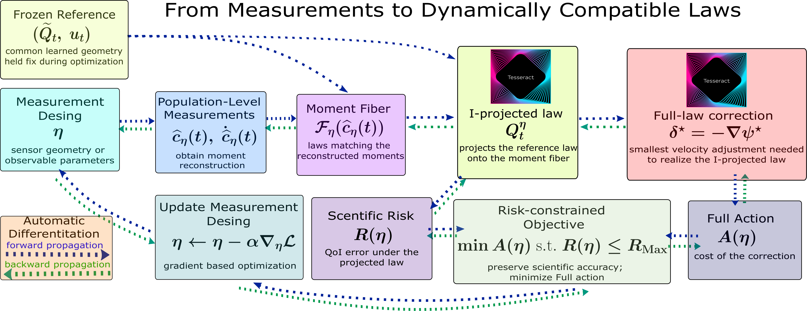

*FIDE workflow. The forward pass constructs a measurement-implied law and evaluates its scientific risk and Full action; gradients are then propagated backward through the pipeline to update the measurement design.*

FIDE turns the problem above into a differentiable pipeline from **measurement design** to **law reconstruction** to **dynamical compatibility**.

**1. Choose a measurement design and reconstruct its aggregate observations.**

A design $\eta$ specifies the sensor geometry or, more generally, the parameters of the observable map $\Phi_\eta$. Sparse population-level measurements are used to reconstruct the moment trajectory $\hat c_\eta(t)$ and, when needed, its derivative $\dot{\hat c}_\eta(t)$. These are the pieces of intermediate information we require the experiment or predictive simulator to provide reliably.

**2. Construct the moment fiber.**

At each time, the reconstructed measurements determine the set $\mathcal{F}_\eta(\hat c_\eta(t))$, containing every law consistent with the observations. The experiment therefore does not provide a unique population law; it provides a constraint on the law.

**3. Lift the measurements to a canonical law.**

FIDE resolves the ambiguity inside the moment fiber using the same frozen reference $\widetilde Q_t$ for every candidate design. At each time it computes the information projection

$$Q_t^\eta = \arg\min_{Q \in \mathcal{F}_\eta(\hat c_\eta(t))} D_{\mathrm{KL}}\left(Q \| \widetilde Q_t\right).$$

The resulting path $t \mapsto Q_t^\eta$ is the **measurement-implied law path**.

Importantly, $Q_t^\eta$ is not claimed to be the unknown physical truth. It is a canonical completion of the aggregate evidence: the measurements determine what must be matched, while the reference supplies what remains unresolved.

**4. Evaluate scientific adequacy.**

The projected law is evaluated using an externally specified scientific risk $R(\eta)$, such as error in a quantity of interest, held-out reconstruction error, or another task-specific criterion. This step remains primary: a design with poor scientific performance is not made attractive simply because it is easy to reconcile with the reference.

**5. Measure full-law dynamical compatibility.**

Let $q_t^\eta$ denote the density of the projected law and let $u_t$ be the frozen reference velocity. FIDE asks for the smallest velocity correction $\delta_t$ such that the **entire projected law** satisfies the continuity equation

$$\partial_t q_t^\eta + \nabla\cdot\left(q_t^\eta(u_t+\delta_t)\right) = 0.$$

In the balanced setting (no probability mass can be created), the minimum-energy correction has the form

$$\delta_t^\star = -\nabla\psi_t^\star.$$

The potential $\psi_t^\star$ solves the density-weighted Poisson problem

$$\nabla\cdot\left(q_t^\eta\nabla\psi_t^\star\right) = \partial_t q_t^\eta + \nabla\cdot\left(q_t^\eta u_t\right).$$

We retrieve similar equations for the unbalanced dynamics case as well. The corresponding **Full action** is

$$A(\eta) = \int \mathbb{E}_{Q_t^\eta}\left[\|\delta_t^\star(X)\|^2\right]\rho(dt).$$

It measures how much additional dynamical effort is required to realize the complete measurement-implied law relative to the frozen reference.

**6. Optimize the experiment, not the reference.**

FIDE minimizes Full action only inside the scientifically admissible set:

$$\min_{\eta:\,R(\eta)\leq R_{\max}} A(\eta).$$

When $\eta$ is continuous, gradients are propagated through the moment reconstruction, information projection, scientific risk, and Full-action computation. The measurement geometry can therefore be updated with a gradient-based step such as

$$\eta \leftarrow \eta - \alpha\nabla_\eta \mathcal{L}.$$

The frozen reference itself is never retrained during this optimization. Every candidate design is judged against the same background dynamics.

In short, the FIDE pipeline is

> **design measurements → reconstruct aggregate information → define the moment fiber → project the frozen reference onto that fiber → measure scientific risk and Full action → differentiate through the pipeline using Tesseract → update the experiment.**

The optimization therefore searches for measurements that remain useful for the scientific task while inducing a complete law-level reconstruction that is as dynamically compatible as possible with the common reference.

See [Sections 4–5 and Appendix A of the technical writeup](technical_writeup.pdf) for the formal methodology, theoretical results, and proofs.

## Where Does Tesseract Enter the Picture?
FIDE's mathematical pipeline contains two implicit numerical problems inside every differentiable Full-action search evaluation: an **information-projection problem** and a **density-weighted Poisson problem**. In the analytical example, both must be solved repeatedly as the two sensor angles change, and the derivative of the final action must pass through both solutions to reach those angles.

This is exactly where Tesseract becomes pivotal. Our outer optimization is written in JAX, while the search's inner solvers are double-precision C++17/OpenMP kernels with their own numerical algorithms. Without Tesseract we would face an unattractive choice:

- lose the speedup that C++ offers over a Jax-based implementation; or

- call the C++ code as an opaque accelerator and break the gradient at the Python/C++ boundary.

Tesseract lets us keep the native solvers **and** expose their mathematically correct derivatives to JAX. The result is not a collection of separately optimized components; it is one end-to-end differentiable sensor-design function.

### The two Tesseracts used by the analytical example
| Pipeline stage             | What it computes                                                                                                       | Native implementation                                                                                               | How it differentiates                                                                                      |
| :------------------------- | :--------------------------------------------------------------------------------------------------------------------- | ------------------------------------------------------------------------------------------------------------------- | :--------------------------------------------------------------------------------------------------------- |
| **Empirical I-projection** | The exponential tilt of the frozen reference particles that matches the two reconstructed sensor moments at every time | Batched C++/OpenMP damped Newton solver in [`native/iprojection_tesseract`](native/iprojection_tesseract/README.md) | Implicit JVP/VJP through the converged moment equation using the moment-covariance system                  |
| **Weighted Poisson**       | The minimum-energy correction that realizes the complete projected law relative to the frozen reference flow           | Batched C++17/OpenMP matrix-free PCG solver in [`native/poisson_tesseract`](native/poisson_tesseract/README.md)     | Implicit reverse pass through an adjoint Poisson solve, rather than backpropagation through PCG iterations |

Both components are loaded in-process with `Tesseract.from_tesseract_api` and called from JAX through `tesseract-jax`. Complete trial/time batches cross each boundary in a single call, which avoids launching one native call for every small nonlinear or linear system.

The analytical example enables the two backends explicitly in [`config.json`](experiments/toy_example_percentage/config.json):

```json

{

  "projection": {

    "trajectory_backend": "tesseract_cpp"

  },

  "optimization": {

    "full_gradient_poisson_backend": "tesseract_cpp",

    "full_exact_poisson_backend": "tesseract_cpp"

  }

}

```

The JAX-facing adapters live in [`src/mfsi/projection_tesseract.py`](src/mfsi/projection_tesseract.py) and [`src/mfsi/poisson_tesseract.py`](src/mfsi/poisson_tesseract.py). The analytical experiment composes them in [`experiments/toy_example_percentage/experiment.py`](experiments/toy_example_percentage/experiment.py).

### Where they sit in one Full-action evaluation
For the analytical example, the design variable is $\eta=(\theta_1,\theta_2)$, the angular positions of two Gaussian sensors on a fixed ring. One forward-and-backward evaluation follows this chain:

```text

sensor angles eta

    |

    v

sensor responses Phi_eta and reconstructed moments c_eta(t)       [JAX]

    |

    v

calibrated exponential-tilt multipliers lambda_eta(t)              [I-projection Tesseract]

    |

    v

projected particle law, continuity forcing, and physical raster    [JAX]

    |

    v

weighted-Poisson potential and Full action A(eta)                  [Poisson Tesseract]

    |

    v

gradient dA/deta and constrained sensor update                     [JAX]

```

The first Tesseract solves, at each selected time, the calibration equation

$$\sum_i q_i(\lambda,\eta)\Phi_\eta(x_i) = \hat c_\eta(t).$$

$$q_i(\lambda,\eta) \propto b_i\exp\left(\lambda^\top\Phi_\eta(x_i)\right).$$

The sensor angles affect both the observable values and the reconstructed moment targets. Rather than differentiating through every Newton step, the Tesseract differentiates the converged calibration condition. Its central linear system is the covariance of the two sensor observables,

$$C_{t,\eta} = \mathrm{Cov}_{Q_t^\eta}(\Phi_\eta,\Phi_\eta).$$

$$D_\eta\lambda_{t,\eta} = -C_{t,\eta}^{-1}D_\eta F.$$

The calibrated particle weights determine the projected density and its reference-relative continuity forcing. After rasterization, the second Tesseract solves the weighted-Poisson system that defines the Full correction. Its adjoint rule propagates the action derivative back through the PDE solution without storing or differentiating through hundreds of PCG iterations.

The backward pass therefore crosses both native boundaries:

```text

dA/deta

  <- Poisson implicit adjoint

  <- raster and continuity-forcing derivatives

  <- I-projection implicit covariance solve

  <- sensor-response and reconstruction derivatives

```

This composition matters because the two inner problems cannot be optimized independently. Moving a sensor changes the moment fiber; that changes the information-projected law; that changes the coefficients and forcing of the Poisson equation; and only then does it change the Full action used to update the sensor.

### What this looks like at the scale of the analytical run
The frozen reference contains `2,592` weighted particles and each candidate design has two moment constraints. During differentiable Full candidate generation, the configured proxy uses four common-random-number trials and seven time nodes. The I-projection Tesseract solves the corresponding `[trial, time]` trajectory batch, and the Poisson Tesseract receives all `4 x 7 = 28` raster systems of size `41 x 41` in one call. OpenMP parallelizes the independent systems on the CPU while JAX retains ownership of the outer objective and sensor optimizer.

### Benchmark: Tesseract versus a full JAX implementation
We benchmarked each native component against its equivalent compiled JAX implementation on the laptop configuration reported below. Here we retain the original practical timing boundary: the Tesseract measurements include the Python/native call and host–device transfer costs, while JAX inputs remain on the GPU. Compilation and one-time setup are excluded from both paths. Times are steady-state medians after warm-up; the I-projection and Poisson results use five timed repetitions.

| Component and path                         | Workload                                                      |   JAX GPU | Tesseract, transfer-inclusive | JAX / Tesseract |
| :----------------------------------------- | :------------------------------------------------------------ | --------: | ----------------------------: | --------------: |
| I-projection trajectory, forward           | `4 × 7` projections, 2,592 particles, 2 moments               |  84.48 ms |                       5.64 ms |      **14.99×** |
| I-projection trajectory, value + gradient  | Same workload, including implicit VJP                         |  93.73 ms |                      16.24 ms |       **5.77×** |
| Complete differentiable I-projection stage | Sensor response, reconstruction, trajectory, value + gradient | 104.88 ms |                      31.43 ms |       **3.34×** |
| Weighted Poisson, forward                  | 28 systems of size `41 × 41`                                  |  21.25 ms |                       1.59 ms |      **13.40×** |
| Weighted Poisson, value + gradient         | Same workload, including adjoint solve and VJP                |  50.33 ms |                       8.97 ms |       **5.61×** |

The I-projection result is the strongest reason not to implement the complete pipeline only in JAX. Its workload consists of many small, sequentially warm-started Newton solves: a poor fit for accelerator control flow, but a good fit for the batched C++/OpenMP implementation. The weighted-Poisson systems also benefit  substantially from the native matrix-free PCG and implicit adjoint. Because both operations occur inside repeated sensor-objective and gradient evaluations, these measured reductions affect the expensive inner loop rather than a one-time setup stage.

The comparisons also verify numerical and derivative agreement:

- I-projection: all native systems converged, maximum calibration residual `9.95e-8`, and trajectory-gradient relative difference `9.76e-6`;

- weighted Poisson: all native systems converged to the configured `1e-6` tolerance, with forward relative difference `5.01e-8` and relative gradient difference `1.25e-7`.

These numbers justify a **selective heterogeneous implementation**: Tesseract is load-bearing for the I-projection and weighted-Poisson solvers, where it preserves gradients and remains faster even after crossing the CPU/GPU boundary. Reproducible benchmark details are stored in the [I-projection results](experiments/toy_example_percentage/outputs/iprojection_backend_benchmark.json) and [Poisson results](experiments/toy_example_percentage/outputs/poisson_backend_benchmark.json).

Finally, the differentiable proxy is used for **candidate generation**, not as a substitute for scientific validation. Promising sensor geometries are re-evaluated with the authoritative physical-density Full solver on the frozen selection bank, using a `101 x 101` raster and all `21` scientific time nodes. Only after the geometry is frozen is it evaluated on the disjoint `128`-trial validation bank. Tesseract makes the heterogeneous search differentiable; the higher-resolution, fail-closed audit protects the reported scientific result.

## Numerical Experiments
### Analytical Gaussian-mixture transport
The first numerical experiment is a controlled two-dimensional system for which the hidden population path is available analytically to the benchmarker. It is deliberately simple enough to inspect, but it contains the central difficulty addressed by FIDE: two experiments can have almost the same finite-data scientific risk while implying very different complete law-level dynamics relative to the same frozen reference.

This section gives the visual and conceptual overview. The full specification, optimization protocol, numerical tolerances, and certificates are documented in [Section 6 and Appendix B.2 of the paper](technical_writeup.pdf) and in the [analytical-example README](experiments/toy_example_percentage/README.md). The repository directory retains the historical name `toy_example_percentage`; the paper and this README call it the **analytical Gaussian-mixture experiment**.

#### Analytical system
The state is a point $x=(x_1,x_2)$ in $[-3.2,3.2]^2$. Define an antipodal pair of Gaussian lobes by

$$g_\alpha(x) = \frac{1}{2}\mathcal{N}\left(x;1.5d(\alpha),0.3^2I\right) + \frac{1}{2}\mathcal{N}\left(x;-1.5d(\alpha),0.3^2I\right).$$

$$d(\alpha)=(\cos\alpha,\sin\alpha).$$

The hidden population evolves along the analytic path

$$\rho_t^\alpha = (1-t)^2g_0+2t(1-t)g_\alpha+t^2g_{\pi/2},\ t\in[0,1].$$

It begins as a horizontal pair, passes through a mixture whose intermediate orientation $\alpha$ is uncertain between $30^\circ$ and $60^\circ$, and ends as a vertical pair. The common endpoints are supplied to a neural reference flow, which is then frozen. Its intermediate trajectory is a shared dynamical background—not privileged access to the analytic hidden path.

Two Gaussian sensors are placed on the same radius-$1.5$ ring as the lobe centers. A sensor at angle $\theta_j$ has response

$$\Phi_j(x;\theta_j) = \exp\left(-\frac{\| x-1.5d(\theta_j)\|^2}{2(0.45)^2}\right).$$

Each sensor returns only the population average of this response. A finite trial observes 100 particles at 11 acquisition times, with detector-noise standard deviation $0.01$. Thus the experiment never observes the complete density shown in the figures below; those densities are available only because this is a validation benchmark.

#### From hidden dynamics to aggregate observations
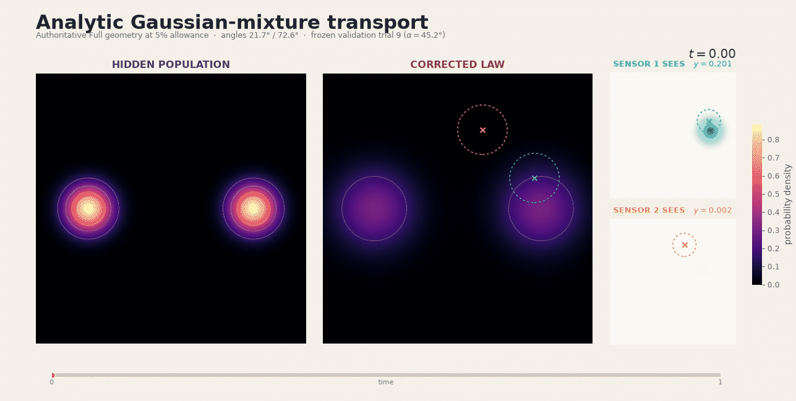

*Animation: hidden population, measurement-implied law, and sensor views.* The left panel follows the analytic hidden population from the horizontal to the vertical endpoint. The center panel shows the law obtained by maximum-entropy information projection of the frozen endpoint reference onto the two reconstructed sensor moments. The two panels on the right isolate the spatial region seen by each sensor and report its scalar response $y$. The colored crosses are sensor centers and the dashed circles indicate one sensor width.

The corrected law is required to reproduce the two observations; it is not expected to reconstruct the hidden density pointwise. Differences away from the sensor supports are therefore not reconstruction failures. They are the unresolved directions inside the moment fiber, completed using the common reference. FIDE measures how much reference-relative dynamical correction is needed to realize this *complete measurement-implied path*.

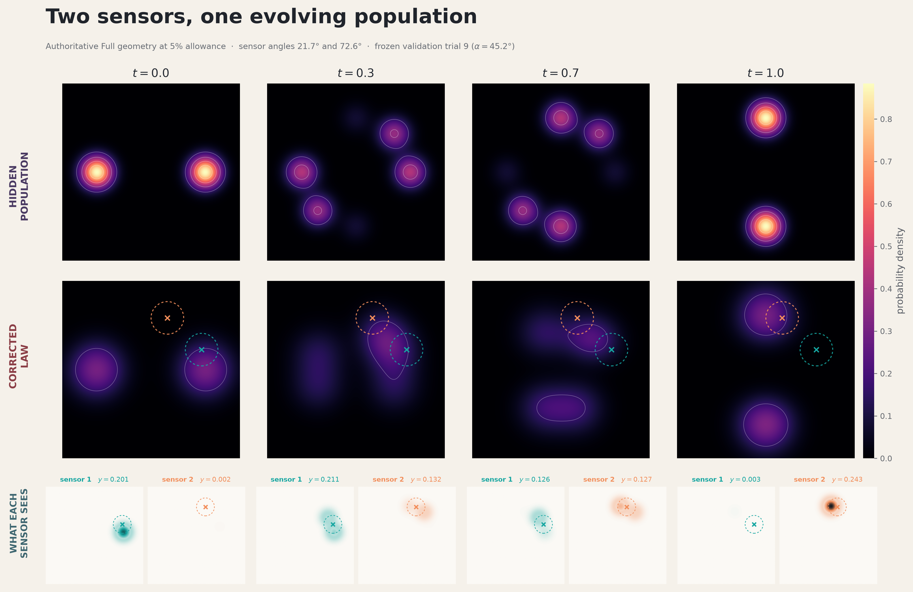

*Static companion: four audited snapshots.* Each column is one time point from a frozen validation trial near the representative nuisance orientation $\alpha=45^\circ$. The top row is the hidden law, the middle row is the sensor-consistent information projection, and the bottom row shows what each sensor contributes to its scalar reading. The figure uses the authoritative 5% Full geometry, with sensor angles approximately $21.7^\circ$ and $72.6^\circ$. At the endpoints, one sensor is naturally more informative than the other; during the transition their roles rebalance as mass moves through their supports.

#### Analytical experimental-design comparison
The design variable is the pair of sensor angles $\eta=(\theta_1,\theta_2)$. Every candidate uses the same frozen reference, observation protocol, selection bank, and independent validation bank. We compare three ways to choose the sensors:

- **Law** minimizes the finite-data scientific risk and supplies the frozen risk anchor.

- **Tangent** minimizes the least correction visible through the two measured moment rates, subject to the same population and risk restrictions.

- **Full/FIDE** minimizes the action of the complete information-projected law, again only among designs that pass those scientific-risk restrictions.

For an allowed Law-relative risk increase $p\in\{0.5,1,2,3,4,5\}$, Full and Tangent must satisfy

$$L(\eta)\leq L_{\max}.$$

$$R(\eta)\leq\left(1+\frac{p}{100}\right)R_{\mathrm{Law}}.$$

This is an information-first comparison: Full action does not compensate for an uninformative experiment. It ranks designs only after the population and finite-data scientific-risk screens have been passed. Candidate selection uses frozen data, and the final geometry is evaluated on a disjoint bank of 128 validation trials.

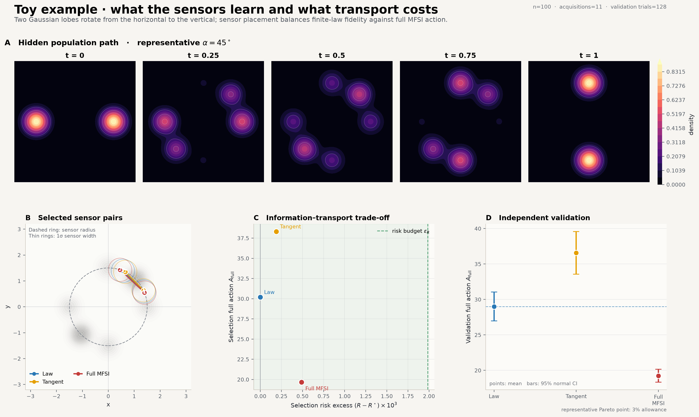

*Experiment dashboard: what is optimized and what is validated.* Panel A shows the analytic hidden path for the representative $45^\circ$ orientation. Panel B overlays the Law, Tangent, and Full sensor pairs on the admissible ring. Panel C compares their exact selection risk and common Full action at the 3% allowance; the vertical dashed line is the risk limit. Panel D reports independent-validation Full action with 95% normal intervals. The nearby sensor layouts are not dynamically interchangeable: Full sharply reduces the common Full action, whereas the Tangent-selected geometry optimizes a weaker moment-rate quantity and performs worse under the law-level metric.

#### Analytical results
The corrected percentage sweep passes every declared selection and validation gate. The principal independently validated results are:

| Allowed extra risk | Full sensor angles          | Selection risk increase | Validation Full action | Reduction versus Law | Hidden-action fraction $\Gamma_h$ |
| -----------------: | :-------------------------- | ----------------------: | ---------------------: | -------------------: | --------------------------------: |
|               0.5% | $(23.09^\circ,69.06^\circ)$ |                  0.040% |       $26.619\pm0.856$ |                8.26% |                            97.39% |
|                 1% | $(20.79^\circ,71.67^\circ)$ |                  0.775% |       $20.310\pm0.634$ |               30.00% |                            95.82% |
|                 2% | $(21.15^\circ,72.03^\circ)$ |                  0.752% |       $19.747\pm0.542$ |               31.94% |                            95.69% |
|                 3% | $(21.50^\circ,72.38^\circ)$ |                  0.739% |       $19.243\pm0.461$ |               33.68% |                            95.56% |
|                 4% | $(21.68^\circ,72.56^\circ)$ |                  0.735% |       $19.013\pm0.425$ |           **34.47%** |                            95.49% |
|                 5% | $(21.68^\circ,72.56^\circ)$ |                  0.735% |       $19.013\pm0.425$ |           **34.47%** |                            95.49% |

The common Law geometry has validation Full action $29.014\pm1.033$. At the representative 4% operating point, Full therefore reduces held-out action by **34.47%** while using only a **0.735%** increase in selection risk, less than one fifth of the available 4% budget. The 5% solution repeats the 4% geometry because no feasible audited candidate improved its action beyond the declared tolerance.

The last column is equally important. Across the sweep, approximately 95.5%–97.4% of the Full correction energy lies outside the two measured moment-rate directions. The Tangent criterion consequently misses most of the law-level correction and does not preserve the Full ranking. This experiment is the concrete numerical example of why matching aggregate moment dynamics is not the same as making the complete inferred law dynamically compatible.

#### Reading the analytical result figures
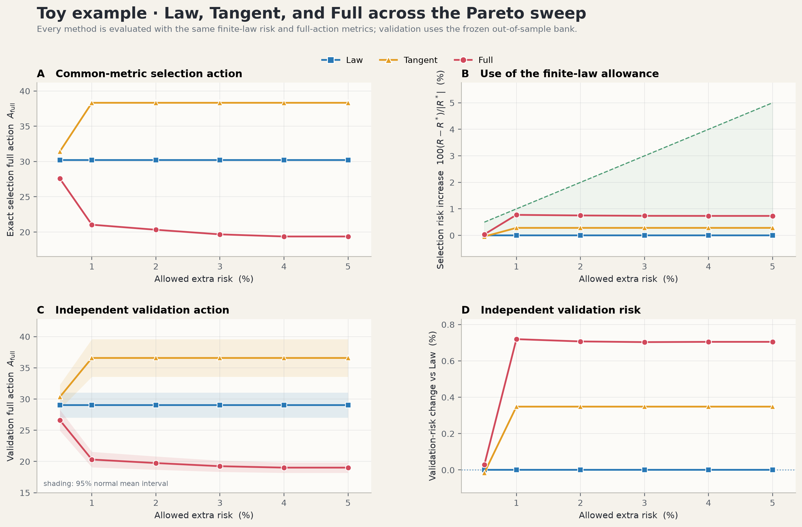

*Cost and risk-use curves.* In panel A, 100% is the Full action of the Law geometry on the same bank; lower is better. Solid curves are selection results and dashed curves are independent validation. Full falls from roughly 92% of Law at 0.5% allowance to roughly 65% at 4%–5%. Tangent rises above 100%, so its smaller moment-rate correction does not imply a smaller full-law correction. Panel B shows the fraction of the available Law-relative risk budget actually used. Only the solid selection curves are constrained; dashed validation risk is an out-of-sample diagnostic rather than a second optimization constraint.

Together, the animation and figures separate four ideas that should not be conflated: the hidden population used only for benchmarking, the sparse aggregate observations available to the experiment, the canonical law completed from those observations and the frozen reference, and the Full action used to compare scientifically admissible sensor designs.

All displayed media are post-processing of frozen artifacts; generating them does not retrain the reference or rerun sensor optimization. The source scripts are [`visualize_paper_gif.py`](experiments/toy_example_percentage/visualize_paper_gif.py), [`visualize_paper.py`](experiments/toy_example_percentage/visualize_paper.py), and [`visualize_pareto.py`](experiments/toy_example_percentage/visualize_pareto.py).

For reproducibility and numerical details, see the [analytical-example README](experiments/toy_example_percentage/README.md) and [Appendix B.2 of the technical writeup](technical_writeup.pdf).

### Vortices

The second experiment moves from an analytically prescribed mixture path to a nonlinear bounded flow. A population of particles is stretched and folded inside a rectangular double gyre while four Gaussian sensors provide only noisy population averages. The experiment retains the same FIDE question—among scientifically adequate sensor systems, which geometry implies the most dynamically compatible complete law—but adds moving coherent structures, impermeable walls, four continuously positioned sensors, and sensitivity to the numerical treatment of density and flux at the boundary.

This section summarizes the confirmed V2.1 experiment. Its full physical configuration, frozen protocols, numerical-repair history, standalone reproduction path, and figure-by-figure audit are in the [vortices-experiment README](experiments/vortices_percentage/README.md). The original V1 study is archived in the ignored `old_stuff/` tree; V2.1 is the canonical, standalone implementation under `experiments/vortices_percentage/`.

#### Double-gyre system and observations

The state lies in $[0,2]\times[0,1]$ and follows the standard time-dependent double-gyre velocity with amplitude $A=0.1$, modulation $\epsilon=0.25$, physical period $10$, and horizon $10$. The initial population combines a 10% uniform background with four narrow truncated Gaussian components. As the separatrix oscillates, the flow moves, stretches, and exchanges these concentrations between the two gyres.

Each candidate experiment places four Gaussian sensors of width `0.12` subject to boundary and pairwise-separation constraints of `0.24`. A finite trial observes 2,000 particles at nine acquisition nodes with detector-noise standard deviation `0.005`; bounded endpoint-anchored splines reconstruct the four moment trajectories on the 21-node scientific grid. Scientific risk is a multiscale MMD criterion, and the Full design is considered only if it satisfies the same population screen and a Law-relative risk allowance.

Three endpoint-trained, box-logit neural references are frozen before sensor selection. Their 3 training seeds each supplies a 32,768-particle rollout. A hard empirical information projection then tilts each reference law to match the four reconstructed sensor moments. As in the analytical example, the resulting law is a canonical completion of the aggregate observations, not a pointwise reconstruction claim.

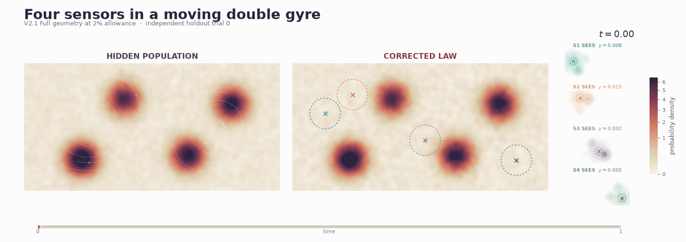

*Animation: hidden double-gyre population, projected law, and the four aggregate sensor views.* The left panel is the simulator population used to generate and benchmark the observations; the center panel is the sensor-consistent information projection of a frozen reference; the right panels show the spatial contribution to each scalar sensor reading. The animation uses the confirmed 2% Full geometry. Differences away from the sensor supports are unresolved directions in the moment fiber, not violations of the measured constraints.

#### Bounded-domain Full action

The bounded rectangle makes the physical Full-action discretization consequential. V2 uses the same cell-integrated, even-reflected Gaussian kernel for density and signed continuity source, a matched reflected reference flux, no artificial floor in the physical projected density, and a homogeneous-Neumann weighted Poisson solve. The exact evaluator uses a `256 × 128` grid at all 21 time nodes and fails closed on mass, compatibility, calibration, covariance, effective-sample-size, and linear-solver gates.

Selection is feasibility-first: exact population and finite-risk checks define the admissible candidate set before Full action is used for ranking. One 128-trial selection bank is shared across all methods and all three references. The final comparison freezes one Law geometry and one Full geometry per allowance, then evaluates them on a fresh shared 64-trial holdout using all three references. Tangent is also cross-evaluated on that bank as a supplementary descriptive comparison, but it is not part of the primary Law–Full simultaneous inference family.

#### Confirmed Pareto result

The confirmed scope is intentionally limited to allowances of 0.5%, 1%, and 2% rather than 0.5%-5% due to limited hackathon time. Across the four designs, three references, and 64 trials, all ordered exact evaluations pass every numerical gate. The Full/FIDE designs produce the following independent holdout results:

| Allowed extra risk | Selection risk increase | Holdout risk change vs Law | Holdout Full action | Reduction versus Law |
| -----------------: | ----------------------: | -------------------------: | ------------------: | -------------------: |
|               0.5% |                  0.291% |                     0.303% |              1.4598 |            **8.28%** |
|                 1% |                  0.810% |                     0.850% |              1.3974 |           **12.19%** |
|                 2% |                  1.556% |                     1.599% |              1.3414 |           **15.71%** |

The common Law holdout action is `1.5915`. All nine reference-by-allowance simultaneous 95% lower bounds for the Full-versus-Law reduction are strictly positive; the common max-deviation half-width is `2.454` percentage points and the maximum within-reference relative standard error is `2.442%`. The confirmed effect therefore grows from 8.28% to 15.71% over the completed range without relying on a single reference replicate.

The Tangent geometries reduce holdout Full action by 5.21%, 5.85%, and 3.45% at the same allowances. That descriptive curve is weaker and nonmonotone under the Full metric, especially at 2%, illustrating again that a geometry optimized for visible moment-rate correction need not minimize the correction of the complete projected law.

#### Reading the vortices figures

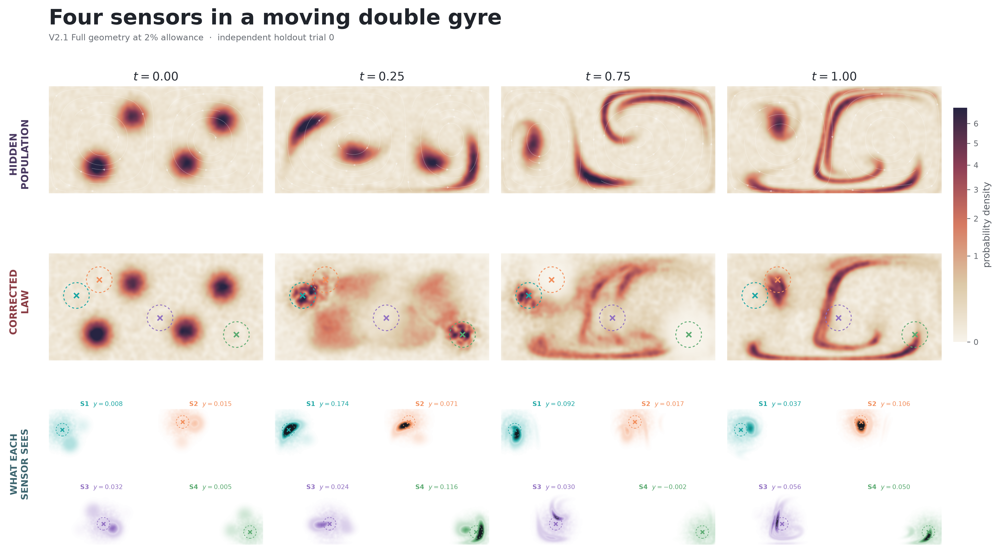

*Four audited snapshots at the largest completed allowance.* Each column is one scientific time, with the hidden population above, the four-moment information projection in the middle, and the sensor-supported contributions below. The sensor centers adapt to different moving structures, while the projected law remains moment-consistent to numerical precision. This is the geometry that yields the 15.71% holdout action reduction; it should not be interpreted as a completed design for allowances above 2%.

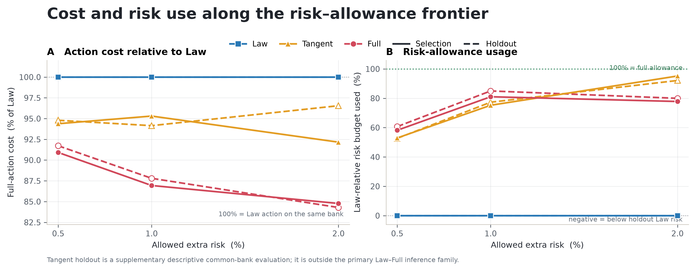

*Action cost and risk use in the same visual language as the analytical experiment.* In panel A, Law is 100% and lower is better; Full remains below both Law and Tangent on selection and holdout at every evaluated allowance. Panel B shows the percentage of the available Law-relative risk budget used. Solid curves are selection values and dashed curves are independent holdout cross-evaluations; only the solid selection risks are constrained.

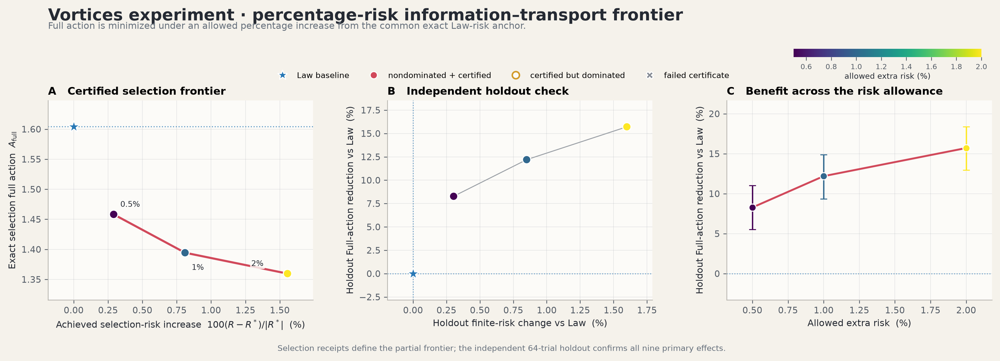

*From selected frontier to independent confirmation.* The panels connect the frozen selection certificates, the fresh holdout Pareto coordinates, and the reference-wise simultaneous intervals. The positive intervals show that the Full reduction is not driven by one reference seed, while the holdout panel confirms that the selected risk/action tradeoff persists out of sample.

#### Why the current frontier stops at 2%

The original plan included 3%, 4%, and 5% allowances, but the exact three-reference `256 × 128` evaluation was too expensive to complete within the hackathon window. We therefore paused those branches and froze a reduced confirmatory protocol for the already completed 0.5%–2% geometries before inspecting their action results. The earlier 1,024-trial confirmation was retired outcome-blind; the accepted fresh 64-trial bank was then generated and evaluated under prespecified precision and validity gates.

This is a scope decision, not evidence that the Pareto curve saturates at 2%. Future work will complete a broader allowance sweep and test whether more permissive scientific-risk budgets reveal a larger Full-action reduction. Until then, no 3%–5% vortices claim is made.

All displayed media are deterministic post-processing of frozen artifacts. The [saved-result verifier](experiments/vortices_percentage/verify_saved_result.py), [standalone publication bundle](experiments/vortices_percentage/outputs/published/README.md), and [full result report](experiments/vortices_percentage/VORTICES_V2_1_C3_64_RESULT.md) provide progressively deeper audit surfaces. The tracked inputs and compact published outputs are sufficient to regenerate every vortices plot and GIF from a fresh clone without rerunning selection or confirmation.

See [Section 6 and Appendix B.3 of the technical writeup](technical_writeup.pdf)
and the [vortices-example README](experiments/vortices_percentage/README.md) for more detail.

### Vortices Prospective

The third experiment keeps the same bounded double gyre, four Gaussian sensors,
finite observation model, and reflected Full-action solver, but changes the
information boundary before selection. **Vortices** above is a retrospective
percentage-risk study: it selects against frozen microscopic simulation banks
and uses three endpoint-reference seeds. **Vortices Prospective** receives only
endpoint ensembles, aggregate sensor-response fields, their complete
finite-sampling covariance, and aggregate scientific-QoI predictions. No
intermediate target particles or simulator path are available until all sensor
geometries have been frozen.

The complete protocol, numerical details, visual audit, staged replay, and
limitations are documented in the standalone
[Vortices Prospective README](experiments/vortices_prospective/README.md). The
retired prospective implementation is archived under `old_stuff/`; the
canonical directory has no runtime or test import from that archive.

#### What changes in the prospective experiment

| Property               | Vortices                                          | Vortices Prospective                                                      |
| :--------------------- | :------------------------------------------------ | :------------------------------------------------------------------------ |
| Selection information  | Frozen microscopic target/reference banks         | Endpoints plus aggregate predictive fields only                           |
| Selection references   | Three frozen seeds                                | One frozen D0 seed                                                        |
| Validation references  | Same three references on a fresh 64-trial holdout | Fresh independent E1 seed trained only after the repaired frontier freeze |
| Risk allowances        | 0.5%, 1%, 2%                                      | 0.5%, 1%, 2%                                                              |
| Main uncertainty claim | Simultaneous reference-by-allowance intervals     | Paired trial interval for the strict 2% effect conditional on held-out E1 |
| Scientific purpose     | Robust retrospective confirmation                 | Aggregate-only prospective transfer test                                  |

The final prospective freeze order is one-way: reuse aggregate inputs and D0,
freeze the reoptimized Law anchor, rerun Full at 0.5% and 1%, adopt the audited
authoritative 2% escape hatch, freeze all three points, then train E1 and create
fresh hidden validation. E1 is validation-only and is never folded back into
optimization.

`D0` and `E1` are internal optimization-artifact labels for the selection and
fresh validation reference seeds; they do not denote different physical
regimes.

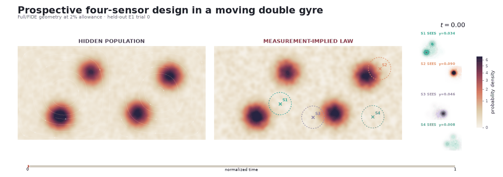

*Animation: the repaired prospective 2% Full geometry on held-out trial 0,
using the same visual grammar as Vortices Percentage.* The hidden
population at left was sealed during selection. The middle panel is the law
completed from four aggregate observations and the frozen endpoint
reference; the narrow panels show what each sensor sees. As in the other
experiments, pointwise differences away from the sensor supports are unresolved
moment-fiber directions rather than failed measurement constraints.

#### Final repaired prospective result

After a stronger Law audit, Full was rerun at 0.5% and 1%; the saved
authoritative feasible finalist was adopted at 2%. A fresh reference and 64
fresh paired hidden trials were generated only after that repaired freeze:

| Allowed extra risk | E1 Law action | E1 Full action | Reduction versus Law | E1 Law risk | E1 Full risk | Paired action-difference 95% CI |   Result   |
| -----------------: | ------------: | -------------: | -------------------: | ----------: | -----------: | :------------------------------ | :--------: |
|               0.5% |       1.70295 |        1.70295 |                0.00% |     1.15612 |      1.15612 | `[0, 0]`                        | no benefit |
|                 1% |       1.70295 |        1.70295 |                0.00% |     1.15612 |      1.15612 | `[0, 0]`                        | no benefit |
|                 2% |       1.70295 |        1.42700 |           **16.20%** |     1.15612 |      1.17102 | `[-0.31510, -0.23681]`          |  **PASS**  |

All three points pass the repaired risk and numerical gates. The tight points select Law
itself, so they certify feasibility but no benefit. At 2%, observed repaired risk is
1.29% above Law—inside the 2% allowance—and Full action is 16.20% lower with a
strictly negative paired interval. Tangent is omitted because there was not
enough time to rerun it after repairing Law due to limited time.

#### Reading the prospective figures

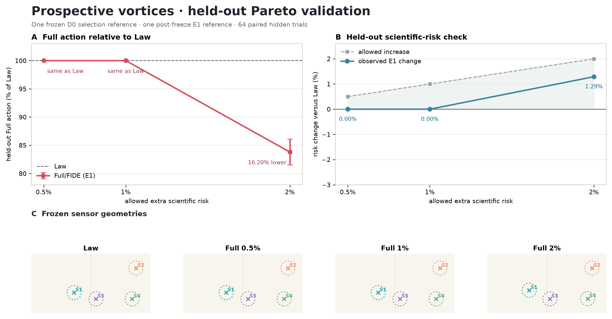

*Held-out action, risk, and geometry.* Panel A normalizes Full action by the
common E1 Law action and includes paired 95% intervals. Panel B compares the
allowed positive risk change with observed E1 change. Panel C shows that 0.5%
and 1% repeat Law while the 2% geometry is distinct.

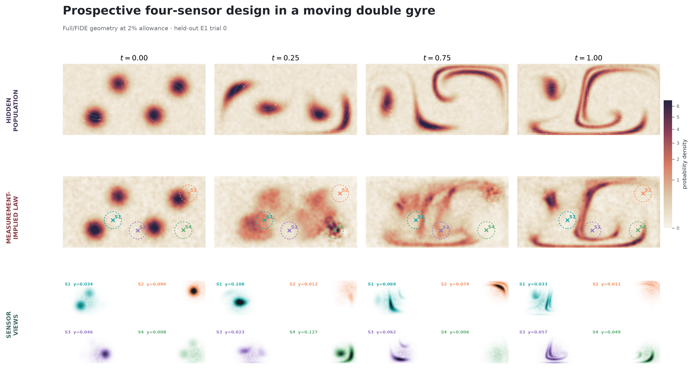

*Four held-out snapshots at the largest preregistered allowance.* The first row
shows hidden double-gyre truth, the second the complete measurement-implied law,
and the third the four sensor-supported views. The projected law matches the
four aggregate trajectories to numerical precision while the frozen reference
completes everything those moments do not identify.

All prospective media are deterministic post-processing of the completed E1
artifacts. The compact [validation summary](experiments/vortices_prospective/results/validation_summary.json),
[saved-result verifier](experiments/vortices_prospective/verify_saved_result.py),
and [visualization manifest](experiments/vortices_prospective/plots/visualization_manifest.json)
provide progressively deeper audit surfaces. No result beyond 2% and no
multi-seed prospective robustness claim is made.

The paper-level overview is in [Section 6 of the technical writeup](technical_writeup.pdf),
with the complete prospective specification and results in Appendix B.4.

## Structure of this Repository
The documented project surface now contains three experiments: the analytical Gaussian-mixture benchmark, the retrospective V2.1 Vortices benchmark, and the aggregate-only Vortices Prospective benchmark. All use the reusable FIDE implementation under `src/mfsi/`; the analytical workflow additionally exercises the two native Tesseract solvers directly during differentiable design.

```text
.
├── README.md                              # Project overview, results, and quick start
├── technical_writeup.pdf                        # Technical paper and mathematical details
├── pyproject.toml                         # Python package and optional dependency groups
├── src/mfsi/                              # Reusable JAX implementation of the FIDE pipeline
│   ├── measurements.py, moments.py        # Sensor maps and moment-trajectory reconstruction
│   ├── reference.py, flow_matching.py     # Endpoint-trained reference flow
│   ├── projection.py                      # Empirical information projection
│   ├── projection_tesseract.py            # JAX adapter for the native I-projection Tesseract
│   ├── poisson.py                         # Weighted-Poisson Full-action formulation
│   ├── poisson_tesseract.py               # JAX adapter for the native Poisson Tesseract
│   └── design.py, selection.py, ...       # Optimization, feasibility, rasterization, and diagnostics
├── experiments/
│   ├── toy_example_percentage/           # Analytical Gaussian-mixture experiment
│   │   ├── README.md                      # Complete scientific and reproduction guide
│   │   ├── config.json                    # Frozen production and smoke configuration
│   │   ├── domain.py, experiment.py       # Analytic law and end-to-end workflow
│   │   ├── run*.py, eval_pareto.py        # Execution and read-only result verification
│   │   └── figures/, outputs/pareto/      # Explanatory and authoritative result media
│   ├── vortices_percentage/              # Retrospective three-reference Vortices experiment
│       ├── README.md                      # Detailed scientific and reproduction guide
│       ├── domain.py, experiment.py       # Double gyre, observations, and scientific risk
│       ├── base_experiment_config.json    # Frozen physical and observation configuration
│       ├── inputs/                        # Frozen truth, endpoint, reference, and holdout banks
│       ├── core.py, config.json           # Reflected V2 Full-action method
│       ├── run_reference_stage.py         # Three endpoint-reference training runs
│       ├── execute_v2_1_selection.py      # Feasibility-first sensor selection
│       ├── verify_saved_result.py         # Fast read-only published-result verification
│       ├── VORTICES_V2_1_*               # Frozen protocols and result report
│       ├── plots/                         # Tracked figures, GIF, and rendered data copies
│       └── outputs/published/             # Compact result records and provenance receipts
│   └── vortices_prospective/             # Aggregate-only prospective Vortices experiment
│       ├── README.md                      # Detailed scientific and reproduction guide
│       ├── prospective_data.py            # Enforced selection information boundary
│       ├── reflected_raster.py            # Local matched reflected density/source solver
│       ├── run_v6a_risk_study.py          # One-seed, three-allowance staged workflow
│       ├── verify_saved_result.py          # Fast compact-result and media verification
│       ├── render_results.py               # Deterministic snapshots, dashboard, and GIF
│       └── results/, plots/                # Held-out summary and tracked media
├── native/
│   ├── iprojection_tesseract/             # C++17/OpenMP batched information projection
│   └── poisson_tesseract/                 # C++17/OpenMP batched weighted Poisson solver
└── tests/                                 # Shared and analytical-workflow verification
```

Each experiment owns its scientific model, frozen configuration, orchestration, and evidence. `src/mfsi/` contains reusable numerical components, while `native/` contains the accelerated implicit solvers exposed to JAX. Neither canonical vortices experiment imports its ignored predecessor. Raw V2.1 development trees remain under `old_stuff/vortices_percentage_v2_1_development/`; the former prospective implementation and successor-development notes remain under `old_stuff/vortices_prospective_legacy/`.

## Getting Started
Run the commands below from the repository root. This quick-start intentionally covers only the analytical Gaussian-mixture experiment, which is the shortest way to verify the implementation and exercise both Tesseract backends. Both vortices workflows are standalone but substantially more expensive; use the [Vortices reproduction guide](experiments/vortices_percentage/README.md#reproduce-and-verify) or the [Vortices Prospective reproduction guide](experiments/vortices_prospective/README.md#reproduce-and-verify) for their saved-result verifiers and staged commands. The documented development environment is Linux under WSL2; the Python package is portable, but the native Tesseract build assumes a C++17 compiler and OpenMP.

### Prerequisites
- Python 3.11 or newer;

- Git and a working Python virtual-environment installation;

- a C++17 compiler with OpenMP support and a native build driver such as Make or Ninja; and

- an NVIDIA GPU only if CUDA acceleration is desired. CPU JAX is sufficient for saved-result verification and basic development.

### Install the Python environment
Create an isolated environment and install the package, the analytical experiment's SciPy/Matplotlib dependencies, the Tesseract runtime, and the test runner:

```bash

python3 -m venv .venv

.venv/bin/python -m pip install --upgrade pip

.venv/bin/python -m pip install -e '.[analytical,tesseract-cpp]' 'pytest>=8'

```

The `analytical` extra contains only the SciPy/Matplotlib dependencies needed by the Gaussian-mixture experiment.

### Optional: reproduce the reported GPU environment
The command above installs a compatible default JAX build. For the reported CUDA 12 configuration, install the pinned accelerator build into the same environment:

```bash

.venv/bin/python -m pip install 'jax[cuda12]==0.8.3'

```

JAX accelerator wheels and driver requirements change independently of this repository. Consult the [official JAX installation guide](https://docs.jax.dev/en/latest/installation.html) when using another CUDA generation, operating system, or accelerator. Keep JAX within the package's declared range unless the repository has first been qualified against a newer release.

### Build the analytical example's Tesseract backends
The analytical example explicitly requests both the empirical information-projection backend and the weighted-Poisson backend. Build both extensions with the same Python environment used above:

```bash

.venv/bin/cmake \

  -S native/iprojection_tesseract \

  -B native/iprojection_tesseract/build \

  -DCMAKE_BUILD_TYPE=Release \

  -DPython_EXECUTABLE="$PWD/.venv/bin/python"

.venv/bin/cmake --build native/iprojection_tesseract/build --parallel "$(nproc)"

.venv/bin/cmake \

  -S native/poisson_tesseract \

  -B native/poisson_tesseract/build \

  -DCMAKE_BUILD_TYPE=Release \

  -DPython_EXECUTABLE="$PWD/.venv/bin/python"

.venv/bin/cmake --build native/poisson_tesseract/build --parallel "$(nproc)"

```

For repeatable local runs, enable 64-bit JAX and choose an OpenMP thread count no larger than the available physical cores. The value `8` below is a conservative example, not a scientific hyperparameter:

```bash

export JAX_ENABLE_X64=1

export XLA_PYTHON_CLIENT_PREALLOCATE=false

export OMP_NUM_THREADS=8

export OMP_DYNAMIC=FALSE

export OMP_PROC_BIND=close

export OMP_PLACES=cores

```

The native modules use double precision, C++17, OpenMP, `-O3`, and `-march=native`; they deliberately do not use `-ffast-math`. Their detailed contracts are documented in the [I-projection backend README](native/iprojection_tesseract/README.md) and [weighted-Poisson backend README](native/poisson_tesseract/README.md).

### Verify the installation and saved result
First confirm which JAX device is active and that 64-bit mode is enabled:

```bash

.venv/bin/python - <<'PY'

import jax

jax.config.update("jax_enable_x64", True)

print("JAX version:", jax.__version__)

print("devices:", jax.devices())

print("64-bit enabled:", jax.config.x64_enabled)

PY

```

Then test the two native interfaces and verify the hashes, nesting, certificates, method tables, and 2,304 saved validation records behind the analytical result:

```bash

OMP_NUM_THREADS=4 .venv/bin/python -m pytest -q \

  tests/test_projection_tesseract.py \

  tests/test_poisson_tesseract.py

.venv/bin/python experiments/toy_example_percentage/eval_pareto.py

```

The evaluator is read-only: it reports the tracked authoritative sweep and does not run training, optimization, Tesseract, or validation again.

### Regenerate the analytical figures
The plotting scripts consume the tracked frozen artifacts. The commands below write into the ignored `outputs/reproduction/figures/` directory so the figures are not overwritten:

```bash

figure_dir=experiments/toy_example_percentage/outputs/reproduction/figures

mkdir -p "$figure_dir"

.venv/bin/python experiments/toy_example_percentage/visualize_pareto.py \

  --output "$figure_dir/pareto.png"

.venv/bin/python experiments/toy_example_percentage/visualize_paper.py \

  --output-stem "$figure_dir/toy_population_correction_sensors"

.venv/bin/python experiments/toy_example_percentage/visualize_paper_gif.py \

  --output "$figure_dir/toy_population_correction_sensors.gif"

```

These are deterministic post-processing commands; they do not retrain the reference, search for new sensors, or create new validation evidence.

### Run a new experiment
Use the smoke profile to check the complete pipeline with a small diagnosis run:

```bash

.venv/bin/python experiments/toy_example_percentage/run.py \

  --smoke \

  --output-dir experiments/toy_example_percentage/outputs/reproduction/smoke

```

To generate a new full base run under `config.json`, omit `--smoke` and use a new output directory. This is substantially more expensive and does not by itself reproduce the later corrected nested `101 x 101` Full sweep:

```bash

.venv/bin/python experiments/toy_example_percentage/run.py \

  --output-dir experiments/toy_example_percentage/outputs/reproduction/source

```

The authoritative replay has three deliberately distinct levels: fast saved-artifact verification, base-run regeneration, and the expensive checkpointed corrected Full sweep reconstructed from its frozen historical seed tree. Follow the [analytical-example reproduction guide](experiments/toy_example_percentage/README.md#reproduction) before attempting the third level; do not use the smoke profile or the older `outputs/run/result.json` as authoritative evidence.

## Future Work
Future work will focus on:

- **Completing the vortices Pareto frontier.** The current confirmed result covers 0.5%–2% because exact three-reference evaluation was limited by the hackathon schedule. Completing 3%–5%, adding finer allowances, and testing whether a broader risk budget produces a larger Full-action reduction are immediate priorities.

- **Scaling to many-body systems.** Extend the current benchmark suite beyond low-dimensional transport problems to interacting many-body systems.

- **Empirically validating the unbalanced formulation.** The current experiments evaluate the balanced probability-law setting. A natural next step is to test the move–reaction extension on systems in which mass is created, destroyed, or exchanged, such as active nematics.

- **Stress-testing the limits of FIDE.** Run systematic ablation suites over measurement sparsity, noise level, number of observables, reference quality, and scientific-risk tolerance to identify regimes in which Full transportability provides meaningful design information and regimes in which it does not.

- **Studying robustness to the frozen reference.** Full action is reference-relative, so an important question is how stable the selected design is across reference-model seeds, architectures, training procedures, and degrees of reference misspecification.

- **Moving from retrospective to prospective design.** In a prospective experimental-design setting, measurements associated with a candidate design have not yet been acquired. Future work will study predictive models for candidate measurement responses and quantify how errors in those predictions propagate into the final FIDE design.

- **Scaling the Full-action computation to higher-dimensional state spaces.** The current benchmarks solve the weighted Poisson problem on a physical spatial discretization. Extending FIDE to high-dimensional molecular, cellular, or many-body state spaces will require more scalable representations of the Full correction.

- **Sequential and adaptive experimental design.** The current formulation optimizes a fixed measurement design. A natural extension is to allow the design to evolve as observations arrive, choosing subsequent measurements based on the law reconstruction induced by earlier ones.

- **Broadening the class of observables.** Beyond localized sensors, future experiments could consider projections, nonlinear detector responses, pair statistics, structure factors, and other scientifically meaningful aggregate observables.

- **Extending the theory beyond the current regularity regime.** Further work could study rank-deficient or changing observable families, nonsmooth measurement maps, more general boundary conditions, and broader classes of unbalanced dynamics.

## Tech Stack
### Hardware configuration
All reported experiments were executed locally on a high-performance laptop, there was no remote cluster or external job scheduler. The machine used an Intel Core Ultra 9 275HX processor with 24 cores and a maximum turbo frequency of 5.4 GHz, together with an NVIDIA GeForce RTX 5090 Laptop GPU with 24 GB of dedicated GDDR7 memory.

The workload was divided between the GPU and CPU:

- **GPU:** JAX particle simulations, endpoint-reference flow training, and automatic differentiation.

- **CPU:** batched native information-projection trajectories and the Tesseract weighted-Poisson search solves, using C++17 and OpenMP. The authoritative sparse Poisson evaluations also ran on the CPU.

This split is central to the implementation: JAX retains the outer differentiable experiment-design loop, while Tesseract carries gradients through the CPU-native solvers described above.

### Software environment
The experiments ran under Windows Subsystem for Linux 2 (WSL2), using Ubuntu 24.04.3 LTS and Linux kernel `6.6.87.2-microsoft-standard-WSL2`. The principal implementation used Python 3.12.3 and JAX 0.8.3 with 64-bit floating-point precision enabled. GPU acceleration used the JAX CUDA 12 backend and its packaged CUDA 12.9 runtime.

The information-projection Tesseract evaluates complete batched empirical projection trajectories with a double-precision Newton solver. Multipliers are warm-started between consecutive time nodes, while independent trajectories and linear-algebra operations are parallelized with OpenMP. The native extension is exposed through pybind11 and integrated into JAX with `tesseract-jax`. Its JVPs and VJPs use implicit moment-covariance solves rather than differentiating through individual Newton iterations.

The native extensions were compiled in release mode with GNU C++ 13.3, C++17, `-O3`, and `-march=native`. We deliberately did not enable `-ffast-math`, in order to preserve the numerical behavior of the double-precision solvers.

| Component                      | Configuration used for the reported experiments       |
| :----------------------------- | :---------------------------------------------------- |
| Execution host                 | Local high-performance laptop                         |
| Operating system               | Ubuntu 24.04.3 LTS under WSL2                         |
| Linux kernel                   | `6.6.87.2-microsoft-standard-WSL2`                    |
| Processor                      | Intel Core Ultra 9 275HX, 24 cores, up to 5.4 GHz     |
| GPU                            | NVIDIA GeForce RTX 5090 Laptop GPU                    |
| GPU memory                     | 24 GB GDDR7                                           |
| NVIDIA driver                  | 581.57                                                |
| Python                         | 3.12.3                                                |
| JAX                            | 0.8.3                                                 |
| jaxlib                         | 0.8.3                                                 |
| Accelerator backend            | CUDA 12 via JAX CUDA plugin 0.8.3                     |
| CUDA runtime                   | 12.9, packaged with JAX                               |
| NumPy                          | 2.5.1                                                 |
| SciPy                          | 1.18.0                                                |
| Tesseract Core                 | `tesseract-core` 1.11.0                               |
| Tesseract JAX interface        | `tesseract-jax` 0.2.3                                 |
| Information-projection backend | Native Tesseract C++/OpenMP batched trajectory solver |
| Differentiable Poisson backend | Native Tesseract C++/OpenMP batched PCG solver        |
| C++ language standard          | C++17                                                 |
| C/C++ compiler                 | GCC/G++ 13.3.0                                        |
| Build system                   | CMake 4.4.2, release configuration                    |
| Python/C++ bindings            | pybind11 3.1.0                                        |
| CPU parallelization            | OpenMP 4.5                                            |
| Native compilation             | `-O3`, `-march=native`, without `-ffast-math`         |
| Native numerical precision     | IEEE 754 double precision (`float64`)                 |
| Neural optimization            | Custom JAX implementation of Adam                     |
| JAX numerical precision        | 64-bit floating point enabled                         |
| Job scheduling                 | Local execution; no external scheduler                |

These are the versions used to produce the reported results, not the minimum installation requirements. The package itself supports Python 3.11 or newer; see `pyproject.toml` and the experiment-specific reproduction instructions for installation details.
