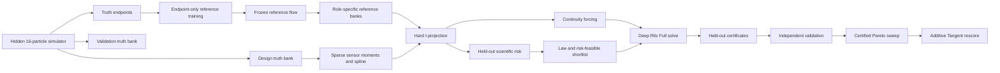

# Many-body skyrmion sensor design with FIDE, Deep Ritz, and Tangent analysis

This directory contains a controlled, high-dimensional sensor-design experiment for a driven many-body skyrmion system. The experiment asks:

> Where should four local-density sensors be placed so that sparse aggregate observations preserve scientifically important collective statistics of a 16-skyrmion system, while requiring as little correction as possible to an endpoint-trained reference dynamics?

One sample is an **entire 16-particle configuration**, not one particle. The microscopic state therefore lives in a 32-dimensional periodic configuration space. A frozen reference flow is trained using endpoint ensembles only. Sparse sensor moments are imposed by empirical information projection, and the velocity correction required to make the projected law dynamically consistent is computed in the full many-body space with a permutation-invariant Deep Ritz solver.

The completed experiment has three layers:

1. **Law design:** minimize a held-out scientific risk over sensor locations.
2. **Full design:** allow a small increase in that risk and minimize the certified full-law correction action.
3. **Tangent extension:** after the original Law/Full milestone was completed, separately compute the cheaper moment-only minimum-norm correction without changing or rerunning the certified Full results.

The authoritative Full Pareto sweep is certified and non-exploratory. At the primary 3% allowance, the independently validated Full action falls from `0.332057` for Law to `0.230970`, a **30.44% reduction**, while remaining inside the predeclared validation neighborhood. The later Tangent extension is also certified, but it solves a weaker moment-matching problem; its smaller actions do not mean it solved the stronger Full problem better.

This document describes the code and saved artifacts currently present. It is not merely a restatement of the original prompt. In particular, the original milestone intentionally excluded Tangent decomposition; Tangent was added later as an additive analysis that preserves the original result and provenance.

## Contents

- [Status at a glance](#status-at-a-glance)
- [Scientific question and experimental logic](#scientific-question-and-experimental-logic)
- [Terminology](#terminology)
- [Dimensionality](#dimensionality)
- [Hidden skyrmion dynamics](#hidden-skyrmion-dynamics)
- [Frozen endpoint-only reference](#frozen-endpoint-only-reference)
- [Sensor model and sparse observations](#sensor-model-and-sparse-observations)
- [Moment reconstruction](#moment-reconstruction)
- [Empirical information projection](#empirical-information-projection)
- [Continuity forcing](#continuity-forcing)
- [Full correction and Deep Ritz formulation](#full-correction-and-deep-ritz-formulation)
- [Tangent formulation](#tangent-formulation)
- [Scientific risk](#scientific-risk)
- [Sensor-design search](#sensor-design-search)
- [Certification and independent validation](#certification-and-independent-validation)
- [Data separation and leakage prevention](#data-separation-and-leakage-prevention)
- [Authoritative configuration](#authoritative-configuration)
- [Results](#results)
- [How to interpret the results](#how-to-interpret-the-results)
- [Visualizations](#visualizations)
- [Running the experiment](#running-the-experiment)
- [Artifact map](#artifact-map)
- [Source-code map](#source-code-map)
- [Testing](#testing)
- [Limitations and next experiments](#limitations-and-next-experiments)
- [Compact mathematical summary](#compact-mathematical-summary)

## Status at a glance

| Item | Implemented state |
|---|---|
| Microscopic state | One complete 16-skyrmion configuration |
| State dimension | `2 × 16 = 32` |
| Physical domain | Rectangular torus `[0,2) × [0,1)` |
| Design variables | Four 2-D sensor centers, hence 8 variables |
| Observation dimension | Four local-density moments per time |
| Scientific-risk dimension | Nine held-out collective features |
| Scientific time grid | 13 nodes on `[0,1]` |
| Reference | Permutation-equivariant endpoint conditional-flow-matching model |
| Reference policy | Trained once from endpoints; frozen for every design and Pareto row |
| Constraint enforcement | Hard empirical exponential information projection |
| Full inner solver | Time-conditioned, permutation-invariant JAX Deep Ritz |
| Primary allowance | 3% relative scientific-risk increase over Law |
| Full Pareto allowances | 0.5%, 1%, 2%, 3%, 4%, 5% |
| 3% milestone | Passed every standalone validation-gate check |
| Full Pareto | Certified; exploratory override is false |
| Tangent analysis | Certified additive extension; no Full rerun or truth/reference regeneration |
| Reproducibility seed | `20260822`, with declared role-specific offsets |
| Numeric precision | JAX 64-bit enabled by entry points |

Primary artifacts:

- `outputs/pareto_authoritative/pareto.json`: authoritative Full Pareto summary;
- `outputs/pareto_authoritative/pareto.csv`: tabular Full Pareto summary;
- `outputs/pareto_authoritative/risk_3pct/result.json`: detailed 3% Full result;
- `outputs/pareto_authoritative/risk_3pct/three_percent_validation.json`: standalone 3% gate;
- `outputs/pareto_authoritative/tangent_analysis/tangent_pareto.json`: Tangent extension;
- `outputs/pareto_authoritative/publication_figures/`: Full publication figures;
- `outputs/pareto_authoritative/tangent_analysis/figures/`: Tangent comparison figures.

`outputs/` is intentionally ignored by this experiment's `.gitignore`; run artifacts can be large and are local products.

## Scientific question and experimental logic

Let

\[
X_t=(\mathbf r_1(t),\ldots,\mathbf r_N(t))\in\Omega^N,
\qquad \mathbf r_i=(x_i,y_i),
\qquad N=16.
\]

The hidden simulator generates a truth law \(P_t\) over full configurations. A sensor design \(\eta\) exposes four aggregate moments

\[
c_\eta(t)=\mathbb E_{P_t}[\Phi_\eta(X_t)].
\]

An endpoint-only neural flow provides a deliberately incomplete reference law \(\widetilde Q_t\) and velocity \(u_t\). For a candidate geometry, the measured moments define an information-projected law \(Q_t^\eta\), absolutely continuous with respect to the frozen empirical reference support. FIDE then asks how much velocity correction is required to make this time-dependent projected law consistent with a continuity equation.

This creates two design objectives:

- **Scientific risk \(R(\eta)\):** how poorly the projected reference reproduces nine held-out many-body statistics of truth.
- **Full action \(A_{\mathrm{Full}}(\eta)\):** kinetic energy of the full many-body correction needed to realize the projected law dynamically.

The Law design is

\[
\eta_{\mathrm{Law}}\in\arg\min_\eta R(\eta).
\]

For relative risk allowance \(\tau\), Full is selected from

\[
R(\eta)\leq\left(1+\frac{\tau}{100}\right)R(\eta_{\mathrm{Law}})
\]

by minimizing certified action. The Pareto experiment quantifies how much action can be saved by allowing a small degradation in held-out scientific fidelity.

The workflow is risk-first and fail-closed:



## Terminology

### Truth

The stochastic driven Thiele-type simulator. It creates endpoint ensembles, design truth trajectories, and disjoint validation truth trajectories. Intermediate truth is never provided to reference training.

### Reference

The endpoint-trained, permutation-equivariant continuous-time neural velocity field. It is frozen before any sensor is evaluated. Every design sees the same checkpoint and common-random-number banks.

### Projected law

For geometry \(\eta\), the empirical exponential tilt of a frozen reference bank whose expected sensor outputs equal the reconstructed target moments. This is \(Q_t^\eta\).

### Law design

The sensor placement minimizing held-out scientific risk. “Law” is a **design criterion**, not a claim that its correction action is zero. The implementation solves and certifies a Full correction at the Law geometry to create the action baseline.

### Full design

The placement with the smallest certified full-law action among designs inside the chosen risk allowance. Each allowance may select a different geometry.

### Tangent design

The placement minimizing moment-only Tangent action inside the same risk allowance. Tangent enforces only four instantaneous moment-rate equations, not the full projected-law continuity equation.

### Selection versus validation

- **Selection** uses declared design/projection/Ritz train/Ritz audit banks and determines winners.
- **Validation** recomputes design-dependent quantities on disjoint truth and reference banks after winners are frozen.

Small selection/validation differences are expected. Validation is not a rerendering of selection.

## Dimensionality

### Microscopic configuration dimension

There are \(N=16\) particles and two coordinates per particle:

\[
d=2N=32.
\]

A bank row has shape `[16, 2]`; a trajectory bank has shape

```text
[time, configuration, particle, xy].
```

One `[16,2]` array is one statistical sample. The 16 particles are not treated as 16 independent observations.

### Space-time dimension of the Full potential

The shared selection network represents

\[
\psi_\theta:[0,1]\times(\mathbb T^2)^{16}\to\mathbb R.
\]

It is effectively a 33-variable scalar approximation problem: time plus 32 state coordinates. Time is evaluated on 13 nodes and encoded with five features.

During independent validation, the shared solution is broadcast into 13 independent per-time networks and polished. This relaxes cross-time sharing so validation is not artificially helped or hurt by the selection architecture's shared-time inductive bias.

### Design, constraint, and risk dimensions

| Object | Dimension |
|---|---:|
| Sensor design \(\eta\) | 8 = 4 centers × 2 coordinates |
| Moment constraint \(c_\eta(t)\) | 4 per time node |
| I-projection multiplier \(\lambda(t)\) | 4 per time node |
| Tangent Gram matrix \(G(t)\) | 4 × 4 per time node |
| Held-out scientific feature vector | 9 per configuration |
| Full correction velocity | 32 per configuration and time |
| Reference velocity | 32 per configuration and time |

The problem is high-dimensional because Full operates on the joint 32-dimensional configuration law. This is not captured by the small sensor count or a 2-D visualization.

## Hidden skyrmion dynamics

### Periodic domain

Particles move on

\[
\Omega=[0,L_x)\times[0,L_y),
\qquad (L_x,L_y)=(2,1).
\]

All physical distances use minimum-image displacement

\[
\delta_{\mathrm{per}}(z)=z-L\,\operatorname{round}(z/L)
\]

componentwise. Positions are reduced modulo the box after every step.

### Deterministic forces

For particle \(i\),

\[
F_i(X,t)=F_i^{\mathrm{int}}(X)+F_i^{\mathrm{pin}}(X)+F^{\mathrm{drive}}(t).
\]

For minimum-image pair vector \(d_{ij}=\mathbf r_i-\mathbf r_j\) and regularized distance

\[
\rho_{ij}=\sqrt{\lVert d_{ij}\rVert^2+10^{-8}},
\]

the repulsion is

\[
F_i^{\mathrm{int}}=\sum_{j\ne i}
k_{\mathrm{int}}e^{-\rho_{ij}/\ell_{\mathrm{int}}}
\frac{d_{ij}}{\rho_{ij}^2},
\]

with \(k_{\mathrm{int}}=0.035\) and \(\ell_{\mathrm{int}}=0.16\). The diagonal is explicitly removed.

There are five fixed Gaussian pinning wells:

\[
(0.36,0.24),\ (0.72,0.74),\ (1.05,0.46),\
(1.43,0.78),\ (1.72,0.25).
\]

For displacement \(d_{ip}=\mathbf r_i-p\),

\[
F_i^{\mathrm{pin}}=-k_{\mathrm{pin}}\sum_p
e^{-\lVert d_{ip}\rVert^2/(2\sigma_{\mathrm{pin}}^2)}
\frac{d_{ip}}{\sigma_{\mathrm{pin}}^2},
\]

where \(k_{\mathrm{pin}}=0.055\), \(\sigma_{\mathrm{pin}}=0.10\). The negative sign attracts particles to pins.

The longitudinal drive ramps near \(t=0.46\):

\[
F_x^{\mathrm{drive}}(t)=0.015+(0.13-0.015)\,\sigma(10(t-0.46)),
\]

while

\[
F_y^{\mathrm{drive}}(t)=0.018\sin(2\pi t).
\]

The ramp, interactions, pins, and transverse drive produce collective intermediate rearrangement.

### Dissipative and Magnus mobility

Force maps to deterministic velocity through

\[
v_i=\frac{\alpha F_i+G R_{90}F_i}{\alpha^2+G^2},
\qquad R_{90}(F_x,F_y)=(-F_y,F_x),
\]

with dissipation \(\alpha=1\) and Magnus coefficient \(G=0.32\). The rotated term makes velocity non-collinear with force.

### Stochastic rollout

Truth uses Euler–Maruyama:

\[
X_{k+1}=\operatorname{mod}_{L}\left(
X_k+\Delta t\,v(X_k,t_k)+0.006\sqrt{\Delta t}\,Z_k
\right).
\]

The authoritative run uses 24 truth substeps inside each of 12 scientific intervals. Initial states are a rectangular lattice adapted to box aspect ratio, perturbed with Gaussian standard deviation `0.035`, wrapped periodically, and independently relabeled by random particle permutations. This guards against exploiting lattice order. Particle count is fixed; no creation or annihilation occurs.

## Frozen endpoint-only reference

### Allowed training information

The reference receives only samples from \(P_0\) and \(P_1\). Its training function accepts matching endpoint arrays of shape `[sample, particle, 2]`; intermediate hidden trajectories never enter reference training.

After training, the checkpoint is frozen and hashed. The authoritative checkpoint SHA-256 is

```text
f0aa333a38cbd7f99748c83e4a13335e40b81e85385f333dd81b597dfcfad3a9
```

All Pareto rows copy and verify the same frozen artifacts. Tangent records hashes again and verifies that truth/reference files were not regenerated.

### Endpoint conditional-flow matching

Endpoint configurations \(X_0,X_1\) are independently sampled. With shortest periodic displacement

\[
\Delta=\delta_{\mathrm{per}}(X_1-X_0),
\]

at random \(t\sim U[0,1]\), the bridge is

\[
X_t^{\mathrm{bridge}}=\operatorname{mod}_L
\left(X_0+t\Delta+\gamma(t)Z\right),
\qquad \gamma(t)=0.01\sin(\pi t),
\]

and the velocity target is

\[
V_t^{\mathrm{target}}=\Delta+0.01\pi\cos(\pi t)Z.
\]

The network minimizes mean squared velocity error over complete configurations.

### Permutation-equivariant architecture

Each particle gets four periodic position features

\[
(\sin(2\pi x/L_x),\sin(2\pi y/L_y),
\cos(2\pi x/L_x),\cos(2\pi y/L_y))
\]

and five time features

\[
(t,\sin\pi t,\cos\pi t,\sin2\pi t,\cos2\pi t).
\]

The nine local features pass through a shared embedder. Mean pooling creates a global summary, concatenated with every local embedding and the time features before a shared 2-vector output head. A particle permutation therefore permutes velocities identically.

Authoritative settings: three hidden embedding layers of width 64, width-64 output head, SiLU activations, 6,000 Adam steps, batch size 512, learning rate `8e-4`, cosine decay to 8%, and gradient clip 8.

### Frozen reference banks

Reference banks begin from subsamples of the frozen endpoint-0 ensemble and use deterministic RK4 rollout with 14 substeps per scientific interval. Different seeds create separate roles. Each bank stores configurations, velocities, and uniform base weights.

## Sensor model and sparse observations

For \(R=4\) sensor centers \(s_j\), fixed width \(\ell=0.12\), and full configuration \(X\),

\[
\Phi_j(X;s_j)=\frac1N\sum_{a=1}^N
\exp\left[-\frac{\lVert\delta_{\mathrm{per}}(\mathbf r_a-s_j)\rVert^2}
{2\ell^2}\right].
\]

These observables are smooth, periodic, and permutation invariant. The design vector

\[
\eta=(s_{1x},s_{1y},\ldots,s_{4x},s_{4y})\in\mathbb R^8
\]

must remain in the box with pairwise minimum-image separation at least `0.20`.

The grid has 13 equally spaced nodes. Seven rounded uniform acquisition indices give

```text
[0, 2, 4, 6, 8, 10, 12].
```

At these nodes, observations average the first 512 design-truth configurations and add deterministic Gaussian noise with standard deviation `0.002`. The seed is common across designs. Endpoint anchors average the complete design truth bank.

## Moment reconstruction

Sparse observations supply targets and derivatives at all 13 nodes through the shared anchored cubic B-spline:

\[
\widehat c_\eta(t),\qquad \dot{\widehat c}_\eta(t).
\]

Endpoint basis columns are removed so the curve exactly honors full-bank means at \(t=0,1\). Interior coefficients solve

\[
\min_\beta
\lVert y-c_{\mathrm{linear}}-B\beta\rVert^2
+\rho\,\beta^\top\Omega\beta
+\epsilon\lVert\beta\rVert^2.
\]

Settings are three internal knots, smoothing `1e-4`, relative ridge `1e-10`, and roughness quadrature order 8. They are fixed globally, never tuned per design on validation. Acquisition indices, finite sample count, residual sum of squares, and roughness are saved.

## Empirical information projection

At each time, let \(\{X_n,b_n\}_{n=1}^M\) be a frozen reference bank and \(\phi_n=\Phi_\eta(X_n)\). The projected weights are

\[
w_n(\lambda)=\frac{b_n\exp(\lambda^\top\phi_n)}
{\sum_m b_m\exp(\lambda^\top\phi_m)}.
\]

The multiplier solves

\[
\lambda^*=\arg\min_\lambda\left[
\log\sum_n b_ne^{\lambda^\top\phi_n}
-\lambda^\top\widehat c_\eta(t)\right],
\]

equivalently enforcing

\[
\sum_nw_n(\lambda^*)\phi_n=\widehat c_\eta(t).
\]

The Jacobian is the projected covariance of \(\Phi\). Newton uses ridge `1e-9`, step cap 20, multiplier clip 1,000, eight line-search reductions, and warm starts over time. The authoritative backend is `tesseract_cpp`; smoke uses JAX.

Projection cannot create configurations outside empirical support. Every candidate therefore requires calibration residual at most `2e-6` and effective-sample-size fraction at least `0.05`, where

\[
N_{\mathrm{eff}}=\frac1{\sum_nw_n^2},
\qquad \mathrm{ESS\ fraction}=N_{\mathrm{eff}}/M.
\]

Calibration, support, forcing-compatibility, or conditioning failures are hard failures. There is no soft fallback with a favorable action.

## Continuity forcing

For sensor feature \(\Phi_r\), define the reference advective rate

\[
a_{nr}=D_X\Phi_r(X_n)u_t(X_n),
\]

evaluated with a JAX Jacobian-vector product. Let

\[
m=\mathbb E_Q[a],\qquad g_n=\lambda^\top a_n.
\]

Differentiating tilted moment constraints yields

\[
(\operatorname{Cov}_Q(\Phi)+\epsilon I)\dot\lambda
=\dot{\widehat c}-m-\operatorname{Cov}_Q(\Phi,g),
\]

with \(\epsilon=10^{-8}\). The forcing is

\[
h_n=\dot\lambda^\top(\Phi_n-\widehat c)+\lambda^\top(a_n-m).
\]

Analytically \(\mathbb E_Q[h]=0\). The code records the pre-centering mean, rejects material mismatch above `2e-7`, and only subtracts a floating-point gauge offset. The covariance condition must be below `1e10`.

In density language,

\[
\partial_tq+\nabla_X\cdot(qu)=hq.
\]

Full finds a correction that removes this entire mismatch.

## Full correction and Deep Ritz formulation

The corrected velocity is

\[
v_{\mathrm{Full}}=u-\nabla_X\psi.
\]

The weak problem is

\[
\mathbb E_{Q_t}[\nabla_X\psi\cdot\nabla_X\varphi+h\varphi]=0
\quad\text{for all admissible }\varphi,
\]

formally

\[
\nabla_X\cdot(q_t\nabla_X\psi)=h q_t
\]

on the 32-dimensional torus. Deep Ritz minimizes

\[
\mathcal J(\psi)=\int_0^1\left[
\frac12\mathbb E_{Q_t}\lVert\nabla_X\psi\rVert^2
+\mathbb E_{Q_t}[h(\psi-\mathbb E_{Q_t}\psi)]
\right]dt.
\]

The reported action is not this signed objective; it is independently audited kinetic energy:

\[
A_{\mathrm{Full}}(\eta)=\int_0^1
\mathbb E_{Q_t^\eta}\lVert\nabla_X\psi\rVert^2dt.
\]

Time integration uses normalized trapezoidal weights.

### Invariant DeepSets potential

Each particle contributes four periodic coordinates and five time features to a shared local MLP. Embeddings are mean-pooled, concatenated with time, and mapped to a scalar. Therefore

\[
\psi_\theta(\pi X,t)=\psi_\theta(X,t),
\]

and automatic differentiation produces an equivariant gradient. Selection uses hidden width 48, two embedding layers, SiLU, and a width-48 scalar head.

### Optimization

1. **Adam:** 1,800 steps, batch 512, learning rate `8e-4`, cosine decay to 5%, gradient clip 20. Configurations are sampled categorically from projected weights at every time; uniform minibatch weights then give an unbiased objective.
2. **L-BFGS:** up to 160 iterations, history 12, tolerance `2e-7`, chunk 512, and 16 Armijo reductions. Chunk accumulation gives exact full-bank values and gradients.

Selection permits two restarts and 320 certification-polish iterations. Validation permits four restarts, 320 polish iterations, and 13 independent per-time networks initialized from selection. Reaching the L-BFGS cap is not itself failure; independent certificates determine validity.

## Tangent formulation

Tangent drops the requirement of realizing the complete projected-law continuity equation. It asks for the minimum-energy instantaneous correction satisfying only four moment-rate constraints:

\[
\mathbb E_Q[D_X\Phi\,v]
=\dot{\widehat c}-\mathbb E_Q[D_X\Phi\,u].
\]

Define

\[
r=\dot{\widehat c}-\mathbb E_Q[D_X\Phi\,u],
\qquad
G_{jk}=\mathbb E_Q[\nabla_X\Phi_j\cdot\nabla_X\Phi_k].
\]

Then

\[
a=G^{-1}r,
\qquad
v_{\mathrm{Tan}}=\sum_{j=1}^4a_j\nabla_X\Phi_j,
\qquad
A_{\mathrm{Tan}}=\int_0^1r^\top G^{-1}r\,dt.
\]

For Gaussian sensors,

\[
\nabla_{\mathbf r_a}\Phi_j
=-\frac{K_{aj}}{N\ell^2}\delta_{\mathrm{per}}(\mathbf r_a-s_j).
\]

For fixed geometry, every Full correction satisfies the four moment-rate constraints, while Tangent minimizes over corrections constrained only by those equations. Therefore

\[
A_{\mathrm{Tan}}(\eta)\leq A_{\mathrm{Full}}(\eta)
\]

up to numerical error. Tangent can ignore distributional rearrangements invisible to four sensor gradients; Full cannot. Raw actions do not establish that Tangent “performs better.” Fair within-method comparisons use each method's Law baseline.

The original result stored only Law and Full, with `forbidden_decompositions_computed = false`. The later additive Tangent runner reads the certified Pareto, verifies frozen hashes, scores saved/refined geometries, uses existing train/audit/validation banks, performs no Full solve, and writes only under `tangent_analysis/`.

## Scientific risk

Scientific risk uses observables that are not among the four optimized sensor outputs. A geometry therefore cannot win merely by reproducing the quantities that constrain it.

For each full configuration, the nine-dimensional held-out vector contains:

1. four smooth pair-distance histograms centered at `0.10`, `0.20`, `0.32`, and `0.48`, width `0.055`;
2. four static structure-factor features at wavevectors
   \[
   2\pi(1/L_x,0),\quad 2\pi(0,1/L_y),\quad
   2\pi(1/L_x,1/L_y),\quad 2\pi(2/L_x,0);
   \]
3. one mean local hexatic-order magnitude, using Gaussian neighbor scale `0.26` and phase \(e^{6i\theta}\).

Let \(\Psi(X)\in\mathbb R^9\). The design truth bank supplies truth means \(\mu_P(t)\) and a pooled covariance. Its inverse, with a scale-aware `1e-5` ridge, defines whitening matrix \(W\). The projected prediction is \(\mu_Q^\eta(t)=\mathbb E_{Q_t^\eta}\Psi\), and

\[
R(\eta)=\sum_{\ell=1}^{13}\omega_\ell
(\mu_Q^\eta(t_\ell)-\mu_P(t_\ell))^\top W
(\mu_Q^\eta(t_\ell)-\mu_P(t_\ell)).
\]

Thus risk measures pair structure, spatial ordering, and hexatic organization. It does not claim to metrize every difference between 32-dimensional laws.

## Sensor-design search

The search spends expensive Deep Ritz solves only where they can affect the result.

### 1. Initial feasible pool

The authoritative profile generates 48 uniformly random feasible geometries, plus mandatory incumbents. Feasibility includes box and periodic minimum-separation constraints.

### 2. Risk and support screening

For every candidate, the code reconstructs moments, performs hard I-projection, computes nine-feature risk, verifies projection/ESS/forcing support on projection and Ritz-training banks, and computes the cheap proxy

\[
\int\mathbb E_Q[h^2]dt.
\]

The proxy only ranks a shortlist. It is never reported as Full action and cannot win without a new Deep Ritz solve and audit.

### 3. Law refinement

Lowest-risk supported designs seed periodic Gaussian local clouds. Authoritative settings declare:

- at least four and at most 24 rounds;
- six centers and eight local candidates per center;
- initial scale `0.08`, divided by round number;
- convergence after two stable rounds;
- stability when relative risk improvement is at most `0.001`.

Failure to reach this rule aborts rather than adopting an under-refined Law anchor.

### 4. Full-region refinement

Within a temporary band up to twice the requested allowance, low-proxy designs seed three additional rounds with six centers, eight candidates per center, and initial scale `0.06` divided by round number.

### 5. Authoritative shortlist

The six lowest-proxy feasible candidates are shortlisted, together with mandatory designs and Law. Every candidate receives a Full solve and held-out audit. Invalid candidates are ineligible.

### 6. Nested Pareto logic

The 3% result must first pass the standalone gate. Allowances are evaluated increasingly, with the previous certified winner retained as a mandatory incumbent. Selection action therefore cannot increase with allowance. Law geometry and Law risk stay fixed.

Content-addressed caches reuse scientifically identical candidates. Valid cached states can be freshly reaudited when metadata changes; stale invalid results are never accepted solely because a cache exists.

## Certification and independent validation

### Full certificates

The Full audit bank is disjoint from optimization. Its nine test functions differ from both design sensors and risk features:

- four fixed local probes of width `0.14` at `(0.21,0.22)`, `(0.58,0.78)`, `(1.18,0.35)`, `(1.72,0.70)`;
- three pair-distance probes centered at `0.16`, `0.30`, `0.48`, width `0.07`;
- two first-mode structure features, one along each box axis.

| Certificate | Meaning | Threshold |
|---|---|---:|
| Maximum normalized weak residual | Held-out weak Poisson equation | `0.12` |
| Maximum Ritz energy residual | Kinetic/linear energy identity | `0.08` |
| Maximum gauge residual | \(\lvert\mathbb E_Q\psi\rvert\) | `1e-9` |
| Maximum moment-rate residual | Corrected sensor-rate consistency | `0.10` |

The energy residual is

\[
\frac{|K+L|}{K+|L|},
\]

where \(K=\mathbb E_Q\lVert\nabla\psi\rVert^2\) and \(L=\mathbb E_Q[h(\psi-\mathbb E_Q\psi)]\). Action standard error comes from weighted variance of sample kinetic energy and projected effective sample count. Projection residual, ESS, forcing mean, and covariance condition are separate gates.

### Tangent certificates

Tangent certifies its small Gram systems directly:

| Certificate | Threshold |
|---|---:|
| Maximum projection residual | `2e-6` |
| Minimum ESS fraction | `0.05` |
| Maximum Gram condition | `1e10` in the completed run |
| Maximum normalized moment-rate residual | `1e-10` |
| Minimum Gram eigenvalue | strictly positive |

Completed residuals are around `1e-17`; maximum Gram conditions are roughly 2.6–2.7, far from singular.

### Independent validation

Once Law and Full geometries are frozen, validation repeats design-dependent work using:

- disjoint truth validation trajectories;
- 16,384-sample validation-fit reference bank;
- disjoint 16,384-sample validation-audit bank;
- observation-noise seed offset by 10,000;
- four Full restarts;
- 13 independent time-node networks.

The milestone requires selection and validation action reductions of at least 1%. Validation Full risk must satisfy

\[
R_{\mathrm{Full,val}}\leq
\left(1+\frac{\tau}{100}+0.05\right)R_{\mathrm{Law,val}}.
\]

The extra `0.05` is predeclared validation slack, not a post-hoc adjustment.

### Standalone 3% gate

`validate_3pct.py` reads saved artifacts and checks:

- authoritative, non-smoke profile;
- finite positive Law anchor and no unresolved invalidation;
- selection risk inside 3%;
- valid Full selection certificate and meaningful reduction;
- valid independent Law and Full results;
- independently reproduced reduction;
- endpoint-only frozen reference;
- unique bank identifiers;
- no validation bank used by selection;
- Law and Full checkpoints present;
- no hidden Tangent/Full decomposition in the original result.

All checks pass in the authoritative 3% report.

## Data separation and leakage prevention

| Bank | Samples | Role |
|---|---:|---|
| Endpoint ensemble | 12,000 | Reference endpoints only |
| Truth design | 6,000 | Targets, whitening, selection truth means |
| Truth validation | 5,000 | Independent validation targets/means |
| Reference projection | 8,192 | Selection I-projection and risk |
| Reference Ritz train | 8,192 | Full optimization and Tangent training score |
| Reference Ritz audit | 4,096 | Selection Full/Tangent certificates |
| Reference validation fit | 16,384 | Independent Full fitting/Tangent projection |
| Reference validation audit | 16,384 | Independent Full/Tangent certification |

Recorded authoritative identifiers:

```text
truth-design-20261033
truth-validation-20261129
projection-20261223
ritz-train-20261325
ritz-audit-20261423
validation-fit-20261523
validation-audit-20261631
```

`BankRegistry` blocks selection from requesting validation-role data and records every access. The standalone gate verifies no selection consumer used a validation role. Common random numbers reduce design-comparison variance within a role without merging selection and validation.

## Authoritative configuration

The complete source is `config.json`.

### Physics and measurements

| Parameter | Value |
|---|---:|
| Particles | 16 |
| Box | `[2.0, 1.0]` |
| Interaction strength / length | `0.035 / 0.16` |
| Pin strength / width | `0.055 / 0.10` |
| Drive start / end | `0.015 / 0.13` |
| Transverse drive | `0.018` |
| Dissipation / Magnus | `1.0 / 0.32` |
| Initial jitter | `0.035` |
| Dynamical noise | `0.006` |
| Time nodes | 13 |
| Truth substeps per interval | 24 |
| Sensors | 4 |
| Sensor width | `0.12` |
| Minimum separation | `0.20` |
| Sparse acquisitions | 7 |
| Configurations per observation | 512 |
| Observation noise | `0.002` |

### Projection and forcing

| Parameter | Value |
|---|---:|
| Projection backend | `tesseract_cpp` |
| Newton maximum steps | 300 |
| Solver residual tolerance | `1e-10` |
| Hard forcing projection tolerance | `2e-6` |
| Minimum ESS fraction | `0.05` |
| Newton ridge | `1e-9` |
| Forcing covariance ridge | `1e-8` |
| Maximum covariance condition | `1e10` |
| Maximum pre-centering forcing mean | `2e-7` |

### Fidelity profiles

- **Smoke:** 4 particles, 3 times, 512-sample reference banks, tiny network, JAX projection. Structural only; cannot unlock Pareto.
- **Preflight:** 16 particles, 7 times, smaller banks and optimizers. Integration/resource check; not authoritative.
- **Authoritative:** full values above, native Tesseract projection, strict bank separation, independent validation, and hard certificates.

## Results

### Primary 3% Full milestone

The frozen selection Law risk is

\[
R_{\mathrm{Law}}=5.1865494745,
\]

so the 3% limit is `5.3421459587`. Full risk is `5.3401060510`, using `2.960669%` extra risk.

| Stage | Law action | Full action | Reduction | Law risk | Full risk |
|---|---:|---:|---:|---:|---:|
| Selection | 0.290740 | 0.203454 | 30.02% | 5.186549 | 5.340106 |
| Independent validation | 0.332057 | 0.230970 | 30.44% | 5.357975 | 5.548627 |

Validation Full risk is about 3.56% above validation Law. It need not reproduce 2.96% exactly because banks/noise differ; it passes the declared 3% plus 5% validation neighborhood.

| Selection diagnostic | Value | Requirement |
|---|---:|---:|
| Projection residual | `8.03e-11` | ≤ `2e-6` |
| Minimum ESS fraction | `0.06916` | ≥ `0.05` |
| Forcing mean residual | `9.76e-9` | ≤ `2e-7` |
| Maximum weak residual | `0.08776` | ≤ `0.12` |
| Maximum energy residual | `0.06132` | ≤ `0.08` |
| Maximum gauge residual | `1.38e-16` | ≤ `1e-9` |
| Maximum moment-rate residual | `0.02443` | ≤ `0.10` |
| Action standard error | `9.16e-4` | reported, not gated |

| Validation diagnostic | Value | Requirement |
|---|---:|---:|
| Projection residual | `3.90e-11` | ≤ `2e-6` |
| Minimum ESS fraction | `0.08965` | ≥ `0.05` |
| Forcing mean residual | `3.17e-8` | ≤ `2e-7` |
| Maximum weak residual | `0.03189` | ≤ `0.12` |
| Maximum energy residual | `0.04912` | ≤ `0.08` |
| Maximum gauge residual | `3.03e-16` | ≤ `1e-9` |
| Maximum moment-rate residual | `0.00720` | ≤ `0.10` |
| Action standard error | `6.16e-4` | reported, not gated |

The reduction is much larger than the 1% minimum and estimated Monte Carlo uncertainty. Together with held-out weak/energy certificates, this is a successful milestone rather than a favorable training loss.

### Authoritative Full Pareto frontier

| Allowed risk | Used risk | Selection risk | Selection action | Validation risk | Validation action ± SE | Validation reduction |
|---:|---:|---:|---:|---:|---:|---:|
| 0.5% | 0.321% | 5.203175 | 0.257003 | 5.424591 | 0.297172 ± 0.001027 | 10.51% |
| 1% | 0.756% | 5.225762 | 0.229368 | 5.384065 | 0.266720 ± 0.000817 | 19.68% |
| 2% | 1.889% | 5.284505 | 0.224305 | 5.389962 | 0.260606 ± 0.000767 | 21.52% |
| 3% | 2.961% | 5.340106 | 0.203454 | 5.548627 | 0.230970 ± 0.000616 | 30.44% |
| 4% | 2.961% | 5.340106 | 0.203454 | 5.548627 | 0.230970 ± 0.000616 | 30.44% |
| 5% | 2.961% | 5.340106 | 0.203454 | 5.548627 | 0.230970 ± 0.000616 | 30.44% |

Every row is valid. Selection ESS ranges about `0.0561–0.0692`, weak residual `0.0744–0.0878`, and energy residual `0.0596–0.0754`, all inside gates.

The 4%/5% rows retain exactly the 3% incumbent. This is an **observed search plateau**: no audited candidate beat it. It is not proof that the continuous frontier is flat.

### Full sensor coordinates

| Design | Sensor 1 | Sensor 2 | Sensor 3 | Sensor 4 |
|---|---|---|---|---|
| Law | (0.8903, 0.2273) | (1.3104, 0.8592) | (0.7976, 0.5357) | (1.6103, 0.5832) |
| Full 0.5% | (0.8882, 0.2266) | (1.3089, 0.8628) | (0.7867, 0.5418) | (1.6162, 0.5844) |
| Full 1% | (0.8916, 0.2159) | (1.3255, 0.8620) | (0.7740, 0.5279) | (1.6268, 0.5775) |
| Full 2% | (0.8946, 0.2041) | (1.3401, 0.8636) | (0.7600, 0.5144) | (1.6376, 0.5667) |
| Full 3–5% | (0.8954, 0.2059) | (1.3344, 0.8654) | (0.7508, 0.5179) | (1.6424, 0.5884) |

Changes are modest but systematic; improvement comes from refining a scientifically strong region, not moving sensors arbitrarily.

### Tangent Pareto extension

Tangent Law action is `0.115007` at selection and `0.100576` at validation. Its certified frontier is:

| Allowed risk | Used risk | Selection Tangent action | Validation Tangent action ± SE | Validation reduction |
|---:|---:|---:|---:|---:|
| 0.5% | 0.490% | 0.095969 | 0.083387 ± 0.000149 | 17.09% |
| 1% | 0.886% | 0.093957 | 0.081550 ± 0.000146 | 18.92% |
| 2% | 1.880% | 0.089812 | 0.078080 ± 0.000141 | 22.37% |
| 3% | 2.482% | 0.083046 | 0.072732 ± 0.000117 | 27.68% |
| 4% | 3.979% | 0.081270 | 0.070593 ± 0.000117 | 29.81% |
| 5% | 4.961% | 0.078776 | 0.068152 ± 0.000111 | 32.24% |

Tangent continues decreasing at 4%/5%. This does not imply Full must: the objectives rank geometries differently. Full actions at Tangent's selected 4%/5% geometries require new Deep Ritz solves and have not been computed.

The extension took `81.81 s`, scored 611 saved feasible geometries, retained 85 refined geometries, obtained 696 valid training scores, audited 57 candidates, and validated six distinct winners. It regenerated no truth/reference data and reran no Full solver.

### Tangent sensor coordinates

| Allowance | Sensor 1 | Sensor 2 | Sensor 3 | Sensor 4 |
|---:|---|---|---|---|
| 0.5% | (0.8961, 0.2096) | (1.3257, 0.8724) | (0.7701, 0.5233) | (1.6309, 0.5743) |
| 1% | (0.8899, 0.2147) | (1.3245, 0.8720) | (0.7663, 0.5253) | (1.6325, 0.5739) |
| 2% | (0.8934, 0.2119) | (1.3302, 0.8708) | (0.7579, 0.5074) | (1.6428, 0.5804) |
| 3% | (0.9102, 0.2093) | (1.3322, 0.8875) | (0.7477, 0.5099) | (1.6424, 0.5745) |
| 4% | (0.8970, 0.2078) | (1.3350, 0.8789) | (0.7525, 0.5130) | (1.6422, 0.5888) |
| 5% | (0.8932, 0.2081) | (1.3363, 0.8784) | (0.7527, 0.5192) | (1.6444, 0.5909) |

### Do the observables evolve?

Yes. Centers and widths are static, but reconstructed \(c_j(t)\) values evolve as density reorganizes. For Full 3%, relative spans `(max-min)/min` are approximately 12.8%, 113.6%, 28.5%, and 9.5%. For Law: 12.8%, 73.0%, 28.8%, 12.9%. Sensor 2 responds especially strongly.

Field figures show noisy acquisitions, reconstructed targets, and full truth means. Their background is empirical **one-particle marginal density**, pooling positions from full configurations. This is intuitive 2-D visualization, not the 32-dimensional law used by risk and action.

### Recorded runtime

Saved Full row totals sum to approximately 4.56 hours; individual rows span about 36.5–64.1 minutes. Authoritative Deep Ritz selection dominates. These include cache behavior and are not portable hardware benchmarks. Original reference history records about 44.8 seconds for 6,000 steps, while frozen Pareto rows report only copy/cache time.

## How to interpret the results

### Was the experiment successful?

Yes, by its predeclared criteria:

- the 3% winner is inside the selection budget;
- Law and Full pass projection, ESS, forcing, weak, energy, gauge, and moment-rate gates;
- action improvement reproduces on disjoint validation banks;
- validation risk remains in the declared neighborhood;
- the standalone artifact gate passes;
- the nested Pareto is certified and non-exploratory;
- reduction is much larger than estimated Monte Carlo uncertainty.

“Successful” does not prove global optimality of the eight-dimensional search or perfect reference modeling. The benchmark deliberately uses an imperfect endpoint-only reference.

### Why does the selected design change with risk allowance?

The underlying Law design does **not** change. Pareto freezes

\[
\eta_{\mathrm{Law}}\quad\text{and}\quad R_{\mathrm{Law}}.
\]

Increasing allowance only enlarges the feasible set for Full or Tangent. A new geometry can accept a small loss in held-out fidelity for lower action. The Law action baseline remains constant within each method.

### Why does validation risk change by a different percentage?

Selection and validation use different finite truth/reference samples and observation noise. A 2.96% selection increase need not reproduce exactly 2.96%. The protocol tests a predeclared validation neighborhood and action improvement; it does not retune after validation.

### Why is Tangent lower than Full?

- Tangent gets four sensor moment rates right as cheaply as possible.
- Full transports the complete information-projected 32-dimensional law correctly in the weak continuity equation.

At common Law geometry, selection actions are `0.115007` Tangent and `0.290740` Full. The gap reflects extra distributional work required by Full, plus any remaining approximation/audit effects. It is not evidence of failed Full optimization: held-out Full weak and energy certificates pass.

Fair comparisons are Full versus Full Law, Tangent versus Tangent Law, retained risk/geometry, or same-geometry Tangent/Full with Tangent understood as a lower bound. Full at a Tangent-selected geometry requires an actual certified Deep Ritz run there.

### Does the Full 4–5% plateau prove saturation?

No. It proves that the nested audited search found no valid candidate beating the 3% incumbent. Denser search, more local starts, or Full evaluation of Tangent's 4%/5% winners could reveal more decrease.

## Visualizations

`visualize_authoritative.py` writes PNG and vector PDF versions of:

- `authoritative_summary`: risk/action Pareto panels, reductions, certificate margins, runtime;
- `sensor_layout_evolution`: selected geometry across allowances.

`visualize_field_observables.py` writes one Law figure and one per Full allowance, with five truth-density snapshots, sensor footprints, sparse observations, reconstructed targets, and truth means. Full 3%, 4%, and 5% figures have the same geometry and scientific content because those rows share a winner.

`visualize_tangent_analysis.py` writes:

- `authoritative_tangent_comparison.{png,pdf}`;
- `tangent_sensor_layout_evolution.{png,pdf}`;
- one field/observable figure per Tangent allowance;
- a compact generated `tangent_analysis.md` guide.

These are post-processing scripts. They read frozen artifacts and rerun no science search.

## Running the experiment

Run from repository root.

### Environment

The project declares Python `>=3.11`, JAX, and NumPy. Skyrmion visuals need the `skyrmions` optional dependencies; authoritative projection needs `tesseract-cpp`:

```bash
python3 -m venv .venv
.venv/bin/pip install -e '.[skyrmions,tesseract-cpp]'
```

Install the appropriate accelerator-specific JAX build for a GPU system. Entry points enable 64-bit JAX. GPU is strongly recommended for authoritative Deep Ritz; smoke can use CPU.

### Smoke

```bash
JAX_PLATFORMS=cpu .venv/bin/python \
  experiments/skyrmions_deep_ritz/run.py --smoke
```

Smoke checks structure with reduced physics, banks, and iterations. It cannot unlock Pareto.

### Preflight

```bash
.venv/bin/python experiments/skyrmions_deep_ritz/run.py --preflight
```

Preflight keeps 16 particles but uses smaller times/banks/optimizers. It is not authoritative.

### Authoritative 3% milestone

```bash
.venv/bin/python experiments/skyrmions_deep_ritz/run.py
.venv/bin/python experiments/skyrmions_deep_ritz/validate_3pct.py
```

The run exits nonzero on failed authoritative milestone; validation exits nonzero unless every artifact check passes. Custom paths avoid affecting other experiments:

```bash
.venv/bin/python experiments/skyrmions_deep_ritz/run.py \
  --config experiments/skyrmions_deep_ritz/config.json \
  --output-dir experiments/skyrmions_deep_ritz/outputs/my_run

.venv/bin/python experiments/skyrmions_deep_ritz/validate_3pct.py \
  experiments/skyrmions_deep_ritz/outputs/my_run/result.json
```

### Certified Full Pareto

Normal defaults consume `outputs/run/result.json` and write `outputs/pareto/`:

```bash
.venv/bin/python experiments/skyrmions_deep_ritz/run_pareto.py
```

The named authoritative directory was produced with an explicit output location from a previously certified source:

```bash
.venv/bin/python experiments/skyrmions_deep_ritz/run_pareto.py \
  --source-result experiments/skyrmions_deep_ritz/outputs/pareto/risk_3pct/result.json \
  --output experiments/skyrmions_deep_ritz/outputs/pareto_authoritative
```

Default allowances are `0.5 1 2 3 4 5`. `--allow-failed-3pct` exists only for explicitly labeled exploratory work; it records failures and cannot yield a certified result.

### Tangent extension without rerunning Full

```bash
.venv/bin/python -m experiments.skyrmions_deep_ritz.run_tangent_pareto
```

The command is idempotent for a matching completed signature. `--force` deliberately rescores. It refuses exploratory or uncertified Full input.

### Generate visuals

```bash
.venv/bin/python -m experiments.skyrmions_deep_ritz.visualize_authoritative
.venv/bin/python -m experiments.skyrmions_deep_ritz.visualize_field_observables
.venv/bin/python -m experiments.skyrmions_deep_ritz.visualize_tangent_analysis
```

For a single result:

```bash
.venv/bin/python experiments/skyrmions_deep_ritz/visualize.py \
  experiments/skyrmions_deep_ritz/outputs/pareto_authoritative/risk_3pct/result.json
```

## Artifact map

### Per Full allowance

| Artifact | Contents |
|---|---|
| `result.json` | Configuration, hashes, designs, certificates, validation, timings |
| `result.candidate_summary.csv` | Authoritative candidate summary |
| `search_diagnostics.json` | Risk candidates and refinement trace |
| `timings.json` | Stage wall-clock timings |
| `truth_banks.npz` | Endpoints, design truth, validation truth |
| `reference.npz` | Frozen equivariant reference checkpoint |
| `reference_manifest.json` | Signature and endpoint-only history |
| `reference_bank_*.npz` | Role-specific configurations, velocities, weights |
| `bank_manifest.json` | Roles, identifiers, access log |
| `ritz_law.npz` | Selection Full checkpoint at Law geometry |
| `ritz_full.npz` | Selection Full checkpoint at winner |
| `ritz_validation_law.npz` | Independent Law fit |
| `ritz_validation_full.npz` | Independent Full fit |
| `authoritative_candidates/` | Candidate certificates and parameters |
| `validation_candidates/` | Independent validation cache |
| `three_percent_validation.json` | Primary 3% standalone gate |

NPZ files hold arrays plus JSON metadata. JSON holds readable scientific metadata and checkpoint references rather than huge arrays.

### Shared caches

`_shared_cache/authoritative/` and `_shared_cache/validation/` are content-addressed across allowances. Signatures include scientific configuration, geometry, targets, derivatives, risk/proxy values, and bank shapes.

### Tangent artifacts

| Artifact | Contents |
|---|---|
| `tangent_pareto.json` | Provenance, hashes, Law certificate, six rows, validation |
| `tangent_pareto.csv` | Compact table |
| `candidate_scores.json` | All training scores and 57 audits |
| `figures/` | Dashboards, layouts, field plots, guide |

Tangent needs no neural checkpoint: each solution is a deterministic 4-by-4 Gram solve.

## Source-code map

| File | Responsibility |
|---|---|
| `config.json` | Authoritative, preflight, smoke configuration |
| `domain.py` | Periodic truth simulator and bank layout |
| `reference.py` | Endpoint CFM, equivariant reference, RK4, checkpoints |
| `measurements.py` | Sensors, constraints, random/local designs |
| `risk.py` | Held-out features, whitening, integrated risk |
| `forcing.py` | Projection wrapper, \(\dot\lambda\), forcing and gates |
| `deep_ritz.py` | Invariant potential, Adam/L-BFGS, Full certificates |
| `tangent.py` | Analytic gradients, Gram solve, Tangent certificates |
| `selection.py` | Bank-role registry and nested selection utility |
| `experiment.py` | Full orchestration, caches, search, validation |
| `run.py` | Smoke/preflight/authoritative entry point |
| `validate_3pct.py` | Saved-artifact milestone gate |
| `run_pareto.py` | Gated nested Full Pareto |
| `run_tangent_pareto.py` | Cache-preserving Tangent refinement |
| `eval.py` | Saved-result reporting |
| `visualize.py` | Single-result diagnostics |
| `visualize_pareto.py` | Basic Pareto plots |
| `visualize_authoritative.py` | Publication Full figures |
| `visualize_field_observables.py` | Density and observable evolution |
| `visualize_tangent_analysis.py` | Tangent/Full comparison suite |
| `ARCHITECTURE.md` | Short isolation/architecture overview |

The experiment is additive: it imports shared `mfsi` projection, moments, cache, configuration, and I/O utilities, but changes no historical experiment configuration or dependency.

## Testing

Tests cover simulator dynamics, permutation symmetry, reference behavior, projection/forcing gates, reconstruction, manufactured Deep Ritz problems, audits, search/validation safeguards, Pareto gating, visualization data, and Tangent.

```bash
.venv/bin/pytest -q
.venv/bin/pytest -q tests/test_skyrmion*.py
```

At the latest verification before this README update, the full suite reported `69 passed`. Scientific artifacts also use hashes, fingerprints, manifests, cache signatures, and the standalone gate; unit tests alone are not treated as scientific certification.

## Limitations and next experiments

### Controlled coarse-grained physics

This is a point-particle Thiele-type benchmark, not a micromagnetic Landau–Lifshitz–Gilbert solver. It captures interaction, pinning, drive, Magnus rotation, and noise in a fixed-dimensional setting. Conclusions apply to this benchmark unless physics is replaced and rerun.

### Intentionally imperfect reference

The reference is trained from unpaired endpoints with a simple noisy bridge. It is a common comparison geometry, not asserted to recover true intermediates. Action is effort relative to this frozen reference.

### Empirical support

Projection stays on finite reference support. ESS gates reject severe collapse, but Monte Carlo/support errors remain. Larger banks improve fidelity at greater cost.

### Finite design search

Random plus local search does not prove global optimality. The Full 4–5% plateau is empirical.

### Neural Full approximation

Deep Ritz approximates an infinite-dimensional problem. Held-out weak, energy, gauge, and moment-rate tests expose underfit but cannot test every function. Capacity, banks, or audit features can be expanded.

### Sparse reconstruction

Seven noisy acquisitions inform the spline. Reconstruction bias affects projected law and both actions. The fixed smoother prevents per-design overfit but deserves sensitivity analysis.

### Nine-dimensional risk

Risk is richer than sensor outputs but remains a chosen scientific summary. Different priorities can select different placements.

### Most informative minimal follow-ups

1. Run Full only at Tangent-selected 4% and 5% geometries to test whether the Full plateau is search coverage.
2. At a few fixed geometries, plot same-geometry Tangent/Full gaps over time.
3. Repeat with several master seeds to quantify design stability.
4. Increase banks or acquisitions in a predeclared sensitivity study.
5. Replace the force law with a higher-fidelity model while preserving interfaces.
6. Scale from 16 to 32 particles as a configuration change and reassess capacity.

## Compact mathematical summary

1. Hidden truth:
   \[
   dX_t=v_{\mathrm{Thiele}}(X_t,t)dt+0.006\,dW_t.
   \]

2. Endpoint-only frozen reference:
   \[
   \dot X_t=u_\theta(X_t,t),
   \qquad \widetilde Q_t=(\mathrm{Flow}_{u_\theta})_\#P_0.
   \]

3. Sensor moments:
   \[
   \Phi_j(X;s_j)=\frac1{16}\sum_{a=1}^{16}
   e^{-\lVert r_a-s_j\rVert_{\mathrm{per}}^2/(2\cdot0.12^2)},
   \quad
   (\widehat c,\dot{\widehat c})=\text{anchored spline}.
   \]

4. Information projection:
   \[
   q_t^\eta\propto\widetilde q_t e^{\lambda_t^\top\Phi_\eta},
   \qquad \mathbb E_{Q_t^\eta}\Phi_\eta=\widehat c_\eta(t).
   \]

5. Scientific risk:
   \[
   R(\eta)=\int
   (\mathbb E_{Q_t^\eta}\Psi-\mathbb E_{P_t}\Psi)^\top W
   (\mathbb E_{Q_t^\eta}\Psi-\mathbb E_{P_t}\Psi)dt.
   \]

6. Continuity forcing:
   \[
   (\operatorname{Cov}_Q\Phi+\epsilon I)\dot\lambda
   =\dot{\widehat c}-\mathbb E_Qa-\operatorname{Cov}_Q(\Phi,\lambda^\top a),
   \]
   \[
   h=\dot\lambda^\top(\Phi-\widehat c)
   +\lambda^\top(a-\mathbb E_Qa).
   \]

7. Full:
   \[
   \psi=\arg\min\int\left[
   \frac12\mathbb E_Q\lVert\nabla\psi\rVert^2
   +\mathbb E_Qh(\psi-\mathbb E_Q\psi)\right]dt,
   \]
   \[
   v_{\mathrm{Full}}=u-\nabla\psi,
   \qquad A_{\mathrm{Full}}=\int\mathbb E_Q\lVert\nabla\psi\rVert^2dt.
   \]

8. Tangent lower bound:
   \[
   r=\dot{\widehat c}-\mathbb E_Q[D\Phi\,u],
   \qquad G=\mathbb E_Q[\nabla\Phi\nabla\Phi^\top],
   \]
   \[
   v_{\mathrm{Tan}}=\sum_j(G^{-1}r)_j\nabla\Phi_j,
   \qquad A_{\mathrm{Tan}}=\int r^\top G^{-1}r\,dt
   \leq A_{\mathrm{Full}}.
   \]

9. Selection:
   \[
   \eta_{\mathrm{Law}}=\arg\min R(\eta),
   \]
   \[
   \eta_{\mathrm{Full},\tau}=\arg\min_{R(\eta)\leq
   (1+\tau/100)R_{\mathrm{Law}}}A_{\mathrm{Full}}(\eta),
   \]
   with the analogous constrained problem for Tangent.

The defining outcome is not merely a smaller optimizer output. It is that a small, explicit loss in held-out many-body fidelity buys a large reduction in certified correction action, and that this reduction survives disjoint validation.

## Read-only saved-result evaluation

From the repository root:

```bash
.venv/bin/python experiments/skyrmions_deep_ritz/eval.py
.venv/bin/python experiments/skyrmions_deep_ritz/eval_pareto.py
```

Both commands read the tracked authoritative JSON files and print existing
results. They do not train, optimize, simulate, validate, or write outputs.
Both use the repository-wide saved-evaluator table style and include Law,
Tangent, Full, and the saved Monte Carlo SEs. The receipts do not retain enough
information to recover SD, which is shown explicitly as unavailable.
