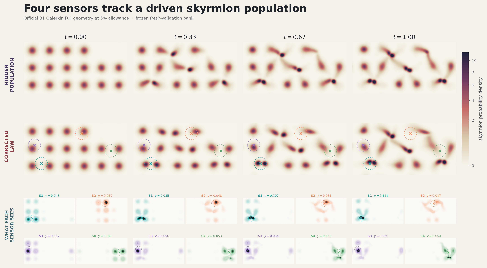

# Skyrmion B1 FIDE/MFSI experiment

This directory contains the completed official B1 Galerkin Pareto study for the
skyrmion benchmark. The current documentation is intentionally small:

- [`OFFICIAL_B1_GALERKIN_PARETO_V1_COMPLETE_STUDY.md`](OFFICIAL_B1_GALERKIN_PARETO_V1_COMPLETE_STUDY.md) is the comprehensive implementation, results, interpretation, audit, and reproduction record.
- [`OFFICIAL_B1_GALERKIN_PARETO_V1_PROTOCOL.md`](OFFICIAL_B1_GALERKIN_PARETO_V1_PROTOCOL.md) is the prospectively frozen protocol.
- [`outputs/official_b1_galerkin_pareto_v1/report.md`](outputs/official_b1_galerkin_pareto_v1/report.md) is the compact generated run report.
- [`outputs/official_b1_galerkin_pareto_v1/final_summary.json`](outputs/official_b1_galerkin_pareto_v1/final_summary.json) is the machine-readable final summary.
- [`outputs/official_b1_galerkin_pareto_v1/selection/selection_manifest.json`](outputs/official_b1_galerkin_pareto_v1/selection/selection_manifest.json) is the sealed selection manifest.
- [`outputs/official_b1_galerkin_pareto_v1/REPRODUCIBILITY.md`](outputs/official_b1_galerkin_pareto_v1/REPRODUCIBILITY.md) inventories the GitHub-visible bundle and the explicitly regenerated oversized arrays.

The official run selected a frozen 6% candidate and returned `PASS`. All 18
validation rows passed both the preregistered strict gate and the diagnostic
`p+5pp` gate. The outcome is scientifically valid for the frozen B1 protocol;
its limitations and the observed Full-versus-Law response plateau are discussed
in the complete study record.

## Paper observation-mechanism figure



Regenerate the PNG and PDF from the frozen official 5% Full geometry and fresh
validation artifacts without running simulation, training, optimization, or
validation. The published paper-reference artifact preserves the exact
configuration nodes and base weights while omitting the unused velocity array:

```bash
.venv/bin/python experiments/skyrmions_galerkin/visualize_paper.py
```

## Reproduction entry points

Run from the repository root with the project environment:

```bash
.venv/bin/python -m experiments.skyrmions_galerkin.official_b1_pareto_run --mode freeze-protocol
.venv/bin/python -m experiments.skyrmions_galerkin.official_b1_pareto_run --mode generate-data
.venv/bin/python -m experiments.skyrmions_galerkin.official_b1_pareto_run --mode law
.venv/bin/python -m experiments.skyrmions_galerkin.official_b1_pareto_run --mode candidates
.venv/bin/python -m experiments.skyrmions_galerkin.official_b1_pareto_run --mode screen
.venv/bin/python -m experiments.skyrmions_galerkin.official_b1_pareto_run --mode tangent
.venv/bin/python -m experiments.skyrmions_galerkin.official_b1_pareto_run --mode full
.venv/bin/python -m experiments.skyrmions_galerkin.official_b1_pareto_run --mode cross
.venv/bin/python -m experiments.skyrmions_galerkin.official_b1_pareto_run --mode freeze-selection
.venv/bin/python -m experiments.skyrmions_galerkin.official_b1_pareto_run --mode generate-validation
.venv/bin/python -m experiments.skyrmions_galerkin.official_b1_pareto_run --mode validate
.venv/bin/python -m experiments.skyrmions_galerkin.official_b1_pareto_run --mode report
```

Focused tests:

```bash
.venv/bin/python -m pytest -q \
  experiments/skyrmions_galerkin/test_official_b1_pareto.py \
  experiments/skyrmions_galerkin/test_final_b1_support_confirmation.py \
  experiments/skyrmions_galerkin/test_single_reference_b1_preflight.py
```

## Three-reference B1 Pareto study

The additive three-reference study reuses the three frozen particle-matched B1
bridge checkpoints as an equal-weight design ensemble. Scientific risk and
forcing support must pass separately for every flow; Tangent and K=280 Full
actions are averaged over independent per-flow solves. Run or resume it with:

```bash
.venv/bin/python -m experiments.skyrmions_galerkin.run_three_reference_pareto --stage all
```

Its isolated output root is
`outputs/skyrmion_b1_galerkin_pareto_3references_v1/`. Individual stages are
`protocol`, `data`, `law`, `candidates`, `screen`, `tangent`, `full`, and
`finalize`; every expensive completed artifact is reused on restart.

Evaluate the completed result and regenerate its robust Pareto PNG/PDF without
rerunning simulation or optimization:

```bash
.venv/bin/python experiments/skyrmions_galerkin/eval_pareto.py --three-reference
MPLBACKEND=Agg .venv/bin/python experiments/skyrmions_galerkin/visualize_pareto.py --three-reference
```

The evaluator checks every frozen per-flow risk ceiling, the equal-weight mean
action, nesting, Full-gap receipts, and validation isolation. The visualization
shows certified Tangent action, realized risk changes for all three flows, and
per-flow budget use; absent Full points are labeled as certification gaps.

## Independent per-seed Pareto studies

Before starting a new common-discretization per-seed Pareto series, qualify the
three independently fitted Laws on the same Galerkin task:

```bash
.venv/bin/python -m experiments.skyrmions_galerkin.run_three_law_qualification --stage all
```

This prospectively tests the shared K/rank-tolerance ladder on development
banks, confirms the selected setting on the larger authoritative banks, and
writes `outputs/skyrmion_b1_three_law_common_task_v1/pareto_handoff.json` only
if every Law/reference-flow diagonal certificate passes. Later Pareto runs must
consume that handoff and include the corresponding Law as a mandatory Full
candidate at every allowance.

The original K>=120 qualification is preserved as a fail-closed diagnostic. If
it reports that the residual is already worsening at the bottom of the ladder,
run the frozen lower-K corrective follow-up:

```bash
.venv/bin/python -m experiments.skyrmions_galerkin.run_three_law_qualification_v2 --stage all
```

If v2 isolates a K-independent raw forcing-mean fluctuation on its smaller
development audit, the final fail-closed larger-bank confirmation is:

```bash
.venv/bin/python -m experiments.skyrmions_galerkin.run_three_law_qualification_v3
```

V3 retains every centered development gate and requires the original,
unamended complete certificate on all three 65k authoritative confirmations.

The support-robust Law refreeze, which is the Pareto-ready qualification entry
point, is:

```bash
.venv/bin/python -m experiments.skyrmions_galerkin.run_three_law_qualification_v4 --stage all
```

It refreezes each Law only after the original support/forcing gates pass on four
selection-bank roles, rechecks the common K ladder, and reserves the
authoritative audit role for the final complete certificate.

The seed-addressable runner executes all six risk allowances for one reference
flow at a time. Each seed has an isolated output root under
`outputs/skyrmion_b1_galerkin_pareto_per_seed_v1/<seed>/`, while deterministic
selection seeds and allowance definitions are shared. Run the first seed with:

```bash
.venv/bin/python -m experiments.skyrmions_galerkin.run_per_seed_pareto --seed B1_seed0 --stage all
```

Additional seeds are additive and do not rerun completed seeds:

```bash
.venv/bin/python -m experiments.skyrmions_galerkin.run_per_seed_pareto --seed B1_seed1 --stage all
.venv/bin/python -m experiments.skyrmions_galerkin.run_per_seed_pareto --seed B1_seed2 --stage all
```

Each completed seed writes `evaluations/allowance_<p>/eval.json` and `eval.md`
for 0.5%, 1%, 2%, 3%, 4%, and 5%. Display all six or one allowance with the
shared read-only evaluator, then regenerate the seed-level PNG/PDF:

```bash
.venv/bin/python experiments/skyrmions_galerkin/eval.py --seed B1_seed0
.venv/bin/python experiments/skyrmions_galerkin/eval.py --seed B1_seed0 --allowance 2
MPLBACKEND=Agg .venv/bin/python -m experiments.skyrmions_galerkin.visualize_per_seed_pareto --seed B1_seed0
```

Historical and superseded study documents are preserved, without modification,
under [`old_stuff/`](old_stuff/). Production code, sealed artifacts, and output
directories remain in their original locations.

## Read-only saved-result evaluation

From the repository root:

```bash
.venv/bin/python experiments/skyrmions_galerkin/eval.py
.venv/bin/python experiments/skyrmions_galerkin/eval_pareto.py
```

These commands read the GitHub-visible official final summary and selection
cross-evaluation under `outputs/`. They verify the authoritative SHA-256 digests
and do not import or run simulation, training, optimization, or validation.
Both use the repository-wide saved-evaluator table style and include Law,
Tangent, Full, and the saved empirical audit-sample SEs. The receipts do not
retain enough information to recover SD, which is shown as unavailable.
