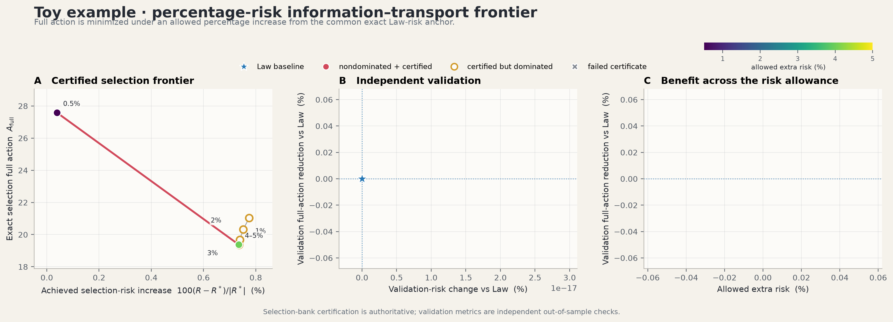

# Toy percentage-risk Pareto experiment

This experiment studies where to place two localized sensors when a controlled increase in finite-data law risk may be exchanged for a reduction in measurement-conditioned transport action. The current results are the fresh, nested, corrected Full-design sweep produced with the accepted positive-support physical-`q_h` evaluator. Population, Law, Tangent, the endpoint reference model, observation banks, reconstruction, information projection, and risk definitions are frozen.

The authoritative corrected result is **PASS**. The Full selection curve is nonincreasing over `0.5%, 1%, 2%, 3%, 4%, 5%`, every selection and validation certificate passes, and the common-raster decomposition is resolved without clipping. The pre-correction/mixed result tree is retained locally under `outputs/old/pareto_pre_corrected_full/` and ignored by Git; it is not a current scientific result.

## Current headline result

| Allowance | Full sensor angles | Exact `L` | Exact `R` | Risk increase | Selection `A_full,h` | Validation `A_full,h` ± SE | Reduction vs Law | `A_tan,h` | `A_hid,h` | `Gamma_h` |
|---:|:---|---:|---:|---:|---:|---:|---:|---:|---:|---:|
| 0.5% | `(23.0868°, 69.0609°)` | 0.0687594 | 0.0662119 | 0.0395% | 27.5740 | 26.6186 ± 0.8560 | 8.26% | 0.7194 | 26.8545 | 0.9739 |
| 1% | `(20.7917°, 71.6743°)` | 0.0691746 | 0.0666986 | 0.7749% | 21.0403 | 20.3103 ± 0.6338 | 30.00% | 0.8790 | 20.1613 | 0.9582 |
| 2% | `(21.1452°, 72.0279°)` | 0.0691929 | 0.0666835 | 0.7521% | 20.3224 | 19.7470 ± 0.5423 | 31.94% | 0.8767 | 19.4458 | 0.9569 |
| 3% | `(21.4988°, 72.3814°)` | 0.0692175 | 0.0666746 | 0.7386% | 19.6714 | 19.2431 ± 0.4611 | 33.68% | 0.8744 | 18.7970 | 0.9556 |
| 4% | `(21.6755°, 72.5582°)` | 0.0692321 | 0.0666724 | 0.7353% | 19.3703 | 19.0131 ± 0.4253 | 34.47% | 0.8732 | 18.4971 | 0.9549 |
| 5% | `(21.6755°, 72.5582°)` | 0.0692321 | 0.0666724 | 0.7353% | 19.3703 | 19.0131 ± 0.4253 | 34.47% | 0.8732 | 18.4971 | 0.9549 |

The consecutive corrected selection-action changes are

```text
-6.5336911, -0.7178278, -0.6510294, -0.3010833, 0.0.
```

Thus `A_full(0.5%) >= A_full(1%) >= ... >= A_full(5%)` passes at tolerance `1e-6`. At 5%, no feasible audited candidate improved on the 4% incumbent beyond tolerance, so the repeated endpoint is intentional.




## Scientific setup

### Hidden population

The state is `x=(x_1,x_2)` on `[-3.2,3.2]^2`. Let

```text
d(alpha) = (cos(alpha), sin(alpha)),
g_alpha(x) = 1/2 N(x; 1.5 d(alpha), 0.3^2 I)
           + 1/2 N(x;-1.5 d(alpha), 0.3^2 I).
```

For normalized time `t in [0,1]`, the analytic hidden path is

```text
rho_t^alpha = (1-t)^2 g_0 + 2t(1-t) g_alpha + t^2 g_(pi/2).
```

The nuisance orientation `alpha` is uniformly averaged over `30–60°` using five-point Gauss–Legendre quadrature. The path moves from horizontal antipodal lobes to vertical antipodal lobes, with uncertain interior curvature.

### Sensors and observations

Two Gaussian sensors are constrained to the radius-`1.5` ring. For sensor angle `theta_j`,

```text
s_j = 1.5 (cos(theta_j), sin(theta_j)),
Phi_j(x;theta_j) = exp(-||x-s_j||^2 / (2 * 0.45^2)).
```

Angles are canonicalized and sorted. Their projective separation must be at least `20°`. Each finite observation trial uses 100 particles at 11 acquisition nodes nested in the 21-node scientific grid, detector noise standard deviation `0.01`, and exact endpoint moments. Selection and validation use disjoint frozen banks.

### Endpoint-only reference flow

The reference velocity `v_psi(t,x)` is trained only from the endpoint laws. Its input contains two coordinates and five time features `(t, sin(pi t), cos(pi t), sin(2 pi t), cos(2 pi t))`. The MLP has four width-128 hidden layers with SiLU activations and a linear two-dimensional output. Conditional flow matching uses

```text
x_t = (1-t)x_0 + t x_1 + 0.15 sin(pi t) z,
u_t = -x_0 + x_1 + 0.15 pi cos(pi t) z.
```

Training uses Adam for 12,000 steps, batch size 2,048, gradient clipping at 10, and cosine learning-rate decay from `1e-3` to `5e-5`. The frozen reference is integrated by RK4 with 16 substeps per scientific interval. A tensor Gauss–Hermite rule of order 36 per coordinate and endpoint lobe gives 2,592 deterministic weighted reference particles.

### Reconstruction and projection

The 11 noisy moment observations are reconstructed over all 21 nodes by endpoint-anchored quadratic generalized least squares with relative ridge `1e-12` and variance floor `1e-10`. Reconstructed trajectories are screened against a common feasible moment polytope; authoritative candidates receive exact convex-hull feasibility checks.

At every time, the empirical information projection tilts frozen reference weights `b_i`:

```text
q_i(lambda) = b_i exp(lambda^T Phi(x_i;eta)) / Z(lambda),
sum_i q_i Phi(x_i;eta) = c(t).
```

The Newton solve is warm-started through time and must pass calibration, effective-sample-size, feasibility, and in-domain-mass checks.

## Objectives and constraints

The population loss `L` compares projected laws based on exact analytic moments with the hidden population. The finite-law risk `R` uses Gaussian-kernel MMD with bandwidth `0.55` at held-out time nodes. The frozen anchors are

```text
L*    = 0.0687360118546
L_max = L* + 0.0005 = 0.0692360118546
R*    = 0.0661857367210.
```

At percentage allowance `p`, every candidate must satisfy

```text
L(eta) <= L_max,
R(eta) <= R* + (p/100) |R*|.
```

The particle Tangent objective is the minimum local correction visible to sensor-moment rates. It remains the experiment's unchanged Tangent optimization metric.

The corrected Full objective is evaluated in a common raster Hilbert space. Bilinear deposition produces physical density `q_h` and signed source `s_h`; both are smoothed by the same strictly positive, full-domain separable Gaussian with per-source-column boundary normalization. The scientific solve is

```text
-div(q_h grad psi_h) = s_h,
delta_h* = -grad psi_h,
A_full,h = ||delta_h*||^2_(q_h).
```

No density floor is added to the scientific operator. Conductive components are solved with a gauge constraint and an equation-preserving sparse direct solve, with a preconditioned-CG fallback. The authoritative raster is `101 x 101`, uses all 21 time nodes, and freezes the median weighted Scott bandwidth at `0.417530106552`.

## Common-discretization decomposition

On the same raster vector space, quadrature, physical `q_h`, and inner product as Full, the moment-rate operator `L_h` defines

```text
delta_tan,h = argmin ||delta||^2_(q_h) subject to L_h delta = -r_h,
delta_hid,h = delta_h* - delta_tan,h.
```

The audit independently computes `A_tan,h`, `A_hid,h`, `Gamma_h=A_hid,h/A_full,h`, and `<delta_tan,h,delta_hid,h>_(q_h)`. It checks Full and Tangent moment feasibility, hidden nullspace membership, orthogonality, the Pythagorean identity, and raw hierarchy. The declared moment/energy tolerance is `1e-6`; values are never clipped.

| Check | Global maximum |
|:---|---:|
| mass error | `4.44e-16` |
| signed-source compatibility error | `5.17e-16` |
| physical Poisson relative residual | `1.19e-11` |
| Full moment-rate residual | `6.62e-14` |
| Tangent moment-rate residual | `8.08e-16` |
| hidden-nullspace residual | `6.62e-14` |
| absolute orthogonality residual | `1.46e-13` |
| absolute Pythagorean residual | `9.09e-13` |
| raw hierarchy violation | `-0.1274` |

Every gate passes. The negative raw hierarchy maximum is slack, not a clipped zero. Consequently `Gamma_h` is numerically supported as a genuine tangent-invisible action fraction for this corrected discretization.

## Frozen hyperparameters

The canonical base configuration is [`config.json`](config.json). The corrected Full follow-up changes only the Full raster/evaluation/search route described below.

| Group | Setting | Value |
|:---|:---|:---|
| global | experiment/training seed | `20260813` |
| population | radius / sigma / domain half-width | `1.5 / 0.3 / 3.2` |
| population | alpha quadrature | `5` nodes over `30–60°` |
| measurement | sensor radius / width | `1.5 / 0.45` |
| measurement | particles / acquisitions / detector noise | `100 / 11 / 0.01` |
| measurement | minimum projective separation | `20°` |
| law | MMD bandwidth / absolute `L` allowance | `0.55 / 0.0005` |
| reference MLP | hidden width / layers | `128 / 4` |
| training | steps / batch / initial LR / final ratio | `12000 / 2048 / 1e-3 / 0.05` |
| training | Adam / gradient clip | `(0.9,0.999,1e-8) / 10` |
| bridge | schedule / noise | `linear / 0.15` |
| reference bank | Gauss–Hermite order / particles | `36 / 2592` |
| rollout | RK4 substeps per interval | `16` |
| reconstruction | method | endpoint-anchored quadratic GLS |
| reconstruction | relative ridge / variance floor | `1e-12 / 1e-10` |
| feasibility | directions / margin / tolerance | `96 / 1e-6 / 1e-9` |
| I-projection | authoritative/search steps | `300 / 80` |
| I-projection | residual tolerance / ridge / step cap | `1e-7 / 1e-7 / 20` |
| I-projection | lambda clip / line-search steps | `1000 / 6` |
| validity | finite/population calibration | `1e-3 / 1e-5` |
| validity | minimum ESS / in-domain mass | `0.03 / 0.995` |
| exact Tangent | pseudoinverse rcond / compatibility | `1e-10 / 1e-7` |
| corrected Full | raster / time nodes | `101 x 101 / 21` |
| corrected Full | bandwidth | `0.417530106552` |
| corrected Full | density floor | `0` in scientific operator |
| corrected Full | Poisson tolerance | `1e-7` |
| corrected Full | mass/source/component tolerance | `1e-12` |
| corrected Full | moment/decomposition tolerance | `1e-6` |
| randomness | Law/action/validation trials | `32 / 64 / 128` |
| randomness | selection/validation namespaces | `8890 / 8891` |
| reporting | bootstrap replicates | `5000` |

## Corrected Full search protocol

Population, Law, and Tangent are not rerun. For every allowance, the previous tighter corrected Full winner is a mandatory incumbent and is rechecked against the current exact `L` and `R` caps. Candidate seeds include the incumbent, historical Full, saved Tangent, Law, all feasible previously audited Full-search candidates, and normal multistarts.

New basins are navigated on a `51 x 51` two-trial frozen prefix, promoted to a 12-trial `101 x 101` prescreen, then decided using all 64 frozen selection trials at `101 x 101`. A winner is replaced only by a feasible, fully certified candidate whose corrected selection action is lower by more than `1e-6`. Only after selection is frozen is the independent 128-trial validation bank evaluated.

All 1–5% winners differ from the previously corrected sweep; their selection-action changes are `-2.68696`, `-2.15943`, `-2.09889`, `-1.59191`, and `-0.85405`. The fixed isolated 0.5% result reproduces within `1.5e-14`. Every current geometry differs from the older pre-correction saved endpoint. The corrected Full design has lower corrected Full action than the saved Tangent design at every allowance, so the central FIDE ranking survives. No further Full optimization is required by the declared protocol; this is a numerical multistart certificate, not an analytic global-optimum proof.

## Reproduction

Run from the repository root with 64-bit JAX enabled. The archive is seed/provenance input only; outputs go to the clean active directory.

```bash
export JAX_ENABLE_X64=1
export XLA_PYTHON_CLIENT_PREALLOCATE=false
export PYTHONPATH="$PWD/src${PYTHONPATH:+:$PYTHONPATH}"

.venv/bin/python experiments/toy_example_percentage/rerun_corrected_full_0p5.py \
  --pareto-dir experiments/toy_example_percentage/outputs/old/pareto_pre_corrected_full \
  --output-dir experiments/toy_example_percentage/outputs/pareto/risk_0p5pct/full_search \
  --grid-n 101 --bandwidth-scale 1.0

.venv/bin/python experiments/toy_example_percentage/run_corrected_nested_full_sweep.py \
  --pareto-dir experiments/toy_example_percentage/outputs/old/pareto_pre_corrected_full \
  --output-dir experiments/toy_example_percentage/outputs/pareto \
  --rerun-0p5-json experiments/toy_example_percentage/outputs/pareto/risk_0p5pct/full_search/corrected_full_rerun.json \
  --search-from-1pct --fresh-evaluations \
  --grid-n 101 --bandwidth-scale 1.0

.venv/bin/python experiments/toy_example_percentage/finalize_authoritative_corrected_pareto.py \
  --seed-pareto experiments/toy_example_percentage/outputs/old/pareto_pre_corrected_full \
  --source-run experiments/toy_example_percentage/outputs/run \
  --output experiments/toy_example_percentage/outputs/pareto \
  --previous-corrected experiments/toy_example_percentage/outputs/old/pareto_pre_corrected_full/corrected_nested_full_sweep/corrected_nested_full_sweep.json \
  --grid-n 101 --bandwidth-scale 1.0
```

All three commands are checkpointed. `--fresh-evaluations` prevents archived corrected action values from entering the active action cache; archived geometries remain legitimate seeds.

## Current artifacts

| Path | Contents |
|:---|:---|
| `outputs/pareto/corrected_nested_full_sweep.csv/.json/.md` | full-precision corrected nested sweep and PASS summary |
| `outputs/pareto/pareto.csv/.json` | compact one-row-per-allowance Full table |
| `outputs/pareto/pareto_methods_selection.csv` | corrected Law/Tangent/Full selection table |
| `outputs/pareto/pareto_methods_validation.csv` | independent validation means, SEs, and validity |
| `outputs/pareto/pareto_methods_tables.md` | generated human-readable method tables |
| `outputs/pareto/positive_raster_decomposition_diagnostics.csv/.json/.md` | common-discretization numerical audit |
| `outputs/pareto/validation_trial_summaries.csv` | all Full, Law, and Tangent validation trial actions |
| `outputs/pareto/risk_*pct/result.json` | current per-allowance result record |
| `outputs/pareto/risk_*pct/candidates.csv` | all preserved/generated seeds and stage outcomes |
| `outputs/pareto/risk_*pct/audit.json` | exact risk, selection, validation, and certificate record |
| `outputs/pareto/risk_*pct/validation_trials.csv` | per-allowance Full validation trials |
| `outputs/pareto/frozen_inputs/manifest.json` | hashes and paths for the active frozen copies |
| `outputs/pareto/authoritative_run_summary.json` | global nesting, numerical maxima, and old/new comparison |
| `outputs/pareto/*.png` | current Pareto, method, experiment, and sensor-layout figures |

The active frozen files are `reference.npz`, `reference_bank.npz`, `selection_bank.npz`, and `validation_bank.npz`. Their SHA-256 hashes match their source-run counterparts. Historical artifacts were moved, not deleted, to `outputs/old/pareto_pre_corrected_full/`; `.gitignore` excludes `outputs/old/` so the archive remains local provenance rather than current tracked output.

## Read-only saved-result evaluation

From the repository root:

```bash
.venv/bin/python experiments/toy_example_percentage/eval.py
.venv/bin/python experiments/toy_example_percentage/eval_pareto.py
```

The first command displays the tracked saved run. The second displays and
hash-verifies the corrected authoritative Pareto sweep. Neither command runs
the experiment or writes outputs. Both use the repository-wide saved-evaluator
table style, include Law/Tangent/Full, and report sample SDs from the saved
independent validation trials (or from a saved ordinary SE and `n`).
