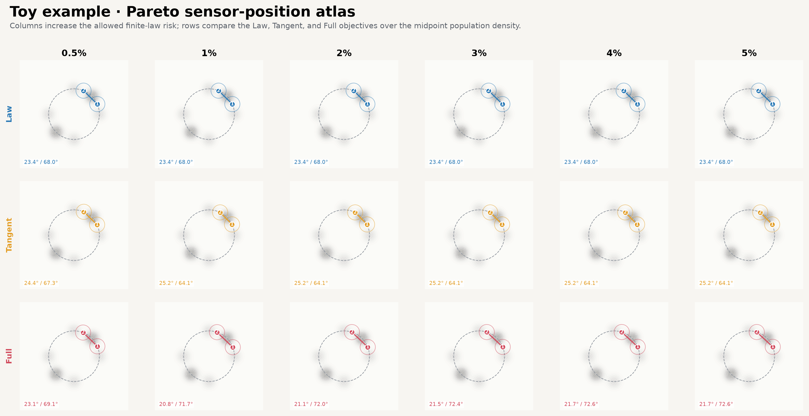

# Toy percentage-risk Pareto experiment

This experiment asks a concrete sensor-design question: **how much can the full measurement-conditioned transport action be reduced if we permit a controlled percentage increase in finite-data law risk?** It uses an analytic two-dimensional population path, two localized Gaussian sensors constrained to a ring, a learned endpoint-only reference flow, finite noisy acquisitions, moment reconstruction, empirical information projection, and both tangent and full MFSI action objectives.

The originally published sweep uses risk allowances of `0.5%, 1%, 2%, 3%, 4%, 5%`. Every saved Law, Tangent, and Full design passed the exact selection-bank certificate and all `128/128` independent validation trials were valid. Under the historical Full evaluator, the strongest validated Full result occurs at the `1%` allowance: mean full action decreases from `314.058 ± 13.066` for Law to `239.625 ± 9.199`, a `23.70%` ratio-of-means reduction. Those records remain immutable. The accepted positive-support physical-`q_h` evaluator and corrected nested Full-only sweep are reported separately below; their final selection curve is strictly decreasing from `27.57395` at 0.5% to `20.22437` at 5%.

Results in this document describe the saved artifacts currently under `outputs/pareto/`. The authoritative machine-readable sources are `result.json` inside each Pareto-point directory and the aggregate CSV files. Rounded values in this README are for presentation.

## Contents

- [Scientific question](#scientific-question)
- [Population and endpoint model](#population-and-endpoint-model)
- [Sensors and finite observations](#sensors-and-finite-observations)
- [Learned reference-flow model](#learned-reference-flow-model)
- [Moment reconstruction and information projection](#moment-reconstruction-and-information-projection)
- [Law, Tangent, and Full objectives](#law-tangent-and-full-objectives)
- [Four sensor-design stages](#four-sensor-design-stages)
- [Percentage-risk Pareto protocol](#percentage-risk-pareto-protocol)
- [Complete hyperparameters](#complete-hyperparameters)
- [Results](#results)
- [Corrected nested Full sweep](#corrected-nested-full-sweep)
- [Interpretation and limitations](#interpretation-and-limitations)
- [Reproduction](#reproduction)
- [Artifacts and source map](#artifacts-and-source-map)

## Scientific question

Let `eta = (theta_1, theta_2)` be the two sensor angles. The experiment first finds a finite-law design and its exact selection-bank risk anchor `R*`. At each percentage allowance `p`, it then searches for a design with low full MFSI action subject to

```text
L(eta) <= L* + epsilon_L
R(eta) <= R* + (p / 100) |R*|.
```

Here:

- `L` is the population-level sensor-design loss.
- `R` is the finite-data law risk, evaluated by held-out Gaussian-kernel MMD.
- `T` is the tangent MFSI action, a transport-only lower-complexity objective.
- `A_full` is the full MFSI action obtained from the weighted Poisson problem.

The sweep changes only `p`. It freezes the reference model, deterministic quadrature/reference bank, selection common-random-number bank, validation bank, and the exact Law anchor so points are directly comparable.

## Population and endpoint model

### Domain

The state is `x = (x_1, x_2)` on the square

```text
Omega = [-3.2, 3.2] x [-3.2, 3.2].
```

The hidden population is known analytically in this controlled benchmark. Define an antipodally symmetric Gaussian component

```text
g_alpha(x) = 1/2 N(x; r d(alpha), sigma^2 I)
           + 1/2 N(x; -r d(alpha), sigma^2 I),

d(alpha) = (cos(alpha), sin(alpha)),
r = 1.5,
sigma = 0.3.
```

For normalized time `t in [0,1]`, the hidden population density is

```text
rho_t^alpha(x) = (1-t)^2 g_0(x)
               + 2t(1-t) g_alpha(x)
               + t^2 g_{pi/2}(x).
```

The nuisance path parameter is uniformly averaged over

```text
alpha in [30 degrees, 60 degrees]
```

using five-point Gauss-Legendre quadrature. Thus the benchmark transitions from horizontal antipodal lobes at `t=0` to vertical antipodal lobes at `t=1`, with uncertain intermediate curvature/orientation.

### Endpoint source used by the reference model

The learned reference sees only the endpoint laws:

- At `t=0`: an equal mixture centered at `(±1.5, 0)` with isotropic standard deviation `0.3`.
- At `t=1`: an equal mixture centered at `(0, ±1.5)` with isotropic standard deviation `0.3`.

It does **not** train on the analytic interior population path. This separation is intentional: the interior path is the hidden target used to evaluate sensing and law recovery, while the reference is an endpoint-conditioned transport prior.

For deterministic reference integration, the initial mixture is represented by a tensor-product Gauss-Hermite rule of order `36` per axis for each lobe, yielding `2 x 36^2 = 2592` weighted particles before rollout.

## Sensors and finite observations

### Sensor family

Two Gaussian sensors lie on a circle of radius `r_s = 1.5`. For angle `theta_j`, the center is

```text
s_j = 1.5 (cos(theta_j), sin(theta_j)),
```

and the observable is

```text
Phi_j(x; theta_j) = exp(-||x - s_j||^2 / (2 ell^2)),
ell = 0.45.
```

The two angles are canonicalized and sorted. Their projective angular separation must be at least `20 degrees`. The design variable therefore has two degrees of freedom but is constrained to avoid redundant, nearly coincident probes.

### Observation process

Each observation trial uses:

- `n = 100` finite particles at each acquisition time;
- `K = 11` acquisition nodes nested in the `21`-node time grid;
- independent additive detector noise with standard deviation `0.01`;
- exact endpoint moments at `t=0` and `t=1` rather than noisy endpoint estimates.

The raw finite observation at an interior acquisition node is

```text
y_{k,j} = (1/n) sum_i Phi_j(X_i(t_k); theta_j) + 0.01 z_{k,j},
z_{k,j} ~ N(0,1).
```

Selection and validation use disjoint frozen trial banks. This prevents favorable optimization noise from being reused as evidence of out-of-sample performance.

## Learned reference-flow model

### Architecture

The reference velocity is an MLP `v_psi(t,x)` with:

- input dimension `7`: two spatial coordinates plus five time features;
- time features `(t, sin(pi t), cos(pi t), sin(2 pi t), cos(2 pi t))`;
- four hidden layers of width `128`;
- SiLU activation after each hidden affine layer;
- a linear two-dimensional velocity output;
- five parameterized affine layers in total.

### Conditional flow-matching training

Independent samples `x_0` and `x_1` are drawn from the two endpoint laws. With linear bridge coefficients and bridge noise,

```text
x_t = (1-t)x_0 + t x_1 + 0.15 sin(pi t) z,
u_t = -x_0 + x_1 + 0.15 pi cos(pi t) z,
z ~ N(0,I).
```

The MLP minimizes mean squared conditional-flow-matching error

```text
E ||v_psi(t,x_t) - u_t||^2.
```

Training uses Adam for `12,000` steps with batch size `2,048`, gradient clipping at norm `10`, and cosine decay from `1e-3` to `5e-5`. The saved run starts at minibatch loss `5.24568` and ends at logged minibatch loss `1.37159`; these stochastic training losses are diagnostics, not law-risk or action metrics.

The frozen reference is rolled through the 21 scientific time nodes using RK4 with `16` substeps per interval. The same checkpoint and weighted particle bank are reused across all Pareto points.

## Moment reconstruction and information projection

### Endpoint-anchored quadratic GLS

For each sensor and trial, the 11 observed moments are reconstructed over all 21 time nodes using endpoint-anchored quadratic generalized least squares. The configured relative ridge is `1e-12` and the variance floor is `1e-10`. The reconstruction supplies both a moment curve `c(t)` and its derivative `c_dot(t)`.

Because not every arbitrary curve is realizable by a probability law, reconstructed coefficients are projected into a common exact feasible moment polytope. The approximate screen uses `96` directions and a `1e-6` margin; authoritative auditing uses exact convex-hull feasibility and robust empirical exponential tilting.

### Empirical I-projection

At each time, weighted reference particles `(x_i,b_i)` are tilted to match the reconstructed moments:

```text
q_i(lambda) = b_i exp(lambda^T Phi(x_i;eta)) / Z(lambda),
sum_i q_i Phi(x_i;eta) = c(t).
```

Newton solves use the configured ridge, step cap, multiplier clipping, and line search. A trajectory solve warm-starts multipliers through time. The authoritative solution must satisfy calibration residual, effective-sample-size, feasibility, and in-domain-mass thresholds.

## Law, Tangent, and Full objectives

### Population loss `L`

`L(eta)` uses exact analytic population moments—without finite sampling or detector noise—to I-project the reference at the configured population time nodes, then measures Gaussian-kernel MMD from the analytic population. It trapezoid-averages time and five-point quadrature in `alpha`. The exact Law screen is

```text
L <= L_max = L* + epsilon_L,
epsilon_L = 0.0005.
```

For the frozen Pareto anchor,

```text
L*    = 0.0687360118546
L_max = 0.0692360118546.
```

### Finite-law risk `R`

After moment reconstruction and I-projection, the projected law is rasterized on the `51 x 51` grid. At time nodes not used for acquisition, discrepancy from the analytic hidden population is measured by squared Gaussian-kernel MMD with bandwidth `0.55`. Held-out-time values are trapezoid-weighted and then averaged over the frozen finite-data trials.

The exact frozen Law anchor is

```text
R* = 0.0661857367210.
```

For allowance `p`, the risk cap is

```text
epsilon_R(p) = (p/100) |R*|,
R_max(p)     = R* + epsilon_R(p).
```

### Tangent action `T`

The tangent action uses the local sensor-gradient Gram matrix under the projected law. In schematic form,

```text
G_t = E_q[J Phi J Phi^T],
r_t = E_q[J Phi u_ref] - c_dot(t),
T   = integral r_t^T (G_t + ridge I)^(-1) r_t dt.
```

It measures the least local velocity correction visible through the sensor moments. It is cheaper than the full action and is a useful design objective, but minimizing it does not guarantee minimal full action.

### Full MFSI action `A_full`

The moment-constrained particle forcing is rasterized into density `q_t(x)` and scalar forcing `h_t(x)`. The full correction potential solves a weighted Poisson equation with a gauge constraint,

```text
-div(q_t grad psi_t) = q_t h_t,
```

and the action is the time integral of the corresponding weighted kinetic energy,

```text
A_full = integral int q_t(x) ||grad psi_t(x)||^2 dx dt.
```

The historical published sweep reports the original `51 x 51`, `21`-time-node evaluator with CG tolerance `1e-8` and at most `520` iterations. Its stage-4 differentiable proxy uses a `41 x 41` grid, seven time nodes, four CRN trials, CG tolerance `1e-6`, and at most `360` iterations. The accepted corrected follow-up instead reports the positive-support physical-`q_h` solve at `101 x 101` on all 21 nodes; its multistart proxy and prescreen are described in [Corrected nested Full sweep](#corrected-nested-full-sweep). Proxy values are never reported as scientific action values.

## Four sensor-design stages

1. **Population** minimizes `L` using the analytic population oracle. It is a controlled lower-level baseline, not a deployable finite-data design.
2. **Law** minimizes finite-data risk `R` while satisfying `L <= L_max`. Its exact risk defines `R*`.
3. **Tangent** minimizes `T` while satisfying both the `L` and percentage-dependent `R` screens.
4. **Full** minimizes exact full-action performance through a multi-fidelity search while satisfying the same screens.

Candidate generation is gradient-based and multistart. Every selectable candidate is re-audited with exact feasibility, robust I-projection, all-trial validity, and the complete selection bank. For the representative 3% run, stage 4 considered `49` screened candidates from `7` gradient starts and `42` distinct screen starts, exactly law-audited `30`, found all `30` valid, and exactly rescored `12` full-action finalists.

## Percentage-risk Pareto protocol

The default sweep is

```text
p in {0.5, 1, 2, 3, 4, 5} percent.
```

The runner:

1. loads the full configuration;
2. replaces the nominal 5% risk setting with the current `p/100`;
3. seeds each point with the compatible frozen reference and CRN artifacts;
4. reuses percentage-independent Law-stage caches when compatible;
5. verifies that every point has the same exact `R*` to absolute tolerance `1e-10`;
6. runs and certifies Law, Tangent, and Full designs;
7. evaluates all designs on a separate validation bank;
8. checkpoints `pareto.csv`, `pareto.json`, plots, method tables, and sensor figures.

The saved banks contain `32` Law-selection trials, `64` action-selection trials, and `128` validation trials. Selection and validation namespaces are `8890` and `8891`. Full-vs-Law uncertainty uses `5,000` bootstrap replicates for the ratio-of-means reduction.

## Complete hyperparameters

The canonical machine-readable configuration is [`config.json`](config.json). The following tables enumerate the active full-run values; the `smoke` overrides are listed separately.

### Population, law, and measurement

| Group | Hyperparameter | Value |
|:---|:---|---:|
| global | experiment seed | `20260813` |
| population | radius | `1.5` |
| population | Gaussian sigma | `0.3` |
| population | domain half-width | `3.2` |
| population | alpha range | `30–60 deg` |
| population | alpha quadrature points | `5` |
| law | Gaussian MMD bandwidth | `0.55` |
| law | absolute population-loss allowance `epsilon_L` | `0.0005` |
| law | nominal relative risk allowance | `0.05` (overridden per Pareto point) |
| measurement | sensor radius | `1.5` |
| measurement | sensor width | `0.45` |
| measurement | finite particles per acquisition | `100` |
| measurement | acquisition nodes | `11` |
| measurement | detector-noise standard deviation | `0.01` |
| measurement | minimum projective separation | `20 deg` |

### Reference-flow training and rollout

| Hyperparameter | Value |
|:---|---:|
| training seed | `20260813` |
| hidden width / hidden layers | `128 / 4` |
| training steps / batch size | `12000 / 2048` |
| initial learning rate / minimum ratio | `0.001 / 0.05` |
| Adam beta1 / beta2 / epsilon | `0.9 / 0.999 / 1e-8` |
| gradient clip norm | `10` |
| bridge schedule / noise std | `linear / 0.15` |
| logging interval | `500` |
| reuse compatible checkpoint | `true` |
| reference-bank mode | `gauss-hermite` |
| Gauss-Hermite order | `36` |
| RK4 substeps per time interval | `16` |

### Reconstruction, feasibility, projection, and MFSI

| Group | Hyperparameter | Value |
|:---|:---|---:|
| reconstruction | kind | `endpoint_anchored_quadratic_gls` |
| reconstruction | relative ridge / variance floor | `1e-12 / 1e-10` |
| feasibility | directions / margin / tolerance | `96 / 1e-6 / 1e-9` |
| projection | authoritative max steps | `300` |
| projection | search max steps / residual tolerance | `80 / 1e-7` |
| projection | Newton ridge / step cap | `1e-7 / 20` |
| projection | lambda clip / implicit ridge | `1000 / 0` |
| projection | line-search steps | `6` |
| projection | backend / acceptance tolerance | `tesseract_cpp / 2e-6` |
| particle MFSI | covariance ridge / tangent ridge | `1e-7 / 1e-7` |
| exact MFSI | covariance ridge / tangent ridge | `0 / 0` |
| exact MFSI | minimum covariance eigenvalue | `1e-12` |
| exact MFSI | tangent pseudoinverse rcond | `1e-10` |
| exact MFSI | max tangent compatibility residual | `1e-7` |
| raster search/risk path | bandwidth / truncation | `0` (defaults to `0.35 dx`) / `4` |
| authoritative Full raster | deposition | bilinear particle deposit + full-support separable Gaussian |
| authoritative Full raster | boundary treatment | per-source kernel-column normalization |
| authoritative Full raster | bandwidth rule | median frozen-reference Scott rule in 2-D |
| authoritative Full raster | baseline bandwidth | `0.417530106552` (`3.32719` cells at `51 x 51`) |

### Poisson, validity, and random trials

| Group | Hyperparameter | Value |
|:---|:---|---:|
| Poisson | grid / time nodes | `51 x 51 / 21` |
| Poisson | search-proxy floor / authoritative operator floor | `2e-5 / 0` (proxy preconditioning/regularization only) |
| Poisson | CG tolerance / max iterations | `1e-8 / 520` |
| Poisson | gauge strength | `1` |
| validity | max finite calibration residual | `1e-3` |
| validity | max population calibration residual | `1e-5` (effective default) |
| validity | minimum ESS fraction | `0.03` |
| validity | minimum in-domain base mass | `0.995` |
| validity | tangent lower-bound tolerance | `1e-6` |
| randomness | Law / action / validation trials | `32 / 64 / 128` |
| randomness | selection / validation namespace | `8890 / 8891` |
| randomness | bootstrap replicates | `5000` |

### Optimization

| Hyperparameter | Value |
|:---|---:|
| nominal population / Law / Tangent / Full steps | `120 / 50 / 40 / 40` |
| default learning rate | `0.02` |
| Law / Tangent / Full learning rate | `0.015 / 0.012 / 0.01` |
| constraint penalty / invalid penalty | `10000 / 10000` |
| feasibility tolerance | `1e-6` |
| generic start count | `12` |
| Law start count / gradient trials / exact audit candidates | `4 / 4 / 8` |
| Tangent start count / local starts / perturbation | `7 / 12 / 5 deg` |
| Tangent gradient trials / exact audits / exact rescores | `4 / 16 / 8` |
| Tangent minimum exact-law-valid / finalists | `8 / 6` |
| Full start count / local starts / random starts | `7 / 16 / 8` |
| Full start perturbation | `6 deg` |
| Full gradient trials | `4` |
| Full gradient grid / time nodes | `41 x 41 / 7` |
| Full gradient CG tolerance / max iterations | `1e-6 / 360` |
| Full gradient proxy / authoritative exact Poisson backend | `tesseract_cpp / physical-q sparse direct` |
| Full prescreen trials / exact audits / exact rescores | `12 / 30 / 10` |
| Full minimum exact-law-valid / finalists | `12 / 10` |
| JIT objectives | `true` |

### Smoke overrides

Smoke mode reduces alpha quadrature to `2`, finite particles to `32`, acquisitions to `3`, the MLP to two width-32 hidden layers trained for `10` steps with batch `128`, Gauss-Hermite order to `4`, RK4 substeps to `2`, feasibility directions to `12`, projection search/solve steps to `10`, the Poisson problem to `11 x 11 x 5`, and all optimization steps to zero with one-trial/one-start wiring checks. It is a numerical integration test, not a result-producing scientific run.

## Results

### Main Pareto table

`Risk inc.` is exact selection-bank `100(R-R*)/|R*|`. Validation entries are mean `±` standard error. `Delta A` is validation full-action reduction relative to Law at the same allowance; negative values mean worse full action than Law.

| Allow. | Method | Sensor angles | Risk inc. | Selection `A_full` | Validation `R` | Validation `A_full` | Delta A vs Law | Cert. |
|---:|:---|:---|---:|---:|---:|---:|---:|:---:|
| 0.5% | Law | 23.38°, 67.95° | 0.000% | 298.50 | 0.065816 ± 0.000211 | 314.06 ± 13.07 | 0.00% | yes |
| 0.5% | Tangent | 24.44°, 67.28° | -0.040% | 325.94 | 0.065805 ± 0.000209 | 343.92 ± 15.18 | -9.51% | yes |
| 0.5% | Full | 21.22°, 68.85° | 0.320% | 245.94 | 0.065992 ± 0.000220 | 255.79 ± 8.44 | 18.55% | yes |
| 1% | Law | 23.38°, 67.95° | 0.000% | 298.50 | 0.065816 ± 0.000211 | 314.06 ± 13.07 | 0.00% | yes |
| 1% | Tangent | 25.17°, 64.15° | 0.284% | 353.07 | 0.066045 ± 0.000208 | 368.01 ± 13.37 | -17.18% | yes |
| 1% | Full | 21.15°, 70.61° | 0.507% | 228.18 | 0.066115 ± 0.000234 | 239.62 ± 9.20 | **23.70%** | yes |
| 2% | Law | 23.38°, 67.95° | 0.000% | 298.50 | 0.065816 ± 0.000211 | 314.06 ± 13.07 | 0.00% | yes |
| 2% | Tangent | 25.17°, 64.15° | 0.284% | 353.07 | 0.066045 ± 0.000208 | 368.01 ± 13.37 | -17.18% | yes |
| 2% | Full | 21.22°, 68.85° | 0.320% | 245.94 | 0.065992 ± 0.000220 | 255.79 ± 8.44 | 18.55% | yes |
| 3% | Law | 23.38°, 67.95° | 0.000% | 298.50 | 0.065816 ± 0.000211 | 314.06 ± 13.07 | 0.00% | yes |
| 3% | Tangent | 25.17°, 64.15° | 0.284% | 353.07 | 0.066045 ± 0.000208 | 368.01 ± 13.37 | -17.18% | yes |
| 3% | Full | 21.22°, 68.85° | 0.320% | 245.94 | 0.065992 ± 0.000220 | 255.79 ± 8.44 | 18.55% | yes |
| 4% | Law | 23.38°, 67.95° | 0.000% | 298.50 | 0.065816 ± 0.000211 | 314.06 ± 13.07 | 0.00% | yes |
| 4% | Tangent | 25.17°, 64.15° | 0.284% | 353.07 | 0.066045 ± 0.000208 | 368.01 ± 13.37 | -17.18% | yes |
| 4% | Full | 21.22°, 68.85° | 0.320% | 245.94 | 0.065992 ± 0.000220 | 255.79 ± 8.44 | 18.55% | yes |
| 5% | Law | 23.38°, 67.95° | 0.000% | 298.50 | 0.065816 ± 0.000211 | 314.06 ± 13.07 | 0.00% | yes |
| 5% | Tangent | 25.17°, 64.15° | 0.284% | 353.07 | 0.066045 ± 0.000208 | 368.01 ± 13.37 | -17.18% | yes |
| 5% | Full | 21.22°, 68.85° | 0.320% | 245.94 | 0.065992 ± 0.000220 | 255.79 ± 8.44 | 18.55% | yes |

### Visual summary




The representative 3% dashboard below shows the full hidden population path, selected sensor pairs, exact selection trade-off, and independent validation:


### Exact Tangent/Full decomposition audit

The saved Law, Tangent, and Full geometry at every allowance was re-evaluated with `ToyExperiment.evaluate_trials_exact` on the frozen 64-trial action-selection bank and all 21 time nodes. The evaluator computes Tangent and Full from the same reconstructed targets and projected weights. With the configured hierarchy tolerance `1e-6`, all 18 final candidates pass: there are zero aggregate, trial-level, or time/trial-level violations. The maximum raw value of `A_tan - A_full` is `-0.0426345638772`; it is reported as signed slack and was not clipped.

The complete table of `A_tan`, `A_full`, `A_hid = A_full - A_tan`, and `Gamma = 1 - A_tan/A_full` is in [the decomposition audit](outputs/pareto/action_decomposition_audit.md). Its machine-readable counterpart is `outputs/pareto/action_decomposition_audit.csv`, and raw per-trial/per-time evaluator values are retained in `outputs/pareto/action_decomposition_evaluations.json`.

The independent correction-field audit constructs `delta_*` and `delta_tan`, forms `delta_hid = delta_* - delta_tan`, and computes its weighted norm and Tangent–Hidden inner product directly at every time/trial. It is a **FAIL** at `1e-6`: maximum absolute `A_full - A_tan - E||delta_hid||^2` is `162.275682388`, and maximum absolute `E[delta_tan · delta_hid]` is `84.962221166`. The direct field polarization identity itself closes to `4.44e-11`, demonstrating that the discrepancy comes from comparing the particle Tangent discretization with the rasterized Full-Poisson field rather than from defining hidden action by scalar subtraction. Full details are in `outputs/pareto/orthogonal_decomposition_audit.csv` and `.json`.

### Common-raster orthogonal-decomposition audit

The follow-up audit removes that particle/raster mismatch. It constructs `L_h` from the sensor potentials on the authoritative `51 x 51` Full grid, with the same physical-density edge weights and cell quadrature used by the reported Full action. At every time/trial it solves the raster Gram system for the minimum-norm correction satisfying `L_h delta_tan,h = -r_h`, computes `delta_hid,h = delta_h* - delta_tan,h`, and evaluates all three energies independently.

The result remains **FAIL** at the saved absolute tolerance `1e-6`, but the first failed condition is now isolated: Full moment-rate feasibility. The maximum Full residual is `1.40388868183`, while raster Tangent feasibility is `9.69460578291e-16`. The consequent maximum hidden-nullspace, absolute orthogonality, and absolute Pythagorean residuals are `1.40388868183`, `86.6966208961`, and `173.393241792`. The raw hierarchy never fails (maximum `A_tan,h - A_full,h = -0.152834205372`), and the direct raster Full energy reproduces the authoritative action within `1.10e-11`.

That original audit identified the issue before the orthogonal projection: the then-authoritative linear solve was stabilized with `q_h + q_floor` (`operator_floor_rel = 2e-5`), whereas both its scientific action and the requested Hilbert-space audit used physical `q_h`. Subtracting the floor and gauge contributions reduced the maximum Full moment residual to `3.69051664890e-9`, directly confirming that attribution. Consequently `A_hid,h/A_full,h` was **not** numerically supported as a genuine tangent-invisible fraction for those saved reports. All candidate and bank hashes were identical before and after the audit. See [the historical common-discretization report](outputs/pareto/common_discretization_decomposition_audit.md), its CSV table, and its JSON time/trial record. The corrected targeted diagnostic below supersedes its solver implementation, but does not overwrite the historical artifact.

### Corrected physical-density solver: targeted gate

The authoritative evaluator now solves `-div(q_h grad psi_h) = q_h h_h` and evaluates the action with the same physical `q_h`. It scales each system by `max(q_h)`, restricts to conductive components, fixes one constant per component, and uses sparse SuperLU with an equation-preserving preconditioned-CG fallback. The configured density floor is never added to the scientific matrix; it is available only inside the fallback preconditioner. Exact Full reporting now requires both the ordinary physical Poisson residual and the independent raster moment-rate residual to pass, together with component compatibility and solver convergence.

The mandated 1% Law/Tangent/Full targeted diagnostic **FAILS before the decomposition checks**. Of 4,032 time/trial systems, 1,920 are component-incompatible: exact zero-density raster regions split the physical operator, while the globally centered source `q_h h_h` does not sum to zero separately on each conductive component. Consequently every one of the 192 audited candidate/trial results is invalid. The maximum component compatibility residual is `2.59048619418`, physical Poisson residual is `3.92131374533e4`, and Full moment-rate residual is `748.279667391`. The raw downstream orthogonality and Pythagorean maxima are therefore not evidence about the theorem. No operator floor was silently restored, all candidate/bank hashes remained unchanged, and the paired second-stage rescore was intentionally not run. See [the corrected targeted audit](outputs/pareto/corrected_full_solver_targeted_audit.md) and its JSON record.

### Positive-support density/source rasterization

The authoritative toy Full evaluator now replaces the zero-producing compact raster only on the scientific Full path. Particle mass and signed forcing mass are deposited bilinearly to retain subcell location information, then passed through the same strictly positive, full-domain separable Gaussian. Each source-cell kernel column is normalized on the finite computational domain, so the declared boundary treatment preserves mass. The deposited signed source `s_h` is carried directly into `-div(q_h grad psi_h) = s_h` and into the raster moment-rate operator; it is never reconstructed by independently estimating `h_h` and multiplying by `q_h`. Only the residual global floating-point source mean is removed. Law-risk rasterization and the optimization proxy remain unchanged.

The baseline bandwidth is reproducible rather than audit-tuned: at each of the 21 frozen reference times, compute the isotropic weighted reference standard deviation times `ESS^(-1/6)`, then use the temporal median, subject to a `1.5 dx` resolution floor. This gives `sigma = 0.417530106552`, or `3.32719` cells on the initial `51 x 51` diagnostic grid and `6.52391` cells on the selected `101 x 101` authoritative grid.

The complete 1% Law/Tangent/Full Stage 1 diagnostic now **PASSES** over all 64 frozen action trials and 21 time nodes. Across the three designs, the global minimum `q_h` is `3.95389925629e-12`; maximum mass error is `3.33066907388e-16`; maximum source-compatibility error is `5.59473864989e-16`; maximum physical Poisson residual is `2.85940179973e-12`; maximum Full, Tangent, and hidden moment residuals are `2.18739294805e-14`, `7.02166693715e-16`, and `2.19849389769e-14`; maximum absolute orthogonality and Pythagorean residuals are `7.16126547186e-14` and `4.54747350886e-13`. The maximum raw hierarchy value is `-0.199721909023`, so the targeted hierarchy passes without clipping. At the baseline, `Gamma_h` is `0.976306`, `0.984735`, and `0.963322` for the Law, Tangent, and Full geometries, respectively, and has a genuine common-discretization interpretation. The baseline Full actions differ from the old evaluator by `-90.437%`, `-89.766%`, and `-90.146%`; the maximum targeted absolute relative change is therefore `90.437%`.

The completed sensitivity study evaluates the full Cartesian product of bandwidth scales `0.7`, `1.0`, and `1.3` with grids `51 x 51`, `81 x 81`, and `101 x 101`, for all three saved 1% geometries and all 64 action trials. Qualitative ordering is stable in all nine configurations: `Full < Law < Tangent`. The externally specified Scott bandwidth is spatially resolved: its 81-to-101 changes are `0.9427%` to `1.0412%`. The full bandwidth/grid robustness criterion nevertheless **FAILS**. At `0.7 sigma`, the largest 81-to-101 change is `6.1834%`, the maximum action response at `101 x 101` is `2591.8357%`, and four narrow-bandwidth design/grid rows have at least one trial that misses the `1e-7` Poisson residual gate. These failures are retained rather than clipped or hidden.

For the diagnostic all-candidate rescore, the bandwidth is fixed by the frozen-reference median Scott rule, not selected for a favorable scientific ordering. Because the full sensitivity envelope misses the declared 5% fine-grid criterion, the conservative authoritative audit rule uses the finest tested `101 x 101` grid with `sigma = 0.417530106552`. At this selected rule every endpoint and saved candidate-pool geometry passes. Across selection and validation, the global maximum Poisson, Full-moment, hidden-nullspace, absolute orthogonality, and absolute Pythagorean residuals are `1.37572e-11`, `7.48320e-14`, `7.50551e-14`, `1.22110e-13`, and `1.81899e-12`; the maximum raw hierarchy value is `-0.153458`. Thus the common-raster hidden fraction is numerically resolved even though bandwidth robustness is not.

The corrected saved-endpoint Full-vs-Law reductions are `5.797%` at 0.5% and 2–5%, and `21.437%` at 1% on the selection bank. Independent-validation reductions are `7.009%` and `21.509%`, respectively. All corrected risks equal their historical values exactly because the raster correction changes only Full action. The saved Full geometry is lowest among the existing feasible audited pool at 1–5%. At 0.5%, the already-saved Full-search candidate `(23.0867771 deg, 69.0608505 deg)` has corrected selection action `27.5739506`, which beats the published Full endpoint's `28.4507664` by `0.876815842`. No optimization was run; the decision is to rerun only the 0.5% Full stage if updated optimized results are desired. See [the sensitivity report](outputs/pareto/toy_positive_raster_sensitivity.md) and [the complete corrected rescore](outputs/pareto/toy_corrected_final_summary.md).

### Isolated corrected 0.5% Full rerun

The recommended 0.5% stage was subsequently rerun in a separate, immutable-output workflow. Because the corrected physical-`q_h` sparse direct solver is not differentiable, the rerun uses deterministic multistart pattern refinement. It seeds the search with all saved/audited candidates, the published Full/Law/Tangent geometries, and the original normal multistarts. Basin navigation uses the same corrected positive-support equation on all 21 time nodes at `51 x 51` with a two-trial frozen selection-bank prefix; the leading ten candidates are prescreened at `101 x 101` on 12 trials, and finalists are decided at `101 x 101` on all 64 selection trials. The winner alone is re-evaluated on all 128 independent validation trials.

The rerun **passes**, but finds no candidate below the prior audited-pool winner. The best geometry remains `(23.0867771118 deg, 69.0608505469 deg)`, with `L=0.068759371094 <= 0.069236011855`, `R=0.066211885629 <= 0.066516665405`, corrected selection action `27.5739505512`, and validation action `26.6186458918`. Relative to the published 0.5% Full endpoint, this improves selection action by `0.8768158421` and validation action by `0.3618042906`. The published endpoint and every frozen input remain byte-for-byte unchanged; this is a separately reported corrected result, not a silent replacement. See [the complete rerun report](outputs/pareto/corrected_full_rerun_0p5pct/corrected_full_rerun.md).

## Corrected nested Full sweep

The corrected follow-up repairs only the Full-design sweep. Population, Law, and Tangent are not rerun. The exact Law anchor, population and finite-risk definitions, endpoint reference checkpoint, 2,592-particle deterministic reference bank, 64-trial action-selection bank, 128-trial validation bank, observation/reconstruction pipeline, and empirical I-projection are unchanged. SHA-256 snapshots taken before and after the sweep agree for every watched historical result and frozen bank.

The authoritative objective is the accepted positive-support physical-`q_h` evaluator: direct bilinear deposition of particle mass and signed source, the frozen full-domain Gaussian, no density floor in the scientific operator, a `101 x 101` grid, all 21 time nodes, baseline Scott bandwidth `0.417530106552`, physical Poisson tolerance `1e-7`, mass and source/component tolerances `1e-12`, and moment/decomposition tolerance `1e-6`. Selection uses all 64 frozen trials. Validation uses all 128 independent trials only after a winner is frozen.

The corrected 0.5% isolated result and corrected 1% endpoint are fixed inputs. At 2%, the 1% geometry is a mandatory incumbent. At each later allowance, the preceding corrected winner is exactly risk-audited and carried forward. Every search also includes the historical Full geometry, saved Tangent geometry, Law geometry, every feasible previously audited Full-search candidate available at that allowance, the saved normal multistarts, and deterministic rings around the important feasible basins. New candidates are navigated with a `51 x 51`, two-trial proxy, prescreened with 12 trials at `101 x 101`, and decided only by exact `101 x 101`, 64-trial action. A candidate replaces the incumbent only when it is feasible, passes every numerical certificate, and lowers selection action by more than `1e-6`.

| Allowance | Corrected Full geometry | Exact `L` | Exact `R` | Risk increase | Selection `A_full,h` | Validation `A_full,h` ± SE | Full-vs-Law validation reduction | `A_tan,h` | `A_hid,h` | `Gamma_h` |
|---:|:---|---:|---:|---:|---:|---:|---:|---:|---:|---:|
| 0.5% | `(23.08677711°, 69.06085055°)` | 0.0687593711 | 0.0662118856 | 0.040% | 27.5739506 | 26.6186459 ± 0.8560270 | 8.256% | 0.7194470 | 26.8545036 | 0.973908 |
| 1% | `(21.14521857°, 70.61365858°)` | 0.0689864418 | 0.0665210538 | 0.507% | 23.7272204 | 22.7732766 ± 0.7964166 | 21.509% | 0.8311191 | 22.8961013 | 0.964972 |
| 2% | `(21.14521857°, 71.11365858°)` | 0.0690502542 | 0.0665709181 | 0.582% | 22.4818592 | 21.6671634 ± 0.7008550 | 25.322% | 0.8470609 | 21.6347983 | 0.962322 |
| 3% | `(20.14521857°, 71.32076536°)` | 0.0692026544 | 0.0667780801 | 0.895% | 21.7702933 | 20.8244221 ± 0.7634620 | 28.226% | 0.8930338 | 20.8772595 | 0.958979 |
| 4% | `(20.49877196°, 71.67431875°)` | 0.0692119713 | 0.0667536717 | 0.858% | 20.9622268 | 20.1796518 ± 0.6613052 | 30.449% | 0.8906096 | 20.0716173 | 0.957514 |
| 5% | `(20.85232535°, 72.02787214°)` | 0.0692278401 | 0.0667356673 | 0.831% | 20.2243685 | 19.5973506 ± 0.5673062 | 32.455% | 0.8882099 | 19.3361585 | 0.956082 |

The consecutive selection-action differences are `[-3.84673014, -1.24536120, -0.71156591, -0.80806647, -0.73785839]`; hence the complete 0.5–5% curve is strictly nested at tolerance `1e-6`. Each 2–5% winner replaces its carried incumbent and differs from the historical saved Full geometry. Every new 2–5% winner also beats the corrected 1% incumbent once its allowance makes it eligible.

All selection and validation rows pass positive-density, mass, signed-source, conductive-component, solver-convergence, trial-validity, physical-Poisson, Full-moment, Tangent-moment, hidden-nullspace, orthogonality, Pythagorean, and raw-hierarchy checks. On selection, the global maxima are `1.06778e-11` for physical Poisson residual, `7.89397e-14` for Full moment residual, `7.91601e-14` for hidden-nullspace residual, `1.32837e-13` for absolute orthogonality residual, and `4.54747e-13` for absolute Pythagorean residual. The largest raw hierarchy value is `-0.117099`, so hierarchy passes without clipping. The independently computed `Gamma_h = A_hid,h/A_full,h` remains a resolved common-discretization tangent-invisible action fraction.

The corrected Full geometry has lower corrected Full action than the saved Tangent geometry at every allowance, so the Tangent-versus-Full ranking conclusion and the central FIDE result survive. No further targeted Full optimization is required by the declared protocol. This conclusion certifies the completed multistart/refinement sweep; it is not a claim of an analytic global optimum. See [the immutable corrected sweep report](outputs/pareto/corrected_nested_full_sweep/corrected_nested_full_sweep.md), the companion CSV/JSON, and the per-allowance audit directories.

### Runtime and numerical diagnostics

The representative 3% point recorded `878.58 s` (`14 min 38.58 s`) total wall time on the machine that produced the saved artifact:

| Phase | Seconds |
|:---|---:|
| setup and cached inputs | 0.29 |
| stages 1–2 Law | 0.12 (reused compatible cache) |
| stage 3 Tangent | 173.00 |
| stage 4 Full | 500.35 |
| validation and certification | 204.75 |

The stage-4 proxy/exact audit at 3% had Spearman rank correlation `0.7483` and Pearson correlation `0.8810` across `12` candidates; proxy and exact evaluators did not select the same best candidate. This is why final scientific reporting always uses the exact full evaluator.

## Interpretation and limitations

- **Full improves the corrected common full-action metric.** In the final corrected nested sweep, Full reduces validation action by `8.256%`, `21.509%`, `25.322%`, `28.226%`, `30.449%`, and `32.455%` at 0.5–5%, respectively. The historical evaluator and intermediate corrected saved-endpoint rescoring remain retained and explicitly labeled.
- **Tangent is not a proxy for identical ranking.** Tangent optimizes its own local transport lower bound. Its selected designs have higher full action here, with validation changes of `-9.51%` or `-17.18%` relative to Law. This is a substantive result, not a plotting error.
- **The 0.5% Tangent design slightly beats the returned Law anchor in exact risk.** Its reported risk increase is `-0.040%`. Thus `R*` is the exact risk of the selected and frozen Law design, but the saved candidates demonstrate that it is not a proven global minimum. Unlike the vortex pipeline, the current toy runner does not refine or reject the anchor when a later transport candidate improves it.
- **The historical saved toy sweep is not perfectly nested, but the corrected Full-only follow-up is.** The historical 1% Full design exposed the problem because it was feasible and lower-action at every looser allowance. The immutable corrected sweep carries each incumbent forward and produces a strictly decreasing exact selection curve. As with any finite multistart numerical search, this certifies the declared search protocol rather than proving a global mathematical optimum.
- **Repeated points are real.** Several allowances return exactly the same audited sensor pair and metrics because expanding an inactive risk constraint does not necessarily change the selected candidate.
- **Selection certification and validation have different roles.** The selection bank decides whether a point satisfies the declared screen. Validation is a disjoint out-of-sample diagnostic and is not used to retroactively accept or reject selection.
- **Uncertainty bars are Monte Carlo uncertainty, not model uncertainty.** Table errors are standard errors across 128 frozen validation trials. The figure shades approximate 95% normal intervals; the Full-vs-Law ratio also has a separate 5,000-replicate paired bootstrap in each point result.
- **The learned reference is endpoint-only.** Results depend on the frozen learned reference path, its training seed, and numerical discretization. This controlled benchmark does not establish invariance to alternative reference models.
- **The analytic population is deliberately idealized.** It is valuable for controlled auditing but is not intended as a realistic physical data generator.

## Reproduction

Run commands from the repository root. Python `>=3.11`, JAX `>=0.4,<0.9`, NumPy `>=1.26`, Matplotlib, and the optional Tesseract C++/JAX stack are required by the configured native backends.

```bash
export JAX_ENABLE_X64=1
export XLA_PYTHON_CLIENT_PREALLOCATE=false
export PYTHONPATH="$PWD/src${PYTHONPATH:+:$PYTHONPATH}"

# 1. Produce the compatible reference and base full run.
.venv/bin/python experiments/toy_example_percentage/run.py

# 2. Run or resume the percentage-risk sweep.
.venv/bin/python experiments/toy_example_percentage/run_pareto.py \
  --percent 0.5 1 2 3 4 5 \
  --source-run experiments/toy_example_percentage/outputs/run \
  --output experiments/toy_example_percentage/outputs/pareto

# Add --force only when every compatible Pareto point should be recomputed.

# 3. Regenerate tables and figures from saved results only.
MPLBACKEND=Agg .venv/bin/python \
  experiments/toy_example_percentage/visualize_pareto.py

# 4. Re-audit saved final candidates on the frozen action bank (no optimization).
.venv/bin/python \
  experiments/toy_example_percentage/audit_action_decomposition.py

# Independently audit the correction fields and orthogonality.
.venv/bin/python \
  experiments/toy_example_percentage/audit_orthogonal_decomposition.py

# Audit Full/Tangent/Hidden entirely in the authoritative raster space.
.venv/bin/python \
  experiments/toy_example_percentage/audit_common_discretization_decomposition.py

# Gate the corrected physical-q evaluator at the mandated 1% candidates.
.venv/bin/python \
  experiments/toy_example_percentage/audit_corrected_full_solver_targeted.py

# Run the positive-support 1% gate and bandwidth/grid sensitivity study.
.venv/bin/python \
  experiments/toy_example_percentage/audit_positive_rasterization.py

# Rescore all final and already-audited candidates under the selected rule.
.venv/bin/python \
  experiments/toy_example_percentage/audit_corrected_all_candidates.py \
  --grid-n 101 --bandwidth-scale 1.0

# Rerun only the affected 0.5% corrected Full stage (resumable; separate outputs).
.venv/bin/python \
  experiments/toy_example_percentage/rerun_corrected_full_0p5.py

# Repair the 2–5% corrected Full sweep with mandatory nested incumbents.
# This is resumable and writes only to corrected_nested_full_sweep/.
.venv/bin/python \
  experiments/toy_example_percentage/run_corrected_nested_full_sweep.py
```

For a fast wiring test that does not produce publication-quality metrics:

```bash
.venv/bin/python experiments/toy_example_percentage/run.py --smoke
```

## Artifacts and source map

### Aggregate Pareto artifacts

| Artifact | Purpose |
|:---|:---|
| `outputs/pareto/pareto.csv`, `pareto.json` | one-row-per-allowance aggregate used by the original frontier plot |
| `outputs/pareto/pareto_methods_selection.csv` | long-form exact selection metrics for Law/Tangent/Full |
| `outputs/pareto/pareto_methods_validation.csv` | long-form independent validation metrics for all three methods |
| `outputs/pareto/pareto_methods_tables.md` | compact generated tables |
| `outputs/pareto/pareto.png` | certified information–transport frontier |
| `outputs/pareto/pareto_methods.png` | four-panel Law/Tangent/Full comparison |
| `outputs/pareto/pareto_sensor_layouts.png` | sensor-position atlas over all allowances |
| `outputs/pareto/experiment_sensors.png` | representative 3% experiment dashboard |
| `outputs/pareto/action_decomposition_audit.csv` | exact per-allowance/per-design Tangent/Full decomposition and hierarchy checks |
| `outputs/pareto/action_decomposition_audit.md` | human-readable decomposition table and concise PASS/FAIL summary |
| `outputs/pareto/action_decomposition_audit_summary.json` | machine-readable global hierarchy summary and frozen-bank hash |
| `outputs/pareto/action_decomposition_evaluations.json` | raw exact per-trial and per-time Tangent/Full values |
| `outputs/pareto/orthogonal_decomposition_audit.csv` | aggregate direct-field hidden-action and orthogonality checks |
| `outputs/pareto/orthogonal_decomposition_audit.json` | aggregate plus every per-time/per-trial direct-field diagnostic |
| `outputs/pareto/common_discretization_decomposition_audit.csv` | one row per allowance/design for the common-raster decomposition |
| `outputs/pareto/common_discretization_decomposition_audit.json` | complete aggregate, trial, and time/trial common-raster diagnostics and immutability hashes |
| `outputs/pareto/common_discretization_decomposition_audit.md` | human-readable common-raster PASS/FAIL report and tables |
| `outputs/pareto/corrected_full_solver_targeted_audit.md` | corrected physical-q 1% Law/Tangent/Full stage-gate report |
| `outputs/pareto/corrected_full_solver_targeted_audit.json` | raw corrected per-time/per-trial diagnostics, hashes, and paired-gate decision |
| `outputs/pareto/toy_positive_raster_targeted_audit.md` | positive-support 1% Law/Tangent/Full PASS table and method declaration |
| `outputs/pareto/toy_positive_raster_targeted_audit.json` | all baseline density/source and decomposition time/trial diagnostics |
| `outputs/pareto/toy_positive_raster_sensitivity.csv` | per-setting/per-design bandwidth and grid convergence table |
| `outputs/pareto/toy_positive_raster_sensitivity.json` | full-precision stability thresholds, candidate ordering, convergence decision, and detailed rows |
| `outputs/pareto/toy_positive_raster_sensitivity.md` | human-readable 3 x 3 sensitivity and convergence report |
| `outputs/pareto/toy_corrected_all_candidates_rescore.csv`, `.json` | corrected selection-bank metrics for all 18 saved Law/Tangent/Full endpoints |
| `outputs/pareto/toy_corrected_validation_rescore.csv`, `.json` | corrected metrics on the independent 128-trial validation bank |
| `outputs/pareto/toy_corrected_candidate_pool_audit.csv`, `.json` | exhaustive existing-pool feasibility, corrected actions, ranks, and per-allowance winners |
| `outputs/pareto/toy_corrected_final_summary.md` | consolidated old-versus-corrected tables, diagnostics, PASS/FAIL decision, and rerun recommendation |
| `outputs/pareto/corrected_full_rerun_0p5pct/corrected_full_rerun.md` | isolated 0.5% corrected Full rerun protocol, winner comparison, and numerical certificate |
| `outputs/pareto/corrected_full_rerun_0p5pct/corrected_full_rerun.json` | full-precision rerun summary and all generated/audited candidate records |
| `outputs/pareto/corrected_full_rerun_0p5pct/corrected_full_rerun_candidates.csv` | risk, proxy, prescreen, selection, and validation status for every rerun candidate |
| `outputs/pareto/corrected_nested_full_sweep/corrected_nested_full_sweep.md` | final human-readable corrected nested 0.5–5% Full table and PASS/FAIL decisions |
| `outputs/pareto/corrected_nested_full_sweep/corrected_nested_full_sweep.csv`, `.json` | full-precision geometry, risks, selection/validation action, SE, decomposition, named certification flags, hashes, and raw validation summaries |
| `outputs/pareto/corrected_nested_full_sweep/risk_*pct/` | per-allowance fixed-input or searched candidate table, authoritative audit record, and 128 validation-trial rows |

Each `outputs/pareto/risk_*pct/` directory contains its exact `result.json`, manifest, frozen banks, candidate audit summary, validation trial rows, timing file, and proxy-vs-exact stage-4 audit.

### Main implementation files

| File | Responsibility |
|:---|:---|
| `domain.py` | analytic population and endpoint source |
| `experiment.py` | reference training, observations, reconstruction, I-projection, objectives, validation, and serialization |
| `run.py` | base run and smoke CLI |
| `run_pareto.py` | percentage-risk sweep, caching, common anchor checks, and aggregation |
| `visualize.py` | single-run scientific dashboard |
| `visualize_pareto.py` | Pareto tables, comparison plots, sensor atlas, and representative dashboard |
| `audit_action_decomposition.py` | frozen-candidate exact Tangent/Full decomposition audit |
| `audit_orthogonal_decomposition.py` | independent direct correction-field decomposition audit |
| `audit_common_discretization_decomposition.py` | common-raster moment feasibility, projection, nullspace, orthogonality, and energy audit |
| `audit_corrected_full_solver_targeted.py` | corrected physical-q targeted diagnostic on frozen candidates/bank |
| `audit_positive_rasterization.py` | positive-support targeted audit and bandwidth/grid sensitivity gate |
| `audit_corrected_all_candidates.py` | checkpointed corrected endpoint/validation rescore and exhaustive saved-candidate-pool audit |
| `rerun_corrected_full_0p5.py` | resumable, isolated corrected-objective multistart refinement for the affected 0.5% Full stage |
| `run_corrected_nested_full_sweep.py` | resumable 2–5% corrected Full-only search with mandatory nested incumbents and immutable outputs |
| `../percentage_pareto_visualization.py` | shared Law/Tangent/Full extraction and publication plotting |
| `../../src/mfsi/measurements.py` | Gaussian sensor definitions |
| `../../src/mfsi/flow_matching.py`, `reference.py` | learned velocity model and flow-matching training |
| `../../src/mfsi/projection.py` | empirical information projection |
| `../../src/mfsi/particles.py` | particle MFSI forcing and tangent action |
| `../../src/mfsi/poisson.py` | weighted Poisson full-action solver |

The exact configuration hash for the saved representative 3% point is `e0695eedc2ef89d88d6a12630ed33563d45a155e876ad546d73022b91a7ec297`; its manifest schema version is `3`.
