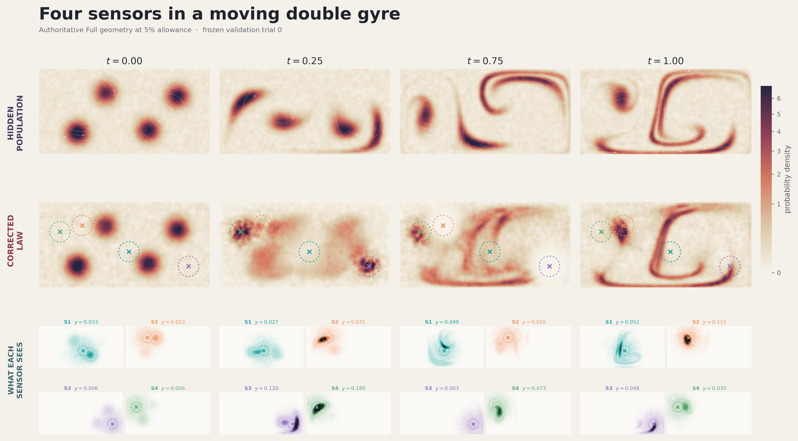
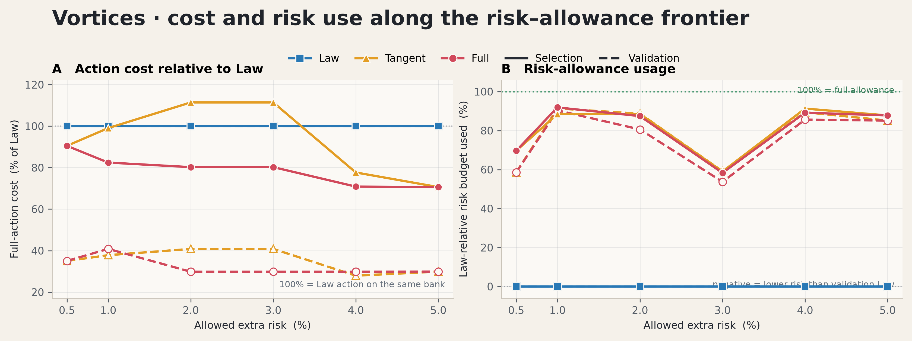
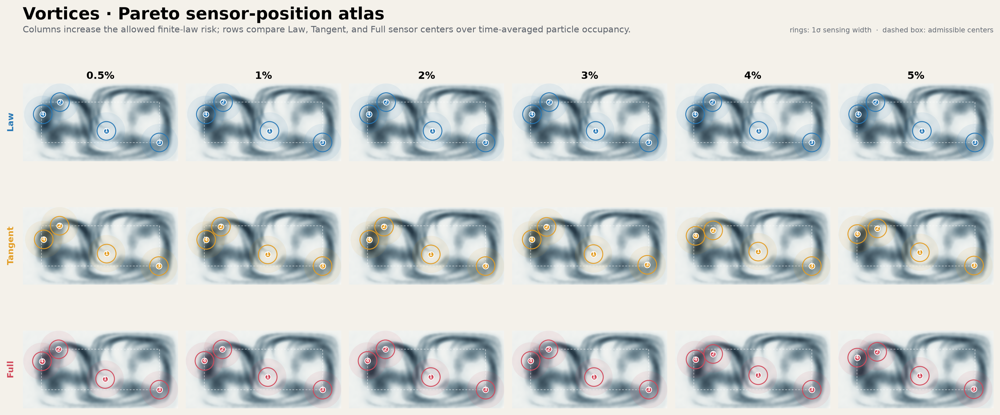
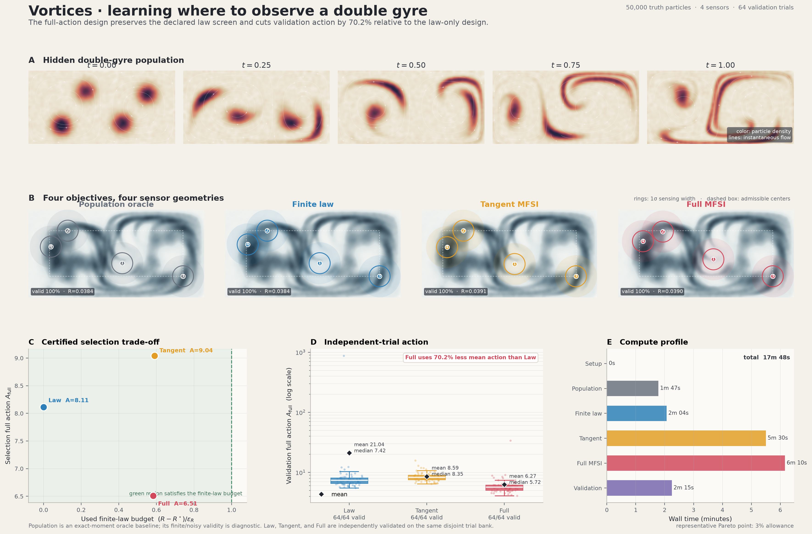

# Vortices percentage-risk Pareto experiment

## Authoritative status

This directory contains the corrected, authoritative percentage-risk sweep for the time-dependent double-gyre experiment. The active results are under `outputs/pareto/`; the pre-correction sweep is retained, unchanged, under `outputs/old/pareto_pre_corrected_full/` and is not a current scientific result.

The corrected sweep covers `0.5%, 1%, 2%, 3%, 4%, 5%`. Full selection uses the physical-density weighted-Poisson evaluator on a `128 x 64` grid at all 21 time nodes. Every final Law, Tangent, and Full geometry passes the exact common-raster audit on the frozen 24-trial selection bank and the independent frozen 64-trial validation bank. The corrected Full selection curve is nested.

The headline result survives: corrected Full designs reduce mean validation Full action relative to the common Law design by `59.17%` to `70.18%`, depending on allowance. The earlier `26.70%` headline belonged to the archived evaluator and must not be quoted as the current result.

Key artifacts:

- [corrected authoritative table](outputs/pareto/corrected_authoritative_pareto.md)
- [common-raster decomposition audit](outputs/pareto/corrected_authoritative_decomposition_audit.md)
- [old-versus-corrected comparison](outputs/pareto/old_vs_corrected_full_comparison.md)
- [Pareto figure](outputs/pareto/pareto_methods.png)
- [sensor-layout figure](outputs/pareto/pareto_sensor_layouts.png)
- [experiment and sensor illustration](outputs/pareto/experiment_sensors.png)

## Scientific question

Four localized sensors observe a finite noisy particle population in a double-gyre flow. Their locations are optimized while allowing a controlled percentage increase in finite-law risk. The experiment asks how much physical correction action can be removed by accepting that small risk increase, and how much of the correction is tangent-visible versus tangent-invisible.

The eight-dimensional design is

```text
eta = (x1,y1,x2,y2,x3,y3,x4,y4).
```

At allowance `p`, an eligible action design must satisfy the unchanged exact risk screens

```text
L(eta) <= L* + epsilon_L,
R(eta) <= R* + (p/100) |R*|.
```

Here `L` is exact-oracle population risk, `R` is finite noisy law risk, and the shared frozen Law anchor is

```text
R* = 0.0383874420112.
```

Selection uses only the frozen selection bank and these exact screens. Validation is computed only after a winner is frozen and never participates in selection.

## Physical model

The domain is `Omega = [0,2] x [0,1]`. Normalized experiment time `t in [0,1]` corresponds to physical time `tau = Ht`, with `H = 10`. The double-gyre field is

```text
a(tau) = epsilon sin(omega tau)
b(tau) = 1 - 2 a(tau)
f(x,tau) = a(tau) x^2 + b(tau) x
omega = 2 pi / period

dx/dtau = -pi A sin(pi f) cos(pi y)
dy/dtau =  pi A cos(pi f) sin(pi y) df/dx
```

with `A = 0.1`, `epsilon = 0.25`, `period = 10`, and normalized velocity `dX/dt = H dX/dtau`.

The initial law is a `10%` uniform background plus four truncated Gaussian components. Their internal mixture weights are `(0.30, 0.20, 0.25, 0.25)`, centers are `(0.45,0.25)`, `(0.78,0.72)`, `(1.28,0.28)`, `(1.62,0.68)`, and coordinate standard deviations are `0.07`. Out-of-domain samples are rejection-resampled, not clipped.

The frozen truth bank contains `50,000` particles on 21 time nodes, generated with seed offset `1001` and RK4 with 32 substeps per interval. Endpoint training data use `50,000` particles, seed offset `2001`, and 512 RK4 substeps per interval.

## Sensors and observations

Each Gaussian sensor has feature

```text
Phi_j(x; eta) = exp(-||x-s_j||^2 / (2 ell^2)),  ell = 0.12.
```

There are four labeled sensors. Centers are constrained to `x in [0.24,1.76]`, `y in [0.24,0.76]`, with minimum pairwise separation `0.24`. Each noisy observation uses `2,000` truth particles, nine acquisition nodes nested in the 21-node scientific grid, and independent detector noise with standard deviation `0.005`. Endpoint moments are exact.

The moment path is an endpoint-anchored, bounded, `C2` cubic penalized least-squares spline with three internal knots, smoothing `1e-4`, relative ridge `1e-10`, eighth-order roughness quadrature, feature bounds `[0,1]`, interior margin `0.002`, and transition width `0.002`.

At each scientific time, empirical information projection calibrates the frozen reference particles to the reconstructed moments. The projection settings are: 300 maximum steps, Newton ridge `1e-7`, step cap `20`, multiplier clip `1000`, search tolerance `1e-6`, acceptance tolerance `2e-6`, support-certificate tolerance `1e-10`, L-BFGS maximum 800 iterations, and at most two retries. Certification also requires adequate effective sample size and empirical-hull support.

## Learned reference model

The endpoint-only reference is trained in box-logit coordinates so its physical pushforward stays inside the rectangle. Its velocity MLP receives two latent coordinates plus `(t, sin(pi t), cos(pi t), sin(2pi t), cos(2pi t))`, has four SiLU hidden layers of width 128, and a linear two-dimensional output.

Training uses conditional flow matching with a deterministic linear bridge, zero bridge noise, Adam (`beta1=0.9`, `beta2=0.999`, `eps=1e-8`), batch size 2,048, 12,000 steps, gradient clipping at 10, and cosine learning-rate decay from `1e-3` to `5e-5`. The frozen reference rollout bank contains 32,768 particles, uses seed offset `3001`, and RK4 with 16 substeps per scientific interval.

The reference checkpoint, rollout bank, truth bank, endpoint data, selection bank, validation bank, source manifest, and configuration are frozen. Their active copies and hashes are recorded in `outputs/pareto/frozen_inputs/manifest.json`.

## Objectives

- **Population** minimizes exact-oracle population risk and is used to establish the population screen.
- **Law** minimizes finite noisy law risk and provides the one common anchor for all allowances.
- **Tangent** minimizes the experiment's unchanged particle-space tangent metric under the same risk screens.
- **Full** minimizes weighted-Poisson correction action under the same risk screens.

The Law risk is a multi-bandwidth MMD with bandwidths `0.05`, `0.1`, `0.2`, and `0.4`; the population slack is `epsilon_L = 0.025`.

### Correct authoritative Full evaluator

Reported Full action uses the physical raster density `q_h` in both the operator and the vector-field inner product:

```text
-div(q_h grad psi_h) = s_h,
delta*_h = -grad psi_h,
A_full,h = ||delta*_h||^2_{q_h}.
```

The authoritative grid is `128 x 64`, all 21 time nodes are included, and there is no density floor in the scientific operator. The solve is a sparse physical-`q_h` direct solve over conductive components, with component compatibility checks, a constant-fixing pin, symmetric variable scaling, and residual iterative refinement using the same factorization. These operations preserve the discrete equation. A preconditioned-CG fallback is available. Certification independently checks the physical Poisson residual and the sensor moment-rate equations.

The regularized `tesseract_cpp` solve remains a search proxy only: its `64 x 32`, seven-time-node gradient objective may guide candidates, but it never supplies a reported scientific Full-action value. The `operator_floor_rel` field retained in the frozen configuration belongs to that proxy path and is not used in the corrected scientific operator.

### Common-raster decomposition

For each final Law, Tangent, and Full geometry, the audit builds the moment-rate operator `L_h` in exactly the Full raster vector-field space and solves

```text
delta_tan,h = argmin ||delta||^2_{q_h}  subject to L_h delta = -r_h,
delta_hid,h = delta*_h - delta_tan,h.
```

It independently evaluates

```text
A_tan,h  = ||delta_tan,h||^2_{q_h},
A_hid,h  = ||delta_hid,h||^2_{q_h},
Gamma_h  = A_hid,h / A_full,h,
<delta_tan,h, delta_hid,h>_{q_h}.
```

`Gamma_h` is reported only because Full feasibility, Tangent feasibility, hidden nullspace, orthogonality, Pythagorean identity, and hierarchy all pass without clipping.

## Optimization and selection protocol

Base optimizer settings are 64 generated starts from an oversampled pool of 128. Population, Law, Tangent, and Full receive 100, 50, 50, and 30 optimization steps with learning rates `0.01`, `0.008`, `0.006`, and `0.004`. Constraint penalty is `10,000`, optimization feasibility tolerance is `1e-6`, and invalid penalty is `1,000`.

Population uses eight starts and audits 20 candidates, requiring at least six exact-valid candidates. Law uses six starts, four gradient trials, audits 24 candidates, requires at least eight exact-valid candidates, and permits two anchor-refinement passes with consistency tolerance `1e-5`.

The repaired Tangent workflow uses four normal starts, four gradient trials, 12 local starts of scale `0.08`, 30 exact audits, and ten exact rescores. Archived candidates, repaired 4%/5% candidates, Full geometries, and the Law geometry are included as seeds and are re-audited; no obsolete Tangent solution is restored.

Full uses three normal starts, two proxy gradient trials, ten local starts of scale `0.06`, four-trial prescreening, 30 authoritative exact audits, and eight exact rescores. Candidate seeds at every allowance include the mandatory previous corrected Full incumbent, archived Full candidates, current Tangent candidates, Law, saved audited feasible candidates, and normal multistarts.

The Full sweep is sequential. The 0.5% winner is carried into 1%, and so on through 5%. An incumbent is replaced only by a feasible candidate with lower corrected selection action beyond tolerance `1e-6`. Validation uses 64 disjoint trials only after the stage winner is frozen.

## Corrected authoritative results

The Full table below uses the frozen 24-trial selection bank for selection action and the independent 64-trial bank for validation. Reduction is the ratio-of-means reduction from the common Law geometry. Values are rounded; machine-readable precision is in `corrected_authoritative_pareto.csv` and `.json`.

| Allowance | Full centers `(x,y)` | Exact L | Exact R | R increase | Selection A_full | Validation A_full ± SE | Full vs Law | A_tan,h | A_hid,h | Gamma_h |
|---:|:---|---:|---:|---:|---:|---:|---:|---:|---:|---:|
| 0.5% | `(1.07263,.39629) (.48624,.76000) (1.76000,.24000) (.27194,.61851)` | .038056816 | .038521091 | .348% | 7.343264 | 7.367562 ± .370033 | 64.98% | .430744 | 6.912520 | .941342 |
| 1% | `(1.05487,.40255) (.47001,.76000) (1.76000,.24000) (.24000,.61089)` | .038212162 | .038740166 | .919% | 6.688760 | 8.589732 ± 1.744830 | 59.17% | .435773 | 6.252986 | .934850 |
| 2% | `(1.08327,.43357) (.50729,.74970) (1.76000,.24000) (.28087,.63963)` | .038784770 | .039058745 | 1.749% | 6.510045 | 6.273495 ± .460063 | 70.18% | .430471 | 6.079575 | .933876 |
| 3% | same as 2% | .038784770 | .039058745 | 1.749% | 6.510045 | 6.273495 ± .460062 | 70.18% | .430471 | 6.079575 | .933876 |
| 4% | `(1.06371,.45502) (.49854,.74203) (1.75976,.24000) (.24971,.64638)` | .039504166 | .039756850 | 3.567% | 5.748588 | 6.274276 ± .901433 | 70.18% | .417009 | 5.331580 | .927459 |
| 5% | `(1.05214,.41790) (.50491,.72562) (1.74915,.24688) (.24562,.65249)` | .039821283 | .040072176 | 4.389% | 5.730633 | 6.288513 ± .679615 | 70.11% | .386964 | 5.343669 | .932474 |

The corrected Full selection sequence is

```text
7.343264075 >= 6.688759712 >= 6.510045283
             >= 6.510045283 >= 5.748588139 >= 5.730632961.
```

The 2% incumbent remains the 3% winner and is reported with the tighter-stage action; its independent repeated solve differed by only `1.63e-7`, below the declared `1e-6` tolerance.

### Law, Tangent, and Full interpretation

The corrected Full geometry equals the Tangent geometry at 0.5% and 5%. On the validation bank, Tangent has lower Full action at 1% and 4%, while Full has lower action at 2% and 3%. This mixed finite-bank ranking replaces the older simpler story. It does not weaken the central result: every selected Full geometry yields a large positive Full-vs-Law reduction, and the common-raster audit supports a genuine tangent-invisible fraction of roughly `92.7%` to `94.1%` on the selection bank.

The unusually large Law validation mean and SE (`about 21.04 ± 13.50`) reflect a small number of high-action validation realizations. All 64 Law validation trials remain numerically valid; the ratio-of-means reduction and its raw trial summaries are retained for transparency.

## Numerical certification

The tolerance is `1e-6`. Across all 18 final geometries and both banks:

| Certification quantity | Maximum |
|:---|---:|
| physical Poisson relative residual | `5.132997e-10` |
| component compatibility residual | `5.390598e-15` |
| Full moment-rate residual | `8.004651e-11` |
| Tangent moment-rate residual | `3.619007e-14` |
| hidden-nullspace residual | `8.004623e-11` |
| absolute orthogonality residual | `3.262391e-11` |
| absolute Pythagorean residual | `6.184564e-11` |
| maximum raw hierarchy value `A_tan,h - A_full,h` | `-8.561291e-2` |

There are zero aggregate, trial, time/trial, hierarchy, or invalid-trial violations. Every physical solve converged. Moment calibration, ESS, support feasibility, in-domain mass, component compatibility, Full moment feasibility, and decomposition gates remain active. Residuals and hierarchy gaps are raw and unclipped.

## Comparison with the archived sweep

The corrected winner changes at 0.5%, 2%, 3%, 4%, and 5%; the 1% Full geometry is unchanged. Absolute old and corrected actions are not directly comparable as optimization-only changes because the scientific evaluator changed from the earlier regularized formulation to physical `q_h`. The complete coordinates and numbers are in `old_vs_corrected_full_comparison.csv`, `.json`, and `.md`.

The corrected validation reductions by allowance are `64.98%`, `59.17%`, `70.18%`, `70.18%`, `70.18%`, and `70.11%`; these supersede the archived `7.99%`, `15.89%`, `15.89%`, `15.89%`, `26.70%`, and `25.94%` values.

No additional Full or Tangent optimization is required for this declared sweep: all mandated seed families were considered, every selected candidate is exact-feasible and certified, the repaired Tangent search is retained, and the Full curve is nested.

## Figures









Regenerate the paper-style observation-mechanism figure from the frozen 5% Full
geometry and validation/reference banks (both PNG and PDF are always written):

```bash
.venv/bin/python experiments/vortices_percentage/visualize_paper.py
```

## Reproduction

Run from the repository root with the project environment activated. The sweep reuses an existing frozen source run and archived candidates:

```bash
.venv/bin/python experiments/vortices_percentage/run_pareto.py \
  --source-run experiments/vortices_percentage/outputs/old/pareto_pre_corrected_full/risk_0p5pct \
  --output experiments/vortices_percentage/outputs/pareto \
  --seed-pareto experiments/vortices_percentage/outputs/old/pareto_pre_corrected_full
```

Finalize and independently certify the frozen winners:

```bash
.venv/bin/python experiments/vortices_percentage/finalize_authoritative_corrected_pareto.py \
  --pareto-dir experiments/vortices_percentage/outputs/pareto \
  --archive-pareto experiments/vortices_percentage/outputs/old/pareto_pre_corrected_full \
  --source-run experiments/vortices_percentage/outputs/old/pareto_pre_corrected_full/risk_0p5pct
```

The finalizer fails closed if nesting, exact candidate certification, or common-raster decomposition fails. It does not optimize or alter winners.

## Artifact map

| Path | Purpose |
|:---|:---|
| `outputs/pareto/pareto.csv`, `.json` | complete active Pareto sweep |
| `outputs/pareto/pareto_methods_selection.csv` | exact selection metrics for Law/Tangent/Full |
| `outputs/pareto/pareto_methods_validation.csv` | independent validation metrics |
| `outputs/pareto/corrected_authoritative_pareto.*` | final corrected Full table and summary |
| `outputs/pareto/corrected_authoritative_decomposition_audit.*` | aggregate and per-time/trial common-raster audit |
| `outputs/pareto/old_vs_corrected_full_comparison.*` | archived-versus-current comparison |
| `outputs/pareto/validation_trial_summaries.csv` | per-trial validation receipts |
| `outputs/pareto/authoritative_run_summary.json` | concise certification and scientific conclusions |
| `outputs/pareto/frozen_inputs/manifest.json` | frozen-input paths and SHA-256 hashes |
| `outputs/pareto/risk_*pct/` | per-allowance results, candidate audits, timings, banks, and manifests |
| `outputs/old/pareto_pre_corrected_full/` | immutable historical sweep |

Core implementation files are `experiment.py` (experiment/evaluators), `selection.py` (candidate generation and exact selection), `run_pareto.py` (nested sweep), `finalize_authoritative_corrected_pareto.py` (publication audit), and `src/mfsi/poisson.py` (weighted-Poisson solvers).

## Read-only saved-result evaluation

From the repository root:

```bash
.venv/bin/python experiments/vortices_percentage/eval.py
.venv/bin/python experiments/vortices_percentage/eval_pareto.py
```

The first command displays the tracked saved run. The second displays and
hash-verifies the corrected authoritative Pareto sweep. Neither command runs
the experiment or writes outputs. Both use the repository-wide saved-evaluator
table style, include Law/Tangent/Full, and report sample SDs from the saved
independent validation trials (or from a saved ordinary SE and `n`).
