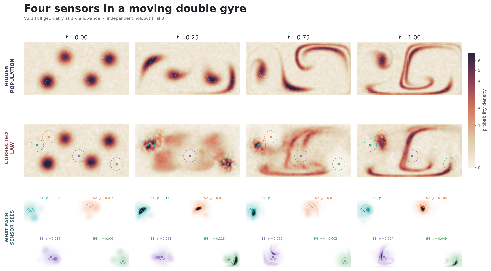
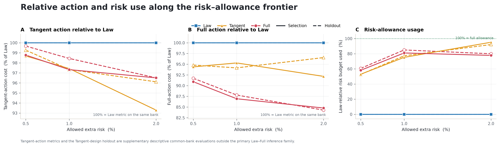

# Vortices experiment: FIDE in a time-dependent double gyre

This directory contains the canonical, standalone V2.1 vortices experiment for **Fiber-Informed Differentiable Experimental Design (FIDE)**. It asks whether four aggregate sensors can remain nearly as informative as a Law-optimal design while inducing a complete population-law trajectory that is easier to reconcile with the same frozen reference dynamics. The experiment is the nonlinear, bounded-domain counterpart of the repository's [analytical Gaussian-mixture experiment](../toy_example_percentage/README.md).

The confirmed result covers risk allowances of **0.5%, 1%, and 2%**. We deliberately stopped at 2% because of the hackathon's computational time limit; the 3%, 4%, and 5% branches were paused before completion and are not part of the claim. A future study will extend the sweep and test whether a broader allowance range produces a larger Pareto effect.

> **Current status: PASS.** On a fresh shared 64-trial holdout, the Full/FIDE designs reduce Full action relative to Law by **8.28%**, **12.19%**, and **15.71%** at the 0.5%, 1%, and 2% operating points. All nine reference-by-allowance simultaneous 95% lower bounds are positive, and all 768 exact reference/design/trial evaluations pass the frozen numerical gates.

## Naming and repository cleanup

The active experiment is V2.1 and now lives at `experiments/vortices_percentage/`. The former V1 directory has been moved to `old_stuff/vortices_percentage_v1/` and remains ignored by Git. V2.1 is nevertheless standalone: the reusable double-gyre model, reference transformation, base configuration, frozen truth population, and frozen endpoint population that V2.1 consumes are all retained in this directory. No active V2.1 import or execution path depends on `old_stuff/`.

The frozen protocol documents and historical manifests still contain their original `experiments/vortices_percentage_v2/` and V1 path strings. Those strings are provenance, not current instructions; editing them would change the hashes that identify the preregistered files. Use the commands and current paths in this README.

## Scientific question

The hidden population is transported by a time-dependent double-gyre flow, but the experiment observes only four noisy Gaussian sensor averages at nine acquisition times. Many population laws reproduce those sixteen-dimensional time-dependent constraints, so the data identify a moment fiber rather than a unique microscopic density.

FIDE completes each fiber using the same frozen endpoint-trained reference and asks which scientifically admissible sensor geometry requires the smallest full-law correction. The comparison separates three designs:

- **Law** minimizes finite-data scientific risk and defines the common risk anchor.

- **Tangent** minimizes the correction visible through the measured moment rates. Its holdout evaluation is supplementary and descriptive in this experiment; it is outside the primary Law–Full inference family.

- **Full/FIDE** minimizes the correction required by the complete information-projected population law, subject to the same population and finite-risk restrictions.

The key question is therefore not whether the reference flow exactly reproduces the hidden simulator. It is whether two sensor systems with nearly equal scientific risk imply complete law paths that demand substantially different corrections relative to the same frozen reference.

## The double-gyre system

The physical domain is the rectangle $[0,2]\times[0,1]$. With normalized experiment time $t\in[0,1]$, physical time $\tau=10t$, amplitude $A=0.1$, modulation $\epsilon=0.25$, period $T=10$, and $\omega=2\pi/T$, define

$$a(\tau)=\epsilon\sin(\omega\tau),\qquad b(\tau)=1-2a(\tau),\qquad f(x,\tau)=a(\tau)x_1^2+b(\tau)x_1.$$

The textbook double-gyre velocity in physical time is

$$v_1=-\pi A\sin(\pi f)\cos(\pi x_2),\qquad v_2=\pi A\cos(\pi f)\sin(\pi x_2)\,\partial_{x_1}f.$$

The implementation returns $dX/dt=10v$ because the rest of the FIDE pipeline uses normalized time. The oscillating separatrix stretches and folds the four initial particle concentrations while the rectangular boundary remains impermeable.

The initial law is a 10% uniform background plus four truncated Gaussian components. Their normalized mixture weights are $(0.30,0.20,0.25,0.25)$, centers are $(0.45,0.25)$, $(0.78,0.72)$, $(1.28,0.28)$, and $(1.62,0.68)$, and both coordinate standard deviations are $0.07$. The frozen truth bank uses 50,000 particles; a finite observation trial samples 2,000 of them.

## Aggregate observations and sensor design

A design is an ordered set of four sensor centers $\eta=(z_1,\ldots,z_4)$ inside the box. Each sensor is a Gaussian response of width $0.12$,

$$\Phi_j(x;z_j)=\exp\left(-\frac{\lVert x-z_j\rVert^2}{2(0.12)^2}\right).$$

The sensor centers remain at least `0.24` from the relevant box limits and at least `0.24` from one another. At acquisition indices `(0, 2, 5, 8, 10, 12, 15, 18, 20)`, each trial observes the four empirical sensor means with independent noise of standard deviation `0.005`. Endpoint-anchored, bounded cubic smoothing splines reconstruct the four moment trajectories and their time derivatives on all 21 scientific nodes.

The finite-data risk is a multiscale Gaussian MMD criterion with bandwidths `(0.05, 0.10, 0.20, 0.40)` and population slack `0.025`. If $R_\mathrm{Law}$ is the selected Law risk, an allowance $p$ admits only designs satisfying

$$R(\eta)\leq\left(1+\frac{p}{100}\right)R_\mathrm{Law}.$$

Full action never compensates for a scientifically poor geometry: population feasibility and the exact finite-risk cap are applied before Full candidates are ranked.

## From endpoints to a measurement-implied law

The reference model is trained only from the common physical endpoint dataset. It is a box-logit endpoint flow with a four-layer, width-128 SiLU MLP, trained for 12,000 Adam steps. Three independent reference-training seeds—`310000101`, `310000102`, and `310000103`—are qualified separately, and each produces a 32,768-particle rollout on the same 21 time nodes. The common physical raster bandwidth, `0.058816544123815116`, is the median of the three reference-only weighted Scott bandwidths and does not use a sensor geometry, action value, or validation outcome.

At every time, the hard empirical information projection exponentially tilts a reference particle law until its four sensor moments equal the reconstructed observations. This projected law is a canonical completion of the aggregate data, not a claim to recover the hidden particle density pointwise.

## Why the V2 numerical repair matters

V1 revealed that bounded-domain Full action is sensitive to how mass and flux are rasterized near the wall. V2 replaces the earlier treatment with a consistent reflected discretization:

- scalar density and signed continuity source use the same cell-integrated Gaussian kernel with even reflection;

- reference flux uses the matching reflected normal-flux rule;

- the physical projected density has no artificial floor;

- the correction satisfies homogeneous Neumann boundary conditions; and

- the weighted Poisson problem is solved as $K(q)\psi=-s$, with $K(q)=-\nabla\cdot(q\nabla)$ and $\delta=-\nabla\psi$.

The authoritative Full action uses a `256 × 128` physical grid and all 21 time nodes. Every candidate must pass mass, source compatibility, Poisson residual, independent-action, calibration, covariance, and effective-sample-size gates. Numerical development and convergence evidence are documented in [VORTICES_V2_NUMERICAL_REPAIR_FINAL.md](VORTICES_V2_NUMERICAL_REPAIR_FINAL.md); the final prospective selection protocol is recorded in [VORTICES_V2_1_SELECTION_PROTOCOL_FROZEN.md](VORTICES_V2_1_SELECTION_PROTOCOL_FROZEN.md).

## Selection and independent confirmation

Candidate generation uses one 128-trial shared selection bank across all methods and all three references. Selection is feasibility-first: exact population and risk checks determine the admissible set, then the Full proxy ranks only admissible geometries, and promoted candidates receive the exact `256 × 128` Full evaluation. Allowances are nested and share a common Law anchor.

The final result uses a fresh 64-trial shared holdout with observation seed `22`, namespace `23`, and bootstrap seed `24`. The four designs—one Law geometry and three Full geometries—were evaluated under every reference and trial, producing $3\times4\times64=768$ exact evaluations. The primary effect family contains the nine reference-by-allowance Full-versus-Law reductions and uses common max-deviation simultaneous 95% intervals. The maximum simultaneous half-width is `2.454` percentage points and the maximum within-reference relative standard error is `2.442%`.

The originally planned 1,024-trial confirmation was retired outcome-blind before any action cell or result was produced, solely because its runtime was incompatible with the remaining hackathon window. A reduced 64-trial protocol was frozen before evaluation. A proposed fused-cell accelerator was also rejected: although it was 1.19× faster, it did not preserve exact floating-point solver fields. The accepted ordered parallel evaluator retained its exact-equivalence qualification.

## Confirmed results

| Allowed extra risk | Full sensor centers $(x,y)$                                            | Selection risk increase | Holdout risk change vs Law | Holdout Full action | Reduction vs Law |
| -----------------: | :--------------------------------------------------------------------- | ----------------------: | -------------------------: | ------------------: | ---------------: |
|               0.5% | `(0.251, 0.607)`, `(0.473, 0.760)`, `(1.061, 0.398)`, `(1.760, 0.240)` |                  0.291% |                     0.303% |              1.4598 |        **8.28%** |
|                 1% | `(0.251, 0.602)`, `(0.468, 0.757)`, `(1.042, 0.393)`, `(1.760, 0.240)` |                  0.810% |                     0.850% |              1.3974 |       **12.19%** |
|                 2% | `(0.257, 0.606)`, `(0.471, 0.754)`, `(1.038, 0.397)`, `(1.750, 0.241)` |                  1.556% |                     1.599% |              1.3414 |       **15.71%** |

The common Law holdout action is `1.5915`. The equal-reference reduction grows monotonically across the evaluated range, and every one of the nine simultaneous lower bounds remains above zero:

| Reference |          0.5% allowance |             1% allowance |              2% allowance |
| :-------- | ----------------------: | -----------------------: | ------------------------: |
| 0         | 7.97% `[5.52%, 10.43%]` | 11.81% `[9.36%, 14.27%]` | 15.40% `[12.95%, 17.86%]` |
| 1         | 8.30% `[5.85%, 10.75%]` | 12.35% `[9.90%, 14.80%]` | 15.82% `[13.37%, 18.27%]` |
| 2         | 8.55% `[6.10%, 11.01%]` | 12.42% `[9.97%, 14.87%]` | 15.91% `[13.46%, 18.37%]` |

The independently evaluated Tangent geometries reduce holdout Full action by 5.21%, 5.85%, and 3.45%. These values are useful descriptive comparisons, but Tangent was not included in the primary simultaneous inference family. At 2%, the Tangent improvement weakens while Full reaches its largest confirmed reduction, reinforcing the distinction between matching measured moment rates and reducing complete law-level correction.

For the complete gate-by-gate result, see [VORTICES_V2_1_C3_64_RESULT.md](VORTICES_V2_1_C3_64_RESULT.md). The canonical machine-readable plotting values and their provenance receipts are in [outputs/published](outputs/published/README.md); the JSON beneath `plots/` is a renderer-produced copy.

## Visualizing the experiment


*Animation: the confirmed 2% Full geometry over all 21 scientific time nodes.* The left panel is the hidden double-gyre population, which is available to the benchmarker but not to the inverse-design method. The center panel is the information-projected law constrained by the four noisy aggregate moment trajectories and completed by one qualified frozen reference. The four narrow panels isolate the response supported by each sensor. Agreement of the four readings does not force pointwise agreement between the two large panels; the difference is precisely the unresolved part of the moment fiber.


*Static 0.5% operating point.* Four audited time slices show the least permissive confirmed Full design. The geometry stays close to the Law optimum and uses 58.2% of its selection risk budget, yet its holdout Full action is already 8.28% below Law. The moving lobes expose different sensors at different times, so the design is judged by the complete trajectory rather than a single snapshot.



*Static 1% operating point.* With a slightly larger admissible risk set, the left and middle-right sensors shift enough to reduce holdout Full action by 12.19%. The projected density still matches the four sensor moments to numerical precision; the visible changes away from the sensor centers reflect how the common reference completes unconstrained directions.


*Static 2% operating point.* This is the largest completed allowance and the geometry used in the animation. It spends 77.8% of the selection allowance and yields a 15.71% holdout Full-action reduction. The result should not be extrapolated to 3%–5%: those designs were never completed or confirmed.



*Relative action and risk-use curves.* Panel A normalizes Full action by the Law action on the same bank, so lower is better and Law is fixed at 100%. Solid lines are selection values; dashed lines are independent holdout values. Full improves monotonically from about 92% to 84% of Law on holdout. Panel B reports the fraction of each Law-relative risk allowance used. Only selection risk is constrained; holdout risk is an independent cross-evaluation. Note this is about *tangent-action cost* where the Tangent law is expected to dominate the Full law.


As shown in this picture, however, Full outperforms Tangent under the complete Full-action metric at every evaluated allowance (expected result), despite Tangent directly optimizing its own moment-level objective. The solid/dashed distinction again separates selection from holdout, and the dotted 100% line denotes the full risk allowance rather than a performance target.


*Primary Full-result dashboard.* The first panel shows selection-bank certification, the second checks the same frozen geometries on the independent holdout, and the third summarizes the reference-wise simultaneous intervals. The figure links optimization, out-of-sample behavior, and inferential uncertainty without treating holdout risk as a second selection constraint.

All media are deterministic post-processing of frozen artifacts; rendering does not retrain a reference, change a geometry, or rerun confirmation. The authoritative renderer is [render_v2_1_c3_64_pareto.py](render_v2_1_c3_64_pareto.py), and the snapshot/GIF adapters are [visualize_v2_1_partial_paper.py](visualize_v2_1_partial_paper.py) and [visualize_v2_1_partial_paper_gif.py](visualize_v2_1_partial_paper_gif.py).

## Reproduce and verify

Run all commands from the repository root in the environment described by the main [Getting Started guide](../../README.md#getting-started). The quick, read-only verification checks the standalone frozen inputs, published Pareto coordinates, certification flags, and tracked media without performing scientific computation:

```bash
.venv/bin/python experiments/vortices_percentage/verify_saved_result.py --json
```

Regenerate the authoritative Pareto figures from the saved exact receipts:

```bash
PYTHONPATH="$PWD/src:$PWD/experiments:$PWD/experiments/vortices_percentage" \
  .venv/bin/python experiments/vortices_percentage/render_v2_1_c3_64_pareto.py
```

Regenerate the confirmed static snapshots and animation:

```bash
PYTHONPATH="$PWD/src:$PWD/experiments:$PWD/experiments/vortices_percentage" \
  .venv/bin/python experiments/vortices_percentage/visualize_v2_1_partial_paper.py

PYTHONPATH="$PWD/src:$PWD/experiments:$PWD/experiments/vortices_percentage" \
  .venv/bin/python experiments/vortices_percentage/visualize_v2_1_partial_paper_gif.py
```

These commands consume only the exposed files under [inputs](inputs/README.md) and [outputs/published](outputs/published/README.md). They work from a fresh clone and do not need the archived search tree, reference checkpoints, or confirmatory run directories. The manifest-driven verifier checks every required input and receipt by SHA-256 before accepting the saved result.

### Optional full scientific replay

Recomputing the scientific result is a separate, expensive workflow. Train the three frozen references first, verify and freeze their common bandwidth, generate the V2.1 selection bank, and then execute selection:

```bash
for seed in 310000101 310000102 310000103; do
  PYTHONPATH="$PWD/src:$PWD/experiments:$PWD/experiments/vortices_percentage" \
    .venv/bin/python experiments/vortices_percentage/run_reference_stage.py --seed "$seed"
done

PYTHONPATH="$PWD/src:$PWD/experiments:$PWD/experiments/vortices_percentage" \
  .venv/bin/python experiments/vortices_percentage/freeze_common_bandwidth.py \
  --reference-receipt experiments/vortices_percentage/outputs/prospective_v2/references/reference_seed_310000101/qualification_receipt.json \
  --reference-receipt experiments/vortices_percentage/outputs/prospective_v2/references/reference_seed_310000102/qualification_receipt.json \
  --reference-receipt experiments/vortices_percentage/outputs/prospective_v2/references/reference_seed_310000103/qualification_receipt.json \
  --output experiments/vortices_percentage/outputs/prospective_v2/freeze/common_bandwidth_receipt.json

PYTHONPATH="$PWD/src:$PWD/experiments:$PWD/experiments/vortices_percentage" \
  .venv/bin/python experiments/vortices_percentage/verify_reference_stage.py

PYTHONPATH="$PWD/src:$PWD/experiments:$PWD/experiments/vortices_percentage" \
  .venv/bin/python experiments/vortices_percentage/generate_v2_1_selection_bank.py

PYTHONPATH="$PWD/src:$PWD/experiments:$PWD/experiments/vortices_percentage" \
  .venv/bin/python experiments/vortices_percentage/execute_v2_1_selection.py
```

Reference training and exact selection are long GPU/CPU jobs and write checkpoints beneath the ignored `outputs/` tree. Development runs and obsolete logs have been moved to the ignored, recoverable `old_stuff/vortices_percentage_v2_1_development/` archive; no visualization or saved-result verification path depends on that archive. The later confirmatory scripts remain available for protocol auditing, but the published 64-trial result must not be casually overwritten or mixed with a new run; use a separate output root for an independent replication.

## Directory map

```text
experiments/vortices_percentage/
├── README.md                              # This narrative and reproduction guide
├── domain.py                              # Time-dependent double gyre and initial law
├── bounded_reference.py                   # Box-logit reference-flow transformation
├── experiment.py                          # Reusable observation, risk, and experiment model
├── base_experiment_config.json            # Frozen physical/observation configuration
├── config.json                            # Corrected V2 reflected Full-action configuration
├── inputs/                                # Frozen truth, endpoint, reference, and holdout banks
├── core.py                                # V2 hard projection, reflected raster, and exact action
├── run_reference_stage.py                 # Three-seed endpoint-reference training
├── verify_reference_stage.py              # Reference qualification and common bandwidth
├── generate_v2_1_selection_bank.py        # Frozen shared selection-bank generation
├── execute_v2_1_selection.py              # Feasibility-first V2.1 selection
├── v2_selection_harness.py                # Promoted reusable selection evaluator
├── run_v2_1_c3_64_confirmatory.py         # Final independent confirmation
├── verify_saved_result.py                  # Fast read-only published-result check
├── VORTICES_V2_1_*                        # Frozen protocols, receipts, and result report
├── plots/                                 # Tracked publication figures, GIF, and rendered data copies
└── outputs/published/                     # Tracked compact result records and provenance receipts
```

## Scope and limitations

This is a controlled benchmark with simulator access to a hidden population, not an empirical fluid experiment. The hidden law is used to generate aggregate observations and evaluate scientific risk; FIDE itself receives only those aggregate observations and the independently trained endpoint reference. The three reference models test sensitivity to training randomness, but they share the same architecture, endpoint dataset, and model class.

Most importantly, the confirmed Pareto statement is **partial**. It establishes a positive and increasing Full-action reduction over 0.5%–2%; it does not establish the shape, saturation point, or maximum attainable reduction of the broader frontier. Completing 3%–5%, adding more allowances, increasing reference diversity, and testing other flow regimes are the natural next steps left for future work going beyond this hackathon project.

For the general theory and the analytical example, see the project [README](../../README.md) and [technical report](../../full_report.pdf).
