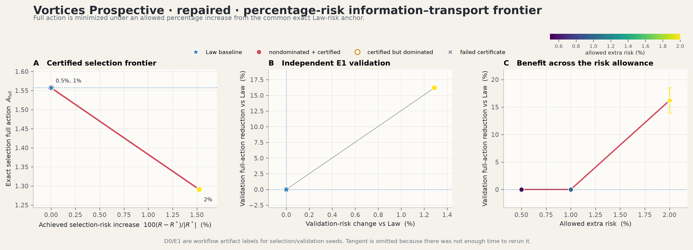
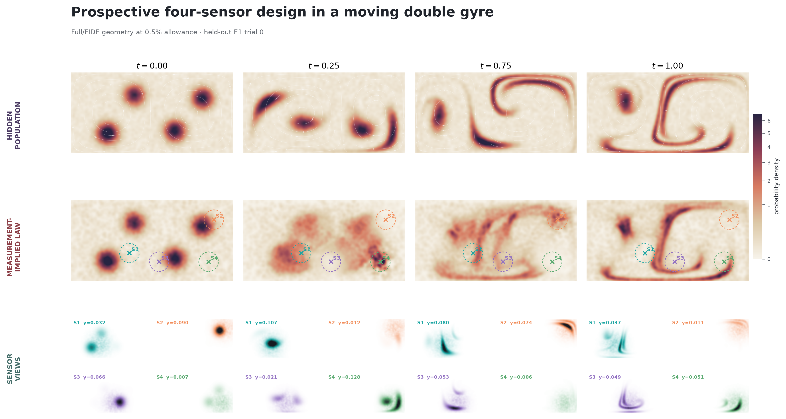

# Prospective Vortices: Aggregate-Only Sensor Design

> **Naming convention.** The project README calls the earlier three-reference,
> simulator-bank study **Vortices** and this experiment **Vortices Prospective**.
> Both use the same time-dependent double gyre and the same Full/FIDE scientific
> question. The difference is the information available before sensor selection:
> Vortices selects from a frozen microscopic simulation bank, while Vortices
> Prospective selects from endpoints and aggregate predictive fields only.

This directory is the canonical prospective-vortices implementation. It is
self-contained with respect to the retired prospective lineage: no production
module, test, renderer, or command imports `old_stuff/vortices_prospective_legacy`.
The previous implementation and the development notes used to construct this
version remain recoverable in that ignored archive.

The production study asks a deliberately narrow question. With one
endpoint-trained design reference and only aggregate target predictions, can
Full/FIDE choose four sensors that preserve scientific performance while
reducing the dynamical correction of the complete measurement-implied law? A
stronger D0-only audit found that the original Law baseline was underoptimized.
The repaired experiment therefore reoptimized Full at 0.5% and 1%, adopted a
previously authoritative feasible 2% finalist, froze the repaired frontier, and
validated on a fresh E1 reference. The final result is deliberately mixed:
0.5% and 1% select Law itself and yield no action reduction, while 2% passes
every gate and reduces held-out Full action by **16.20%**.

## Experiment narrative

### The hidden physical system

The state is $x=(x_1,x_2)\in[0,2]\times[0,1]$. Particles follow the standard
time-dependent double-gyre flow. In normalized scientific time $t\in[0,1]$,
physical time is $10t$, and

$$
f(x_1,t)=a(t)x_1^2+b(t)x_1,
\qquad
a(t)=0.25\sin(2\pi t),
\qquad
b(t)=1-2a(t),
$$

$$
v_1=-10\pi(0.1)\sin(\pi f)\cos(\pi x_2),
\qquad
v_2=10\pi(0.1)\cos(\pi f)\sin(\pi x_2)\,\partial_{x_1}f.
$$

The initial population is a 10% uniform background plus four narrow truncated
Gaussian components centered at `(0.45, 0.25)`, `(0.78, 0.72)`, `(1.28, 0.28)`,
and `(1.62, 0.68)`. The oscillating separatrix stretches, folds, and transfers
these concentrations between the two gyres. Impermeable walls make the
bounded-domain density, flux, and Poisson discretizations scientifically
consequential rather than cosmetic implementation details.

The hidden 50,000-particle trajectory is unavailable during selection. It is
sealed until every allowance-specific geometry has been frozen and is used
only for held-out validation and explanatory media.

### What four sensors observe

A geometry is

$$
\eta=(x_1,y_1,\ldots,x_4,y_4),
$$

with each sensor at least `0.24` from the boundary and every sensor pair at
least `0.24` apart. Sensor $j$ has Gaussian response

$$
\Phi_j(x;\eta)=
\exp\left(-\frac{\lVert x-(x_j,y_j)\rVert^2}{2(0.12)^2}\right).
$$

One finite trial samples 2,000 particles at nine acquisition nodes and adds
independent detector noise with standard deviation `0.005`. Endpoint-anchored
cubic splines reconstruct the four moment trajectories on 21 scientific time
nodes. A smooth $C^2$ bounded transformation keeps the reconstructed moments
inside the feasible interval without introducing the zero-gradient plateaus
caused by hard clipping.

The experiment never observes a density. It receives four noisy population
averages at each acquisition time. The density shown in the figures is either
hidden validation truth or the canonical law completed from those aggregate
measurements and a frozen endpoint reference.

### What “prospective” means here

Before selection, the target interface exposes only:

- the two endpoint ensembles used to train the reference;

- aggregate response-mean and response-second fields on a fixed physical grid;

- analytically recovered cross-sensor second moments, hence the complete
  finite-sampling covariance of the four observations; and

- five aggregate scientific-QoI prediction curves and their frozen scales.

It deliberately exposes no intermediate target particles, simulator object,
hidden-state path, or loader capable of reaching the hidden-validation tree.
The `TargetProspectiveData` interface enforces this boundary and refuses paths
inside `hidden_validation`.

This is the key distinction from [Vortices](../vortices_percentage/README.md).
The percentage experiment is a robust, three-reference retrospective design
study built from a frozen microscopic simulator bank. This prospective study
asks what can be selected when only endpoint and aggregate predictive
information is available. It uses one D0 design-reference seed for speed. E0
belongs to the superseded first freeze; the repaired frontier uses a fresh E1
reference and fresh hidden-validation seeds.

## From aggregate measurements to a complete law

The neural reference flow is trained only on the two endpoint distributions.
Its 32,768-particle rollout supplies a common intermediate background law
$q_t^{\mathrm{ref}}$ and reference velocity. At each time, the four reconstructed
sensor moments define a moment fiber. FIDE chooses the exponential tilt

$$
q_t^\eta(x)
\propto q_t^{\mathrm{ref}}(x)
\exp\!\left(\lambda_t^\top\Phi(x;\eta)\right)
$$

whose four moments match the measurements. This projected law is
measurement-implied, not claimed to recover the hidden density pointwise. The
reference completes directions that four scalar observations do not identify.

The Full action asks how much reference-relative velocity correction is needed
to realize the complete projected-law trajectory. If $s_t$ is the signed
continuity forcing, the correction is obtained from

$$
K(q_t)\psi_t=-s_t,
\qquad
K(q_t)=-\nabla\cdot(q_t\nabla),
\qquad
\delta_t=-\nabla\psi_t,
$$

with homogeneous Neumann boundary conditions. The action integrates
$\int q_t\lVert\delta_t\rVert^2$ over space and time.

## What is compared

All methods share the same design reference, candidate constraints, common
random numbers, aggregate predictions, risk definition, and held-out trial
bank.

| Method | Selection objective | Scientific role |
| :-- | :-- | :-- |
| **Law** | Dedicated risk-only search | Freezes the repaired risk anchor; it is a finite-search baseline, not a proof of global optimality |
| **Tangent** | Minimum correction visible through the four measured moment rates | Omitted from the repaired comparison because there was not enough time to rerun it after repairing Law |
| **Full/FIDE** | Minimum action of the complete information-projected law | Tests complete law-level compatibility inside the admissible risk set |

At allowance $p\in\{0.5,1,2\}$%, Full must satisfy

$$
R(\eta)\leq\left(1+\frac{p}{100}\right)R_{\mathrm{Law}}.
$$

This is feasibility-first selection. Full action cannot compensate for poor
scientific informativeness; it ranks a geometry only after exact population,
risk, geometry, projection, covariance, effective-sample-size, Poisson, and
moment-rate checks pass.

## Freeze order and leakage boundary

The final repaired workflow enforces the following one-way sequence:

```text
aggregate target fields + endpoints
                │
                ▼
reuse the byte-identical frozen D0 reference
                │
                ▼
reoptimize Law on D0 only
                │
                ▼
rerun Full at 0.5% and 1%; adopt the audited 2% escape hatch
                │
                ▼
freeze the repaired three-point frontier
                │
                ▼
train and freeze independent E1 reference
                │
                ▼
generate hidden states and observation randomness
                │
                ▼
64-trial paired validation and reporting
```

Selection refuses to run after evaluation-reference or hidden artifacts exist.
The repaired combined manifest records that all three points were frozen before
E1 training and hidden validation. E1 is validation-only; it is not a second
selection seed and is never averaged into the objective. E0 was inspected only
for the superseded first freeze and is not used in the repaired claim.

## Numerical implementation and repaired failure modes

### Reflected bounded-domain raster

Density and signed source use the same direct cell-integrated even-reflection
Gaussian operator:

```text
q_h = S_reflect(q)
s_h = S_reflect(s)
K(q_h) psi = -s_h
```

The implementation uses four reflected image pairs, no physical-density floor,
and no source-column normalization. The bandwidth is a frozen reference-only
weighted Scott bandwidth in physical units; it does not depend on PDE grid
spacing, sensor geometry, trial, risk, or action. Authoritative evaluation uses
a `128 × 64` grid at all 21 scientific nodes and streams one time node at a time
to cap the reflected-kernel plan near 50 MB.

### Corrections inherited into the prospective formulation

Several distinct errors had to be removed rather than treating the earlier
failure as a single optimization problem:

- density and continuity source now use one matched reflected scalar kernel;

- reference flux uses the matching bounded-domain convention;

- finite-sampling noise uses the full four-sensor covariance, including
  cross-sensor terms;

- moment reconstruction uses the smooth bounded transform rather than hard
  clipping;

- geometry cache keys preserve sensor labels during differentiable search;

- the unmodified Law geometry is retained as a mandatory Full feasibility
  anchor at the first Pareto point; and

- the preceding certified Full winner remains mandatory at later nested
  allowances.

The last two safeguards are important under tight risk constraints. Gradient
steps can move every optimized start just outside an exact risk boundary even
when an already certified geometry remains feasible. A truncated funnel may
improve a certified incumbent, but it may not silently discard it.

### Performance choices

The production profile keeps the exact protocol while avoiding redundant work:

- one D0 selection reference and one validation-only E0 reference;

- exactly three risk allowances and beta `0` only;

- 16 Law, Tangent, and Full starts, with Full starts evaluated in batches of 8;

- cached low-resolution reflected plans reused across trials and gradient steps;

- streamed authoritative kernels instead of all-time multi-gigabyte plans;

- reused compiled rescore executables and exact Pareto-incumbent cache hits; and

- no unproductive prospective L-BFGS phase.

JAX runs in float64. The measured successful end-to-end runtime was about 75
minutes on an RTX 5090 Laptop GPU with 24 GB VRAM; an 80–90 minute budget is a
reasonable allowance for repeat runs on that machine.

## Authoritative results

### Final repaired D0 selection and E1 validation

`D0` and `E1` are internal optimization-artifact labels: `D0` identifies the
reference artifact used during optimization, and `E1` identifies the fresh
post-freeze validation artifact. They are not different physical regimes or
different scientific experiments.

The stronger Law search fixed D0 risk at `1.19657794045`. Full was rerun against
that anchor at 0.5% and 1%. At both tight allowances the only certified
action-minimizing choice was the Law geometry itself. At 2%, the saved
authoritative `full-grad-001-polished` escape-hatch candidate was feasible and
better than carrying the 1% incumbent forward.

| Allowance | D0 Law risk | D0 Full risk | D0 ceiling | D0 Law action | D0 Full action | Selection mode |
| --------: | ----------: | -----------: | ---------: | ------------: | -------------: | :------------- |
|      0.5% | 1.19657794 | 1.19657796 | 1.20256083 | 1.55723989 | 1.55723989 | repaired Full search; Law incumbent selected |
|        1% | 1.19657794 | 1.19657796 | 1.20854372 | 1.55723989 | 1.55723989 | repaired Full search; 0.5% incumbent selected |
|        2% | 1.19657794 | 1.21481697 | 1.22050950 | 1.55723989 | 1.29078832 | saved authoritative escape hatch |

Only after that three-point freeze was E1 trained and a fresh 64-trial hidden
bank generated:

| Allowance | E1 Law action | E1 Full action | Reduction | E1 Law risk | E1 Full risk | Paired action-difference 95% CI | Strict result |
| --------: | ------------: | -------------: | --------: | ----------: | -----------: | :----------------------------- | :-----------: |
|      0.5% | 1.70295372 | 1.70295372 | 0.00% | 1.15611926 | 1.15611926 | `[0, 0]` | no benefit |
|        1% | 1.70295372 | 1.70295372 | 0.00% | 1.15611926 | 1.15611926 | `[0, 0]` | no benefit |
|        2% | 1.70295372 | 1.42699969 | **16.20%** | 1.15611926 | 1.17101696 | `[-0.31510, -0.23681]` | **PASS** |

All three points pass E1 risk and numerical certification. The 2% risk increase
is `1.2886%`, below the allowed 2%, and its paired interval lies strictly below
zero. The tight points are not failures of feasibility; they establish that the
repaired search found no certified improvement over Law at those allowances.
Validation evaluated only two unique geometries and reused seven exact cache
hits.

Tangent is not included in this repaired table because there was not enough
time to rerun it after repairing Law. The repaired point manifests use the Law
geometry in the Tangent slot solely to reuse validation machinery and the
geometry cache; that placeholder is not a Tangent result.

### Post-hoc Law baseline audit

A stronger risk-only audit was run after the negative risk change exposed the
search asymmetry. It used D0 only: 91 geometries discovered by the original
search, 48 fresh global geometries, 32 first-stage Adam starts, eight full-bank
Adam polishes, and four deterministic full-bank L-BFGS polishes. It did not read
E0 or the hidden validation bank and did not modify the frozen production run.

The repaired Law risk is `1.19657794045`, down from `1.22720547227` by
**2.4957%**. Consequently, all three originally selected Full geometries fail
the tightened D0 ceilings:

| Allowance | Original Full D0 risk | Repaired ceiling | Margin to ceiling | Status |
| --------: | --------------------: | ---------------: | ----------------: | :----: |
|      0.5% | 1.21361205 | 1.20256083 | -0.01105122 | **FAIL** |
|        1% | 1.21521808 | 1.20854372 | -0.00667436 | **FAIL** |
|        2% | 1.22103661 | 1.22050950 | -0.00052711 | **FAIL** |

The archived 2% authoritative finalist `full-grad-001-polished` remained
feasible (`risk 1.21481697`) and has D0 Full action `1.29078832`. No saved
authoritative finalist repaired 0.5% or 1%. The completed repaired workflow
therefore reran those two searches, adopted the 2% candidate, and validated the
new freeze on E1 as reported above. The compact audit record is
[results/law_reoptimization_summary.json](results/law_reoptimization_summary.json);
the full resumable record is under
`outputs/law_reoptimization_audit/results/law_reoptimization_result.json`.

The historical tables below document the original frozen run against the old
Law-selected baseline. They remain useful provenance, but must not be read as
the repaired frontier.

### Original D0 selection certificates

The following values were computed on the design reference before E0 existed:

| Allowed extra risk | Law risk | Full risk | Risk ceiling | Law action | Full action | Selection reduction |
| -----------------: | -------: | --------: | -----------: | ---------: | ----------: | ------------------: |
|               0.5% | 1.22721 | 1.21361 | 1.23334 | 1.58958 | 1.45005 | 8.78% |
|                 1% | 1.22721 | 1.21522 | 1.23948 | 1.58958 | 1.42024 | 10.65% |
|                 2% | 1.22721 | 1.22104 | 1.25175 | 1.58958 | 1.28345 | 19.26% |

Every selected geometry is below its exact D0 risk ceiling and passes all
selection-time numerical gates.

### Original held-out E0 validation

After the Pareto set was frozen, the independent E0 reference and the 64-trial
hidden validation bank produced:

| Allowed extra risk | Law action | Full action | Reduction vs Law | Law risk | Full risk | Full/Law risk | Paired action-difference 95% CI | Strict result |
| -----------------: | ---------: | ----------: | ---------------: | -------: | --------: | ------------: | :----------------------------- | :-----------: |
|               0.5% | 1.58087 | 1.45056 | **8.24%** | 1.11101 | 1.08885 | 0.9801 | `[-0.14333, -0.11729]` | **PASS** |
|                 1% | 1.58087 | 1.42148 | **10.08%** | 1.11101 | 1.08823 | 0.9795 | `[-0.17741, -0.14137]` | **PASS** |
|                 2% | 1.58087 | 1.31544 | **16.79%** | 1.11101 | 1.08663 | 0.9781 | `[-0.31186, -0.21900]` | **PASS** |

The held-out risk does not merely stay within the allowed increase—it is about
2% lower than Law at every point. All 64 trials at every point are valid, every
paired confidence interval lies strictly below zero, and every projection,
covariance, ESS, Poisson, compatibility, moment-rate, and finite-value
certificate passes. Validation evaluated seven unique geometries and reused two
exact geometry-cache hits.

#### Why is the observed extra risk negative?

The allowance is an upper bound,
$R_{\mathrm{Full}}\leq(1+p)R_{\mathrm{Law}}$, not an equality constraint. A
negative observed change is therefore allowed: it means that the selected Full
geometry has lower measured scientific risk than the frozen Law geometry. This
happens on both D0 and E0, so it is not a held-out sign or plotting error.

It does, however, qualify the interpretation of the baseline. Law received one
16-start risk-only search, while the Full funnel received fresh starts,
allowance-to-allowance incumbents, rescoring, and polishing at each of three
points. In this nonconvex finite-CRN problem, that larger combined search found
geometries that improve risk as well as action. The result therefore certifies
dominance over the **frozen Law-selected baseline**; it does not certify that
Law is the global risk minimizer or that the Full designs had to spend their
risk allowances.

The completed baseline audit above confirms this diagnosis: the stronger Law
search lowers D0 risk by 2.4957%, and every originally selected Full point fails
its repaired ceiling. Because E0 is already known, any E0 reanalysis is post-hoc;
a fresh E1 reference and hidden bank are required for a new strictly
confirmatory claim.

The current compact machine-readable authority is
[results/validation_summary.json](results/validation_summary.json), with a flat
[CSV companion](results/validation_summary.csv). The complete raw trial-level
record remains under the ignored production output tree at
`outputs/prospective_reflected_single_seed_pareto_repaired/results/validation_result.json`.

## Visualizing the experiment


*Animation: the repaired held-out 2% Full geometry over all 21 scientific time
nodes, in the same paper style as Vortices Percentage.* The left panel is the
hidden E1 validation population, unavailable during
selection. The middle panel is the exponential-tilt law implied by the four
aggregate measurements and the frozen E1 endpoint reference. The narrow panels
show the part of the hidden density seen by each sensor and report the matched
scalar moment. Pointwise differences away from sensor supports are unresolved
moment-fiber directions, not failed constraints.


*Repaired Pareto dashboard.* Panel A shows that 0.5% and 1% coincide with Law
and that 2% reduces E1 action by 16.20%. Panel B confirms the 2% E1 risk increase
remains below its allowance. Panel C makes the repeated tight-allowance geometry
and distinct 2% escape-hatch layout explicit.



*Toy-style selection/validation/allowance view.* Panel A is the certified D0
frontier, Panel B is the fresh E1 risk/action check, and Panel C shows benefit
versus allowed risk with the paired interval. Tangent is omitted because there
was not enough time to rerun it.



*Static 0.5% operating point.* Full equals the repaired Law geometry. The figure
is retained to show the valid measurement-implied path, but there is no action
benefit at this allowance.


*Static 1% operating point.* This again equals Law: risk and numerical gates
pass, but the repaired search certifies no action improvement.


*Static 2% operating point.* This is the largest preregistered allowance and the
geometry used in the animation. It reaches a **16.20%** E1 reduction. No claim
is made for allowances above 2%.

All media are deterministic post-processing of frozen artifacts. Rendering
does not retrain a reference, rerun optimization, or alter validation. The
[visualization manifest](plots/visualization_manifest.json) records input and
output hashes, projection residuals, ESS checks, and the read-only data role.

## Reproduce and verify

Run commands from the repository root in the environment documented by the
main [Getting Started guide](../../README.md#getting-started).

### Fast saved-result verification

This checks the compact result, strict-success conditions, raw authority hashes
when the production output tree is present, and all tracked visual hashes:

```bash
.venv/bin/python experiments/vortices_prospective/verify_saved_result.py --json
```

### Regenerate all figures and the GIF

The renderer reads only the completed repaired artifacts. It reconstructs
one held-out E1 trial for display but does no selection or scientific
validation:

```bash
PYTHONPATH="$PWD/src:$PWD/experiments/vortices_prospective" \
  .venv/bin/python experiments/vortices_prospective/render_results.py \
  --run-dir experiments/vortices_prospective/outputs/prospective_reflected_single_seed_pareto_repaired
```

### Inspect the production scope without computation

```bash
PYTHONPATH="$PWD/src:$PWD/experiments/vortices_prospective" \
  .venv/bin/python experiments/vortices_prospective/run_v6a_risk_study.py \
  --dry-run
```

The repair dry run is:

```bash
.venv/bin/python experiments/vortices_prospective/run_repaired_study.py --dry-run
```

It must report D0 reuse, fresh E1 validation, Full reruns only at 0.5% and 1%,
and authoritative escape-hatch adoption at 2%.

### Original staged run and repaired replay

The original staged run creates the aggregate inputs and frozen D0 artifacts
that the repair reuses:

```bash
export PYTHONPATH="$PWD/src:$PWD/experiments/vortices_prospective"

.venv/bin/python experiments/vortices_prospective/run_v6a_risk_study.py \
  --stage prepare

.venv/bin/python experiments/vortices_prospective/run_v6a_risk_study.py \
  --stage design-references

.venv/bin/python experiments/vortices_prospective/run_v6a_risk_study.py \
  --stage select

.venv/bin/python experiments/vortices_prospective/run_v6a_risk_study.py \
  --stage evaluation-references

.venv/bin/python experiments/vortices_prospective/run_v6a_risk_study.py \
  --stage validate
```

`--stage all` performs the same sequence and resumes compatible checkpoints.
The repaired continuation is:

```bash
.venv/bin/python experiments/vortices_prospective/reaudit_law.py

.venv/bin/python experiments/vortices_prospective/run_repaired_study.py \
  --stage select

.venv/bin/python experiments/vortices_prospective/run_repaired_study.py \
  --stage evaluation-reference

.venv/bin/python experiments/vortices_prospective/run_repaired_study.py \
  --stage validate
```

`run_repaired_study.py --stage all` resumes compatible checkpoints and performs
the same repaired sequence. For a genuinely independent replication, provide a
new output path and new frozen seed registry; do not overwrite or mix it with
the completed authority.

### Tests

```bash
PYTHONPATH="$PWD/src:$PWD/experiments/vortices_prospective" \
  .venv/bin/python -m pytest -q experiments/vortices_prospective
```

The tests cover aggregate-only access, seed separation, freeze gates,
finite-sampling covariance, bounded moments, differentiable reflected raster
equivalence, gradient checks, incumbent retention, cached execution, and
fail-closed validation prerequisites. They do not add an earlier vortices
directory to `sys.path`.

## Output and provenance layout

The final repaired run lives at:

```text
outputs/prospective_reflected_single_seed_pareto_repaired/
├── shared/
│   ├── endpoint_reference/               # aggregate-input endpoint ensemble
│   ├── prospective/                      # aggregate response/QoI fields and CRN
│   ├── references/design/D0/             # selection-only reference
│   ├── references/evaluation/E1/         # created only after repaired freeze
│   └── results/                           # reference manifests and bindings
├── points/
│   ├── risk_0p5pct/                       # frozen shared + V6a point
│   ├── risk_1pct/
│   └── risk_2pct/
├── hidden_validation/                    # created only after complete freeze
└── results/
    ├── combined_frozen_manifest.json
    ├── validation_result.json
    ├── pareto.json, pareto.csv
    └── report.md
```

The raw manifests preserve the absolute execution paths recorded when the
experiment directory was temporarily named `vortices_prospective_new`. Those
strings are historical provenance, not runtime imports. Scientific JSON was
left byte-identical during the directory rename so its SHA-256 bindings remain
valid. Current code, tests, renderers, compact results, and commands use only
the canonical `experiments/vortices_prospective` path.

## Directory map

```text
experiments/vortices_prospective/
├── README.md                              # this narrative and reproduction guide
├── configs/
│   ├── production_v6_common.json          # physical, statistical, and numerical protocol
│   ├── production_v6a.json                # beta-zero Full arm
│   └── v6_fast_execution_exact_v1.json    # exact batched execution profile
├── domain.py, physical.py                 # double gyre and hidden validation model
├── bounded_reference.py                   # box-logit endpoint reference flow
├── build_prospective_data.py              # aggregate-only target construction
├── prospective_data.py                    # enforced selection information boundary
├── evaluator.py                           # risk, projection, Tangent, and Full evaluation
├── reflected_raster.py                    # cached reflected density/source plans
├── v4_objective.py, v4_select.py          # differentiable candidate-generation substrate
├── v6_objective.py, v6_select.py          # multi-reference-capable exact selection funnel
├── v6_reference_ensemble.py               # reference-role registry and training
├── run_v6a_risk_study.py                  # canonical one-seed, three-point workflow
├── reaudit_law.py                         # resumable D0-only Law repair audit
├── run_repaired_study.py                  # 0.5/1 reruns, 2% adoption, fresh E1 validation
├── render_results.py                      # deterministic plots, snapshots, and GIF
├── verify_saved_result.py                 # fast read-only compact-result verifier
├── results/                               # compact tracked repaired E1 values
├── plots/                                 # tracked result dashboard, snapshots, GIF, hashes
├── test_*.py                              # local independent regression suite
└── outputs/                               # ignored full checkpoints and raw authority
```

The V4/V5-named modules remain because the final V6a study deliberately reuses
their tested objective, optimizer, audit, and validation primitives. They are
active dependencies, not obsolete experiment folders. Superseded narrative
notes, copied percentage-development files, the failed pre-anchor checkpoint,
and the complete former prospective implementation are archived together under
`old_stuff/vortices_prospective_legacy/`.

## Scope and limitations

This is a controlled simulator benchmark, not an empirical fluid deployment.
The held-out path is microscopic, but selection is genuinely aggregate-only.
The E1 validation is independent of D0 training and repaired selection randomness, yet
there is only one design seed and one validation-reference seed. The 64 paired
trials quantify observation randomness conditional on that E1 reference; they
do not replace a multi-reference robustness study.

The comparison with Vortices should therefore be read structurally, not as a
head-to-head ranking. Vortices uses three references, direct microscopic target
banks, and simultaneous reference-wise inference. Vortices Prospective uses one
selection reference and aggregate target fields, then tests transfer to one
post-freeze reference. Only the repaired 2% point shows a strict prospective
benefit; the 0.5% and 1% points coincide with Law. The experiments' broader
information sets and uncertainty claims differ.

Finally, the frontier stops at 2% by protocol. Nothing here establishes the
shape, saturation point, or maximum attainable reduction beyond that range.
Additional design/reference seeds, broader allowances, alternative flow
regimes, and prospective-model misspecification tests are the natural next
steps.

For the general FIDE formulation and the retrospective benchmark, see the
project [README](../../README.md), the [Vortices README](../vortices_percentage/README.md),
and the [technical report](../../full_report.pdf).
